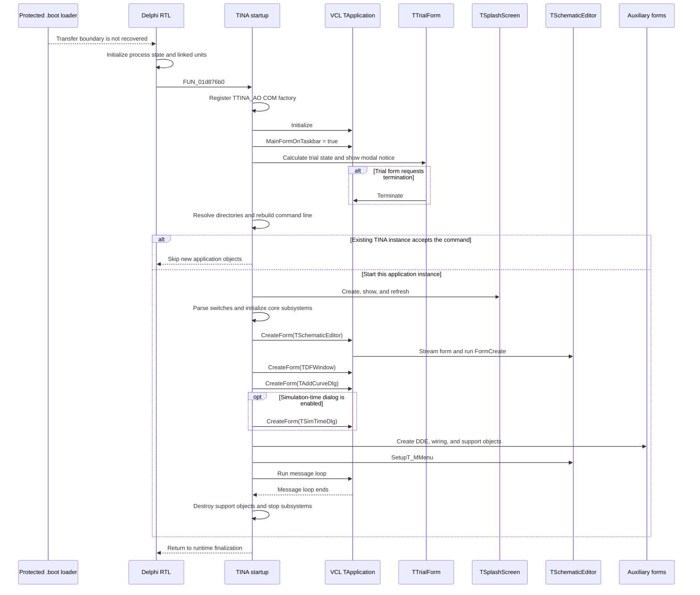

# Application startup and initialization

## Scope and entry boundary

The installed executable has a protected loader. The rebuilt runtime PE still has its PE entry point at virtual address `04659058` in the `.boot` section. This address is outside the recovered application range `00401000` to `01DB814F`. The static image does not preserve the transfer from the protected loader to the Delphi program.

The earliest recovered Delphi startup root is [`FUN_01d876b0`](../DecompiledSources/Tina16/functions/0000000001D876B0__FUN_01d876b0.c). It has no recovered caller. It calls the Delphi runtime initializer, registers the TINA COM automation class, initializes the VCL application, enables main-form taskbar behavior, runs the trial gate, and then starts the TINA program body.

This document starts at that recovered root. It does not claim that `FUN_01d876b0` is the protected PE entry point.

## Startup sequence

## Recovered phases

| Order | Function | Responsibility | Main evidence |
| --- | --- | --- | --- |
| 1 | [`FUN_01d876b0`](../DecompiledSources/Tina16/functions/0000000001D876B0__FUN_01d876b0.c) | Recovered Delphi entry wrapper | It calls the runtime initializer, COM registration, `TApplication.Initialize`, the main-form taskbar setter, the trial wrapper, and the runtime finalizer in this order. |
| 2 | [`FUN_00420110`](../DecompiledSources/Tina16/functions/0000000000420110__FUN_00420110.c) | Delphi executable and unit initialization | It installs the module data and passes the compiled initialization table to `FUN_00413790`. [`FUN_004136f0`](../DecompiledSources/Tina16/functions/00000000004136F0__FUN_004136f0.c) walks that table in order and calls each non-null initializer. |
| 3 | [`FUN_01d85fa0`](../DecompiledSources/Tina16/functions/0000000001D85FA0__FUN_01d85fa0.c) | TINA COM automation registration | RTTI identifies the class references as `TAutoObjectFactory` and `TTINA_AO`. The call registers `TTINA_AO` before VCL initialization. |
| 4 | [`FUN_0080ce00`](../DecompiledSources/Tina16/functions/000000000080CE00__FUN_0080ce00.c) | `TApplication.Initialize` | It invokes the installed VCL initialization procedure when the procedure is present. |
| 5 | [`FUN_0080f890`](../DecompiledSources/Tina16/functions/000000000080F890__FUN_0080f890.c) | Set `MainFormOnTaskbar` | The startup wrapper passes `1`. The function stores this state and updates the taskbar/window-owner path if a main form already exists. |
| 6 | [`FUN_01d87650`](../DecompiledSources/Tina16/functions/0000000001D87650__FUN_01d87650.c) | Trial gate and program-body dispatch | It sets an environment flag, runs `FUN_01546460(1)`, and then calls `FUN_01d86bd0`. |
| 7 | [`FUN_01546460`](../DecompiledSources/Tina16/functions/0000000001546460__FUN_01546460.c) | Trial notice | RTTI identifies the constructed form as `TTrialForm`. Its resources contain trial days, **Buy Now**, and **Continue** controls. The function calculates trial state, shows the form modally, and requests application termination when the form's termination field is set. |
| 8 | [`FUN_01d86bd0`](../DecompiledSources/Tina16/functions/0000000001D86BD0__FUN_01d86bd0.c) | TINA process coordinator | It resolves paths, applies compatibility settings, performs conditional existing-instance forwarding, starts the splash and core services, creates forms, runs the VCL loop, and performs ordered cleanup. |
| 9 | [`FUN_0080d020`](../DecompiledSources/Tina16/functions/000000000080D020__FUN_0080d020.c) | `TApplication.Run` | It marks the application as running, prepares the main form, and repeatedly processes messages until the termination flag is set. |
| 10 | [`FUN_00413fb0`](../DecompiledSources/Tina16/functions/0000000000413FB0__FUN_00413fb0.c) | Delphi runtime finalization | It processes exit procedures, objects, and runtime finalization state after the TINA program body returns. |

The initialization-table walker proves the order of linked unit initialization. The recovered data does not map each table entry to a Delphi unit name. For this reason, this graph does not invent names for individual unit-initialization procedures.

## TINA program coordinator

`FUN_01d86bd0` has the following application-level phases.

### 1. Exit procedure and directory setup

The coordinator registers [`FUN_017f3480`](../DecompiledSources/Tina16/functions/00000000017F3480__FUN_017f3480.c) through [`FUN_00451b10`](../DecompiledSources/Tina16/functions/0000000000451B10__FUN_00451b10.c). The callback finds the `LVDChild` window named `TINA Control Panel`, sends message `0x401`, and waits for at most 100 intervals of 100 ms for that window to close.

The coordinator then obtains `ParamStr(0)` and derives the initial program directory. [`FUN_01d78bd0`](../DecompiledSources/Tina16/functions/0000000001D78BD0__FUN_01d78bd0.c) reads `setup.ini`, selects the all-users or current-user registry root, and resolves `RootDir` and `CommonCatDir` under `SOFTWARE\DesignSoft\<product>`. [`FUN_01d7d5a0`](../DecompiledSources/Tina16/functions/0000000001D7D5A0__FUN_01d7d5a0.c) shows the recovered `TfrmSetEnvVars` environment-directory setup dialog when the product key is absent. [`FUN_01d790e0`](../DecompiledSources/Tina16/functions/0000000001D790E0__FUN_01d790e0.c) resolves `SettingsDir`, `CatalogDir`, and `TempDir` from the current-user key and supplies defaults when values are absent. It creates the temporary directory when required.

### 2. Command line and compatibility checks

The coordinator rebuilds one command-line string from `ParamStr(1)` through `ParamStr(ParamCount)`. [`FUN_01b1dd50`](../DecompiledSources/Tina16/functions/0000000001B1DD50__FUN_01b1dd50.c) conditionally searches for another `tina.exe` process. When it finds a different instance and a usable target window, it sends message `0x8D2` with the command line. A successful transfer stops creation of the new application's UI objects.

[`FUN_01d771e0`](../DecompiledSources/Tina16/functions/0000000001D771E0__FUN_01d771e0.c) checks `kernel32.dll` and `ntdll.dll` for Wine exports and records the Wine host text and Darwin flag. [`FUN_01b1ffa0`](../DecompiledSources/Tina16/functions/0000000001B1FFA0__FUN_01b1ffa0.c) resolves `IsWow64Process` dynamically and records whether the process runs under WOW64.

The coordinator sets the help file to `TINA.CHM`, sets the VCL application title to `TINA`, records the executable path, and applies the startup numeric-control setting before it creates the splash form.

### 3. Splash, libraries, and core services

RTTI identifies the first direct form construction as `TSplashScreen`. The coordinator shows and refreshes it. [`FUN_01d7a6c0`](../DecompiledSources/Tina16/functions/0000000001D7A6C0__FUN_01d7a6c0.c) validates the SPICE library indexes in the program, common-catalog, and catalog directories. It can ask the user to rebuild missing or invalid indexes, continue, or terminate.

[`FUN_00c37230`](../DecompiledSources/Tina16/functions/0000000000C37230__FUN_00c37230.c) parses the command-line switches and selects a `.TSC` or `.SCH` startup file. [`FUN_01d79d90`](../DecompiledSources/Tina16/functions/0000000001D79D90__FUN_01d79d90.c) initializes the major application services. Its recovered operations include INI and global settings, device and component data, VHDL DLL version and status checks, HDL callbacks, SPICE search paths, update and component-filter INI files, localized strings, and the macro smoke-parameter store. It writes a non-zero startup status when required initialization fails.

If that status is non-zero, the coordinator hides the splash, shows **Terminating TINA.** with the title **Startup Error**, and requests `TApplication.Terminate`.

### 4. Application objects and forms

The coordinator creates these persistent objects before the message loop:

- `TTinaDDEMgr`
- `TTINAWireing`
- `TSchematicEditor`
- `TDFWindow`
- `TAddCurveDlg`
- `TDdeServer`
- `TSimTimeDlg` when its startup flag is set

The class names come from recovered Delphi VMT and RTTI data. The three main form calls use [`FUN_0080ce30`](../DecompiledSources/Tina16/functions/000000000080CE30__FUN_0080ce30.c), the recovered `TApplication.CreateForm` implementation. `TSchematicEditor` is the first normal form passed to `CreateForm`, so the VCL stores it as the application main form.

The coordinator also loads a PCB definition, applies the `icon_TINA` application icon, registers type-ID handler tables, attaches the reconstructed command line to the DDE server, registers a 200 ms callback, and calls [`TSchematicEditor.SetupT_MMenu`](../DecompiledSources/Tina16/functions/0000000001C8F340__FUN_01c8f340.c).

## Main form initialization

[`FUN_01c69770`](../DecompiledSources/Tina16/functions/0000000001C69770__FUN_01c69770.c) is `TSchematicEditor.FormCreate`. VCL calls it while `TApplication.CreateForm` constructs and streams the first form.

The handler records checkpoint strings `TSchematicEditor.FormCreate.0` through `.6`. The recovered work between those checkpoints has these responsibilities:

1. Create the main editor support objects and connect application callbacks.
2. Open `TINA.INI` and read startup feature settings.
3. Configure the Open Schematic, Save Schematic, Open Macro, Save Macro, Back Annotation, and picture-import dialogs. The dialog places include user examples, product examples, Texas Instruments examples, Infineon examples, and macro directories.
4. Initialize editor controls, menus, and visibility state.
5. Consume the file selected by the command-line parser. It opens a schematic or imports a `.BAN` back-annotation file.
6. Load `default.prm` when the file exists and the current operating mode permits it.
7. Enable or hide features from the product mode, available executables, license state, and INI values.
8. Restore recent paths and file-dialog defaults.
9. Create menu commands for Auto Test and Model Test when their settings permit them.
10. Register editor callbacks and timers, then invoke `SetRealDPI.exe` through the recovered process-launch helper.

The handler creates UI state and supporting objects. It does not start the application message loop. `FUN_01d86bd0` starts that loop only after all persistent forms and support objects exist.

## Message loop and shutdown

The coordinator calls `TApplication.Run` after `SetupT_MMenu`. When the loop ends, it destroys the splash, DDE manager, DDE server, wiring object, optional simulation-time dialog, and other owned startup objects. [`FUN_01d7a5f0`](../DecompiledSources/Tina16/functions/0000000001D7A5F0__FUN_01d7a5f0.c) releases the device, PCB, component, macro, and related core services. The coordinator records the shutdown checkpoints `Main.0`, `Main.1`, and `Main.2` when exit logging is enabled.

Finally, control returns through `FUN_01d87650` to `FUN_01d876b0`, which enters the Delphi runtime finalization path.

## Known limits

- The protected `.boot` transfer to the Delphi startup wrapper is not present in the recovered call graph.
- The linked unit initialization table is executable and ordered, but individual entries do not have recovered unit names.
- Some startup fields have only recovered offsets or global addresses. This document uses their observed values and consumers instead of invented Delphi field names.
- The unreachable error branch controlled by the local byte that is set to `1` in `FUN_01d86bd0` is not assigned an application meaning.
- This sequence documents process startup and initialization. It does not document every service that `FUN_01d79d90` creates or every main-form control that `TSchematicEditor.FormCreate` configures.
