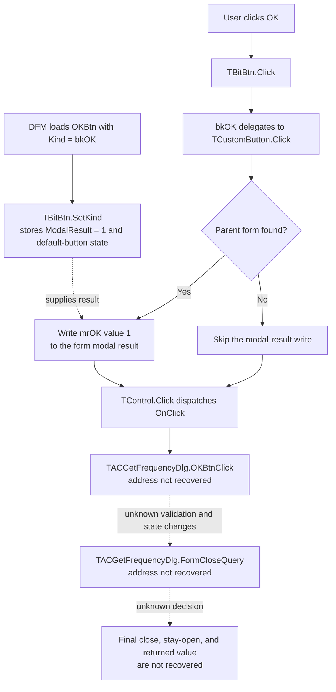

# OK

> Analysis status: The standard VCL acceptance path is recovered. The custom handler and final close decision remain unresolved.

## Control

| Property | Recovered value |
| --- | --- |
| Form | ACGetFrequencyDlg |
| Form caption | Frequency |
| Component path | ACGetFrequencyDlg.OKBtn |
| Control class | TBitBtn |
| Button kind | bkOK |
| Active control when the form opens | OKBtn |
| Handler name | OKBtnClick |
| Handler address | Not recovered |
| Graph node | `resource:dfm:ACGetFrequencyDlg/ACGetFrequencyDlg.OKBtn` |
| Handler node | `concept:dfm-handler:TACGetFrequencyDlg/OKBtnClick` |
| Graph layer | tina.exe |

## What happens when clicked

The recovered VCL path proves that this button requests an OK result before it dispatches the custom click handler:

1. The DFM loader applies `Kind = bkOK` to the `TBitBtn`. The recovered `TBitBtn.SetKind` path maps kind index 1 to modal result 1, the Delphi `mrOK` value. It also applies the standard OK caption, glyph, and default-button state.
2. `TBitBtn.Click` treats `bkOK` as a normal button kind and delegates to the inherited `TCustomButton.Click` path. Only `bkHelp` and `bkClose` use special branches in this method.
3. The inherited click path looks for the parent form. If it finds one, it copies the button's modal result 1 to the form's modal-result field.
4. The same path then dispatches the button's `OnClick` event. The DFM names that event method `TACGetFrequencyDlg.OKBtnClick`.

The modal-result write is before the custom `OnClick` call in the recovered VCL source. Therefore, the custom handler can still validate data, change state, change the modal result, or let a later close query reject closure. Its address and body are not present in the recovered image, so none of these custom actions can be claimed.

If the button has no parent form, the inherited path skips the modal-result write but still dispatches the click event. The DFM structure places this button directly on `ACGetFrequencyDlg`, so that fallback is a framework behavior, not the expected resource layout.

## Frequency-entry context

The form resource provides these direct facts:

- It is a centered dialog with the caption **Frequency**.
- `FreqLabel` says **Frequency** and identifies `FreqEdit` as its focus control.
- `Unit1` says **[Hz]**.
- `FreqEdit` is a `TFloatEdit` with `Engineering` format and a maximum length of 15 characters.
- `OKBtn`, `CancelBtn`, and `HelpBtn` use the built-in kinds `bkOK`, `bkCancel`, and `bkHelp`.
- `FreqEdit.OnError`, `FormCreate`, `FormCloseQuery`, and `OKBtn.OnClick` all name custom methods, but none has a recovered code address.

This context establishes that the dialog presents a frequency in hertz. It does not prove that `OKBtnClick` reads the editor, which numeric range it accepts, where it stores a value, or which error it shows.

## Acceptance flow

## Recovered VCL call path

- [`FUN_0082bc30`](../../../DecompiledSources/Tina16/functions/000000000082BC30__FUN_0082bc30.c) is the recovered `TBitBtn.SetKind` path. For a noncustom kind, it selects standard text, modal result, glyph, and default or cancel state. Its modal-result table contains value 1 at the `bkOK` index.
- [`FUN_0082b0e0`](../../../DecompiledSources/Tina16/functions/000000000082B0E0__FUN_0082b0e0.c) is the recovered `TBitBtn.Click` override. It delegates `bkOK` to the inherited button click path.
- [`FUN_00687f30`](../../../DecompiledSources/Tina16/functions/0000000000687F30__FUN_00687f30.c) resolves the parent form, copies the button modal result at offset `0x4f0` to form offset `0x508`, and then calls the common click dispatcher.
- [`FUN_00650840`](../../../DecompiledSources/Tina16/functions/0000000000650840__FUN_00650840.c) invokes an assigned click event or its action-link fallback.
- [Recovered DFM evidence](../../../DecompiledSources/Tina16/resources/dfm/ui-evidence.json) supplies the form, controls, labels, kinds, and unresolved event names.

## Custom-handler gap

The graph has one `triggers` edge from `OKBtn` to the unresolved handler concept. It has no function node, call edge, or source file for `OKBtnClick`. The form resource has containment and event edges only; no recovered function edge identifies a constructor, `ShowModal` caller, or result consumer.

A read-only search of the complete captured process dump found `TACGetFrequencyDlg` only in this DFM stream. It found no second class-name instance for a VMT. Without that VMT and its published method table, the handler name cannot be mapped to an address. This also prevents a field-offset map for the form class.

## Inputs, outputs, and limits

| Question | Proven result |
| --- | --- |
| Immediate framework input | A click on the `bkOK` button. |
| Immediate framework state change | Parent form modal result is set to 1 when a parent form is found. |
| Custom handler input | The VCL dispatcher passes the button as `Sender`; other inputs are unknown. |
| Frequency parsing or range check | Unknown because `OKBtnClick` and `EditFloatError` are unresolved. |
| Output value or destination | Unknown; no caller or result consumer is recovered. |
| Final modal result | The VCL path requests `mrOK`, but custom code and `FormCloseQuery` can affect final closure. |
| Cancel or no-op path | No custom branch is recovered. The VCL no-parent fallback skips only the modal-result write. |
| Error behavior | No handler-level message, exception path, or recovery rule can be assigned. |

## Analysis limits

- The standard `bkOK` path proves an OK acceptance request. It does not prove that the dialog finally closes.
- The labels and editor format prove the displayed input context. They do not prove the custom validation rule or output contract.
- Further custom-handler analysis needs the binary module that owns `TACGetFrequencyDlg`, or another address-backed mapping for its VMT and published methods.
