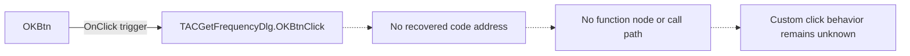

# OKBtn

> Analysis status: Blocked by missing handler address and class RTTI.

## Control

| Property | Recovered value |
| --- | --- |
| Form | ACGetFrequencyDlg |
| Component path | ACGetFrequencyDlg.OKBtn |
| Control class | TBitBtn |
| Caption | Not present in the recovered resource. |
| Hint | Not present in the recovered resource. |
| Text | Not present in the recovered resource. |
| Handler name | OKBtnClick |
| Handler address | Not present in the recovered resource. |
| Graph node | `resource:dfm:ACGetFrequencyDlg/ACGetFrequencyDlg.OKBtn` |
| Handler node | `concept:dfm-handler:TACGetFrequencyDlg/OKBtnClick` |
| Graph layer | tina.exe |

## What happens when clicked

Pending individual analysis. An agent must read the recovered handler source and its relevant callees before it replaces this text.

The graph proves that this control triggers the Delphi method name
`TACGetFrequencyDlg.OKBtnClick`. It does not identify the method address. No
recovered function, direct call, state change, result, error path, or no-op path
can be assigned to this handler.

## Click flow

## Handler evidence

- Source: [DecompiledSources/Tina16/resources/dfm/ui-evidence.json](../../../DecompiledSources/Tina16/resources/dfm/ui-evidence.json)
- Recovered role: Not present in the recovered resource.
- Current graph summary: Unresolved Delphi event handler TACGetFrequencyDlg.OKBtnClick, referenced by 1 UI event.
- Current graph behavior: Not present in the recovered resource.
- Current graph evidence: Not present in the recovered resource.
- Complexity: simple
- Distinct outgoing calls: Not present in the recovered resource.
- Graph connection: One `triggers` edge connects the control resource node to
  the unresolved handler concept.
- RTTI result: The rebuilt image parser does not find a
  `TACGetFrequencyDlg` class entry. It therefore cannot inspect a published
  method table for `OKBtnClick`.
- Form-level result: `FormCloseQuery`, `FormCreate`, `EditFloatError`, and
  `OKBtnClick` all have no recovered address on this form.

## Direct calls

- No direct call edge is present in the recovered graph.
- No function node is linked to the handler concept. The recovered C source
  therefore has no handler entry point that can be reviewed safely.

## Resource evidence

- Kind: bkOK
- Modal result: Not present in the recovered resource.
- Checked state: Not present in the recovered resource.
- List items: Not present in the recovered resource.
- Image reference: Not present in the recovered resource.
- Extracted glyph: None.
- The `bkOK` value is direct resource evidence for the button kind. It does not
  prove what the custom `OKBtnClick` method validates, changes, or returns.

## Nearby label candidates

Nearby labels are layout candidates only. They are not proof of behavior.

- Rank 1: &Frequency at distance 41.
- Rank 2: [Hz] at distance 220.

## Analysis limits

- Do not infer behavior from the control class, caption, hint, glyph, or nearby label alone.
- Do not replace the pending status until the handler source and relevant call path provide enough evidence.
- The rebuilt image contains the `ACGetFrequencyDlg` DFM stream, but its parsed
  Delphi class set does not contain `TACGetFrequencyDlg`.
- The frequency editor and `[Hz]` label show the dialog input. They do not prove
  that this handler reads the value or which limits it applies.
- Inputs other than the event sender are unknown. Decisions, state changes,
  outputs, validation errors, modal-close behavior, and no-op behavior are also
  unknown.
- Further analysis needs the binary module that contains the
  `TACGetFrequencyDlg` VMT and published method table, or another address-backed
  mapping from `OKBtnClick` to recovered code.
