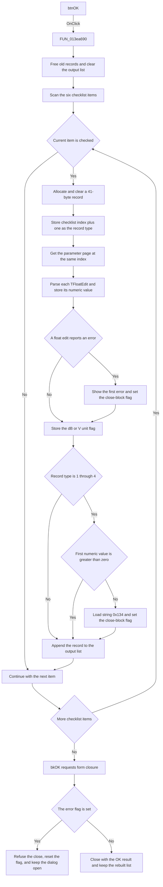

# btnOK

> Analysis status: Source reviewed. The behavior is supported by the recovered
> handler, the form controls, the record-loading path, and the close-query path.

## Control

| Property | Recovered value |
| --- | --- |
| Form | ACGoalFunctionsDlg |
| Component path | ACGoalFunctionsDlg.btnOK |
| Control class | TBitBtn |
| Caption | Not present in the recovered resource. |
| Hint | Not present in the recovered resource. |
| Text | Not present in the recovered resource. |
| Handler name | btnOKClick |
| Handler address | 013ea690 |
| Graph node | `resource:dfm:ACGoalFunctionsDlg/ACGoalFunctionsDlg.btnOK` |
| Handler node | `function:013ea690` |
| Graph layer | UI |

## What happens when clicked

`FUN_013ea690` replaces the dialog's output list with records made from the
currently checked AC goal functions. The list is supplied by the caller when it
creates this dialog. The handler does this work before the built-in `bkOK`
button closes the form.

The inputs are:

- the six checked states in `clbACGoalFuncs`;
- the `TFloatEdit` values on the parameter page for each checked goal;
- the `dB` or `V` radio-button choice on that page; and
- the existing output-record list at form offset `0x8B8`.

The checklist and parameter pages use this common order:

| Record type | Checklist item and page | Numeric inputs from the resource |
| ---: | --- | --- |
| 1 | Center Frequency | Target center frequency, cut-off level, tolerance |
| 2 | Low Pass | Target cut-off frequency, cut-off level, tolerance |
| 3 | Band Pass | Target bandwidth, cut-off level, tolerance |
| 4 | High Pass | Target cut-off frequency, cut-off level, tolerance |
| 5 | Maximum | Target, tolerance |
| 6 | Minimum | Target, tolerance |

The handler first frees every old record and clears the output list. It then
scans all checklist items. It skips an unchecked item. For each checked item,
it allocates a 41-byte packed record and sets its first byte to the one-based
record type shown above. It clears the remaining 40 bytes, which provide five
eight-byte value slots.

The handler gets the parameter page with the same zero-based index as the
checklist item. It scans the page's child controls. Each `TFloatEdit` value is
parsed and validated by `FUN_00b90090`, then stored in the next record slot. The
handler also finds the first radio button and stores a numeric unit flag: zero
when that first button is checked, or one when it is not checked. On all six
pages, the resource shows that the first radio button is `dB` and the second is
`V`. The handler then appends the new record to the output list.

There is one additional value rule. Record types 1 through 4 are the four
frequency-based goals. Their first numeric value must be greater than zero. If
it is zero or negative, the handler loads localized string resource `0x134`
and passes it to `FUN_013ea300`. The exact text of resource `0x134` is not
recovered in the graph.

`FUN_013ea300` shows only the first error message for an acceptance attempt and
sets an error flag at form offset `0x8C8`. The `TFloatEdit.OnError` handler uses
the same path for edit-specific validation errors. When the `bkOK` action then
requests form closure, `FUN_013eaab0` refuses the close if the error flag is
set. It resets the flag so that the user can correct the values and try again.
The records made during the failed attempt are not rolled back. A later click
frees and rebuilds them.

If validation succeeds, the form can close with the OK modal result. The caller
keeps the rebuilt output list and applies the accepted AC-goal configuration.
Unchecked goal types do not produce records. If the handler is invoked with no
checked item, it clears the output list and adds nothing. Normal UI use prevents
this path because `clbACGoalFuncsClick` disables `btnOK` when no item is checked.

The handler has no explicit recovery for an allocation failure. It also assumes
that each parameter page has the expected radio-button controls. These are
standard runtime and recovered-resource invariants, not user choices.

## Click flow

## Handler evidence

- Source: [DecompiledSources/Tina16/functions/00000000013EA690__FUN_013ea690.c](../../../DecompiledSources/Tina16/functions/00000000013EA690__FUN_013ea690.c)
- Recovered role: AC goal-function record rebuild and acceptance validation handler.
- Current graph summary: Handles 1 Delphi UI event: ACGoalFunctionsDlg.btnOK.OnClick.
- Current graph behavior: The checked-in graph does not yet contain a curated behavior description for this function.
- Current graph evidence: The handler is in the `UI` layer. Its source and 15 direct call edges cover list replacement, checked-state reads, page-control traversal, numeric parsing, validation-message lookup, and error-state handling.
- Complexity: complex
- Distinct outgoing calls: 15

The related form methods confirm the data flow:

- `FUN_013ea240` stores the caller-supplied output list at form offset `0x8B8`.
- `FUN_013ea400` reads records from that list and restores their checklist,
  numeric-edit, and radio-button values when the form is created.
- `FUN_013ea360` enables `btnOK` only when at least one checklist item is
  checked.
- `FUN_013eaa90`, the common `TFloatEdit.OnError` handler, forwards its edit
  error text to `FUN_013ea300`.
- `FUN_013eaab0`, the form's `OnCloseQuery` handler, blocks one close attempt
  when the error flag is set.
- `FUN_013ee620`, the caller's AC Goal Functions button handler, passes its
  list to this dialog and applies the accepted result only when the modal result
  is OK.

## Direct calls

- `function:004095c0` — allocates each 41-byte output record and raises the
  Delphi memory error path if allocation fails.
- `function:004095f0` — frees each previous output record.
- `function:0040d200` — clears the five value slots in a new record.
- `function:004113d0` — tests whether a page child has the requested Delphi
  class.
- `function:00414480` — clears the temporary localized Unicode string.
- `function:004ae7e0` — appends a new record pointer to the output list.
- `function:004aeac0` — gets an existing record pointer from the output list.
- `function:00654bc0` — gets one child control from a parameter page.
- `function:00654c00` — gets the combined child-control count for a page.
- `function:006d7610` — gets the parameter page at the checklist item's index.
- `function:00821920` — reads one checklist item's checked state.
- `function:00b89270` — gets the application string-resource manager.
- `function:00b8e520` — loads localized validation string `0x134`.
- `function:00b90090` — parses and validates one `TFloatEdit` value.
- `function:013ea300` — shows only the first error and sets the form's
  close-block flag.

## Resource evidence

- Kind: `bkOK`
- Modal result: Not present as an explicit property. The built-in `bkOK` kind
  supplies the normal OK action.
- Checked state: Not present in the recovered resource.
- List items: Not present on this button. `clbACGoalFuncs` supplies the six goal
  names used by the handler.
- Image reference: Not present in the recovered resource.
- Extracted glyph: None.

## Nearby label candidates

Nearby labels are layout candidates only. They are not proof of behavior.

- No same-parent label candidate is available.

## Analysis limits

- The button has no recovered caption, hint, text, image, or glyph. Its
  `bkOK` kind explains its standard visual role, while the handler and
  close-query sources prove the application behavior.
- The record's original Delphi type name and field names are not recovered.
  The 41-byte size, one-byte type, five value slots, and round-trip use are
  proven by the save and form-create paths.
- The exact text of localized string resource `0x134` is not available in the
  graph. The instruction-level call setup proves the resource ID and the
  handler proves that it is used for the non-positive first-value error.
- The recovered source proves that the first radio button produces flag zero
  and the other choice produces flag one. The `dB` and `V` meaning comes from
  the radio-button captions on every parameter page.
