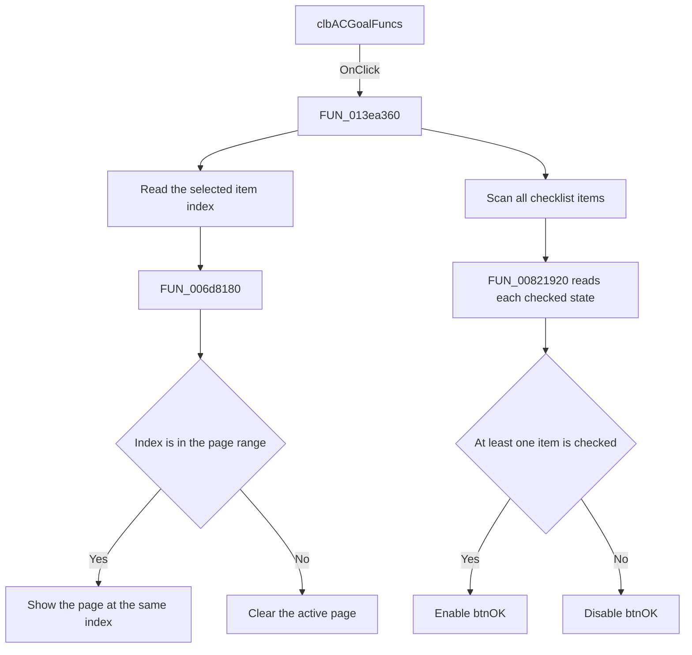

# clbACGoalFuncs

> Analysis status: Source reviewed. The click behavior is supported by the
> recovered handler, its two direct callees, and the form resource.

## Control

| Property | Recovered value |
| --- | --- |
| Form | ACGoalFunctionsDlg |
| Component path | ACGoalFunctionsDlg.clbACGoalFuncs |
| Control class | TCheckListBox |
| Caption | Not present in the recovered resource. |
| Hint | Not present in the recovered resource. |
| Text | Not present in the recovered resource. |
| Handler name | clbACGoalFuncsClick |
| Handler address | 013ea360 |
| Graph node | `resource:dfm:ACGoalFunctionsDlg/ACGoalFunctionsDlg.clbACGoalFuncs` |
| Handler node | `function:013ea360` |
| Graph layer | UI |

## What happens when clicked

The click handler has two separate effects:

1. It reads the selected checklist row. It gives this index to
   `FUN_006d8180`, which selects the page with the same index in
   `pcACGoalFuncPars`. The checklist and page control contain the same six
   entries in the same order:

   | Index | Checklist item | Parameter page |
   | ---: | --- | --- |
   | 0 | Center Frequency | `tsCenterFreq` |
   | 1 | Low Pass | `tsLowPass` |
   | 2 | Band Pass | `tsBandPass` |
   | 3 | High Pass | `tsHighPass` |
   | 4 | Maximum | `tsMax` |
   | 5 | Minimum | `tsMin` |

2. It scans all checklist items with `FUN_00821920`. If at least one item is
   checked, it enables `btnOK`. If no item is checked, it disables `btnOK`.

The selected row and the checked rows have different purposes. The selected
row controls which parameter page is visible. The checked rows control whether
the dialog has at least one goal function that can be accepted. Thus, an
unchecked selected row can still show its parameter page. If the user unchecks
the last checked row, the same click disables the OK button.

The recovered handler does not change a check state. `TCheckListBox` owns that
control behavior. The handler reads the current states after the click reaches
the event method. It also does not save goal-function settings. That work is
outside this handler.

If the selected index is outside the page range, `FUN_006d8180` clears the
active page. The checked-item scan still runs and still updates `btnOK`. The
scan uses valid indexes from zero to the recovered item count, so it has no
separate invalid-item path. The handler does not show an error message.

## Click flow

## Handler evidence

- Source: [DecompiledSources/Tina16/functions/00000000013EA360__FUN_013ea360.c](../../../DecompiledSources/Tina16/functions/00000000013EA360__FUN_013ea360.c)
- Recovered role: Checklist selection and dialog-validity coordinator for AC goal functions.
- Current graph summary: Handles 1 Delphi UI event: ACGoalFunctionsDlg.clbACGoalFuncs.OnClick.
- Current graph behavior: The checked-in graph does not yet contain a curated behavior description for this function.
- Current graph evidence: The handler is in the `UI` layer. Its only direct call edges go to `FUN_006d8180` and `FUN_00821920`.
- Complexity: moderate
- Distinct outgoing calls: 2

The recovered form field use gives the downstream control mapping:

- `param_1 + 0x6C8` is `clbACGoalFuncs`. The handler reads its selected index,
  item count, and checked states.
- `param_1 + 0x6D0` is `pcACGoalFuncPars`. The handler selects one of its six
  pages through `FUN_006d8180`.
- `param_1 + 0x6B0` is `btnOK`. The virtual setter at offset `0x128` receives
  true only when the checked-item scan finds an item.

`FUN_013ea400`, the form-create handler, also calls `FUN_013ea360` after it
restores the initial checklist selection and checked states. This reuse confirms
that `FUN_013ea360` synchronizes the parameter page and OK-button state from
the checklist. It is not only a mouse-specific operation.

## Direct calls

- `function:006d8180` — [FUN_006d8180](../../../DecompiledSources/Tina16/functions/00000000006D8180__FUN_006d8180.c)
  validates the selected index against the page count. For a valid index, it
  gets that page and makes it active. For an invalid index, it clears the active
  page.
- `function:00821920` — [FUN_00821920](../../../DecompiledSources/Tina16/functions/0000000000821920__FUN_00821920.c)
  reads one checklist item's stored check state. It returns false when no state
  object exists. Otherwise, it returns true only for the recovered checked
  state value.

## Resource evidence

- Kind: Not present in the recovered resource.
- Modal result: Not present in the recovered resource.
- Checked state: Not present in the recovered resource.
- List items: ("Center Frequency", "Low Pass", "Band Pass", "High Pass", "Maximum", "Minimum")
- Image reference: Not present in the recovered resource.
- Extracted glyph: None.

## Nearby label candidates

Nearby labels are layout candidates only. They are not proof of behavior.

- No same-parent label candidate is available.

## Analysis limits

- The resource has no caption, hint, glyph, or nearby label for this checklist.
  The item text defines the six choices, but the handler and page-control data
  flow prove the behavior.
- The decompilation does not show the internal VCL sequence that changes a
  checkbox before it calls `OnClick`. It only proves that this handler reads the
  current checked states.
- This handler does not validate or store the parameter values on the selected
  page. It only selects the page and sets whether `btnOK` is enabled.
