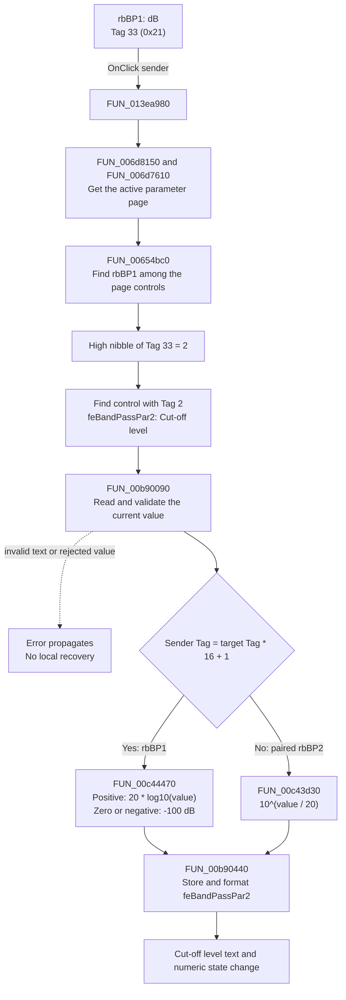

# dB

> Analysis status: Source reviewed. The click behavior is supported by the
> recovered handler, its conversion callees, and the embedded form properties.

## Control

| Property | Recovered value |
| --- | --- |
| Form | ACGoalFunctionsDlg |
| Component path | ACGoalFunctionsDlg.pcACGoalFuncPars.tsBandPass.rbBP1 |
| Control class | TRadioButton |
| Caption | dB |
| Hint | Not present in the recovered resource. |
| Text | Not present in the recovered resource. |
| Handler name | rbClick |
| Handler address | 013ea980 |
| Graph node | `resource:dfm:ACGoalFunctionsDlg/ACGoalFunctionsDlg.pcACGoalFuncPars.tsBandPass.rbBP1` |
| Handler node | `function:013ea980` |
| Graph layer | UI |

## What happens when clicked

This radio button changes the Band Pass **Cut-off level** edit from a linear
voltage value to dB. The shared handler uses component tags, not captions, to
find the correct edit and conversion:

1. `FUN_013ea980` gets the active page from `pcACGoalFuncPars`. It enumerates
   the controls on that page until it finds the event sender, `rbBP1`.
2. `rbBP1` has Tag 33 (`0x21`). The handler takes the high nibble, which gives
   target Tag 2. On the Band Pass page, Tag 2 belongs to
   `feBandPassPar2`, the edit beside the **Cut-off level** label.
3. The handler compares the complete sender tag with
   `target tag * 16 + 1`. Tag 33 matches this expression, so `rbBP1` selects
   the dB branch. The paired `rbBP2` control has Tag 34 (`0x22`) and selects
   the inverse V branch.
4. `FUN_00b90090` reads and validates the current numeric value from
   `feBandPassPar2`. For a positive value, `FUN_00c44470` calculates
   `20 * log10(value)`. For zero or a negative value, it returns `-100` dB.
5. `FUN_00b90440` stores the converted value in `feBandPassPar2` and rewrites
   its displayed text with the edit's numeric format.

The handler does not set either radio button's checked state. It receives the
sender after the control click has selected it. It also does not save the goal
function, close the dialog, or update another model object. Its proven output
is the numeric state and text of `feBandPassPar2`.

There is no no-op branch. For a valid click, the handler always reads,
converts, and formats the target edit. The numeric reader can raise an error if
the edit text cannot be accepted or if its validation callback rejects the
value; this handler has no local recovery. The two control-search loops also
assume the sender and target tag exist on the active page. Invalid form wiring
is not handled as a no-op.

## Click flow

## Handler evidence

- Source: [DecompiledSources/Tina16/functions/00000000013EA980__FUN_013ea980.c](../../../DecompiledSources/Tina16/functions/00000000013EA980__FUN_013ea980.c)
- Recovered role: Shared dB/V converter for tagged AC goal-function parameter edits.
- Current graph summary: Handles 12 Delphi UI events: ACGoalFunctionsDlg.pcACGoalFuncPars.tsCenterFreq.rbCF1.OnClick, ACGoalFunctionsDlg.pcACGoalFuncPars.tsCenterFreq.rbCF2.OnClick, ACGoalFunctionsDlg.pcACGoalFuncPars.tsLowPass.rbLP1.OnClick.
- Current graph behavior: The checked-in graph does not yet contain a curated
  behavior description for this function.
- Current graph evidence: The `UI`-layer handler is bound to six dB/V radio
  pairs. Its direct call edges contain the active-page, child-control,
  float-edit, and conversion functions shown below.
- Complexity: complex
- Distinct outgoing calls: 7

The embedded DFM properties give the exact Band Pass mapping:

| Component | Meaning | Tag |
| --- | --- | ---: |
| `feBandPassPar1` | Target bandwidth | 1 |
| `feBandPassPar2` | Cut-off level | 2 |
| `feBandPassPar3` | Tolerance | 3 |
| `rbBP1` | dB selector | 33 (`0x21`) |
| `rbBP2` | V selector | 34 (`0x22`) |

The same encoding appears on the Center Frequency, Low Pass, and High Pass
pages. Their second edits have Tag 2, their dB controls have Tag 33, and their
V controls have Tag 34. The Maximum and Minimum pages use Tag 1 edits with
radio Tags 17 and 18. This repeated mapping confirms that the high nibble
selects the edit and the low nibble selects the conversion direction.

## Direct calls

- `function:006d8150` — [FUN_006d8150](../../../DecompiledSources/Tina16/functions/00000000006D8150__FUN_006d8150.c)
  returns the active page index, or `-1` when the page control has no active
  page.
- `function:006d7610` — [FUN_006d7610](../../../DecompiledSources/Tina16/functions/00000000006D7610__FUN_006d7610.c)
  gets the active page object by index.
- `function:00654bc0` — [FUN_00654bc0](../../../DecompiledSources/Tina16/functions/0000000000654BC0__FUN_00654bc0.c)
  gets one child control by index. The handler uses it first to find the sender
  and then to find the child whose Tag matches the target tag.
- `function:00b90090` — [FUN_00b90090](../../../DecompiledSources/Tina16/functions/0000000000B90090__FUN_00b90090.c)
  parses and validates the float edit's text, updates its cached numeric value,
  and returns that value. It raises when the parsed value is outside its broad
  supported range or when the registered validation callback rejects it.
- `function:00c44470` — [FUN_00c44470](../../../DecompiledSources/Tina16/functions/0000000000C44470__FUN_00c44470.c)
  is the branch used by `rbBP1`. It returns `20 * log10(value)` for a positive
  value and the supplied `-100` fallback otherwise.
- `function:00c43d30` — [FUN_00c43d30](../../../DecompiledSources/Tina16/functions/0000000000C43D30__FUN_00c43d30.c)
  is the inverse branch used by the paired V radio. It calculates
  `10^(value / 20)`.
- `function:00b90440` — [FUN_00b90440](../../../DecompiledSources/Tina16/functions/0000000000B90440__FUN_00b90440.c)
  stores the converted double and writes its formatted text back to the edit.

## Resource evidence

- Kind: Not present in the recovered resource.
- Modal result: Not present in the recovered resource.
- Checked state: true
- Component Tag: 33 (`0x21`).
- Paired V control: `rbBP2`, Tag 34 (`0x22`).
- Target edit: `feBandPassPar2`, Tag 2, initial text `3`.
- List items: Not present in the recovered resource.
- Image reference: Not present in the recovered resource.
- Extracted glyph: None.

## Nearby label candidates

Nearby labels are layout candidates only. They are not proof of behavior.

- Rank 1: [Hz] at distance 28.
- Rank 2: Tol. at distance 82.
- Rank 3: [%] at distance 164.
- Rank 4: Cut-off level at distance 188.
- Rank 5: Target bandwidth at distance 212.

## Analysis limits

- The nearby `[Hz]` label is closer to `rbBP1` than the Cut-off level label, so
  proximity alone gives the wrong association. The component-tag data flow is
  the evidence that maps this radio button to `feBandPassPar2`.
- The source proves the displayed conversion and its target edit. It does not
  show when the converted dialog value is copied into the final goal-function
  model.
- The source does not give a named unit reference for the logarithm. It proves
  `20 * log10(value)`, but it does not state a separate reference voltage.
