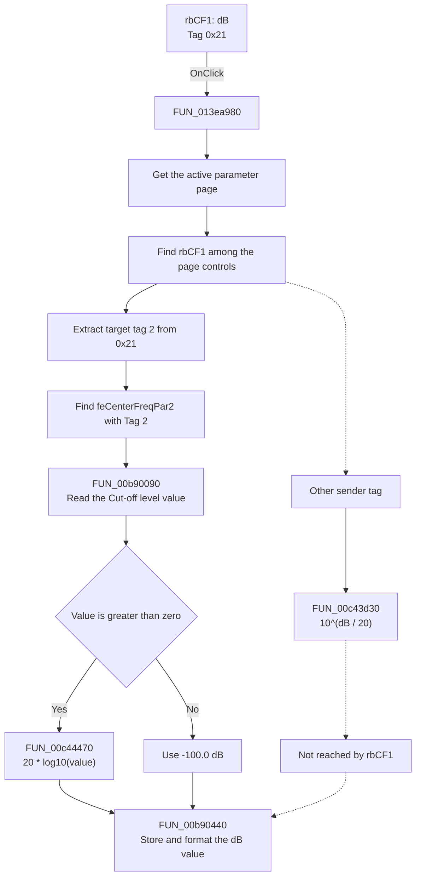

# dB

> Analysis status: Source reviewed. The behavior is supported by the recovered
> sender tag, the matching float-edit tag, the shared handler, and its numeric
> conversion callees.

## Control

| Property | Recovered value |
| --- | --- |
| Form | ACGoalFunctionsDlg |
| Component path | ACGoalFunctionsDlg.pcACGoalFuncPars.tsCenterFreq.rbCF1 |
| Control class | TRadioButton |
| Caption | dB |
| Delphi Tag | 33 (`0x21`) |
| Hint | Not present in the recovered resource. |
| Text | Not present in the recovered resource. |
| Handler name | rbClick |
| Handler address | 013ea980 |
| Graph node | `resource:dfm:ACGoalFunctionsDlg/ACGoalFunctionsDlg.pcACGoalFuncPars.tsCenterFreq.rbCF1` |
| Handler node | `function:013ea980` |
| Graph layer | UI |

## What happens when clicked

This radio button changes the **Cut-off level** field on the Center Frequency
page from a linear voltage value to a decibel value. It does not change the
target center frequency or its Hz unit.

`FUN_013ea980` is a shared handler for six pairs of `dB` and `V` radio buttons.
It uses each component's Delphi `Tag` value to select the correct float edit
and the conversion direction. For this control, the sequence is:

1. The handler gets the active page from `pcACGoalFuncPars` and scans its child
   controls until it finds the sender, `rbCF1`.
2. `rbCF1.Tag` is 33 (`0x21`). The handler extracts the high nibble:
   `(0x21 & 0xF0) >> 4 = 2`.
3. It scans the same page for a child whose full tag is `2`. The recovered form
   identifies this child as `feCenterFreqPar2`. This float edit has initial
   text `3` and is aligned with the **Cut-off level** label.
4. The low nibble of `rbCF1.Tag` is `1`. This selects the linear-to-dB branch.
   `FUN_00b90090` reads and validates the current numeric value from
   `feCenterFreqPar2`.
5. `FUN_00c44470` converts a positive value with `20 * log10(value)`. For zero
   or a negative value, it returns the supplied floor value of `-100.0 dB`.
6. `FUN_00b90440` stores the result in the same float-edit control and formats
   its visible text.

For example, a current value of `3 V` becomes approximately `9.54 dB`. The
handler does not save the converted value to the goal-function result object.
The OK handler reads the float edits later. It also does not set the radio
button's checked state; the VCL radio control does that before it invokes
`OnClick`.

The reverse function, `FUN_00c43d30`, calculates `10^(dB / 20)`. It is present
in the shared handler, but the fixed tag of `rbCF1` cannot select that branch.
The `V` radio button uses that branch.

There is no missing-control recovery. The two scans assume that the sender and
the matching tagged edit exist on the active page. This condition is true in
the recovered form. If the float edit contains invalid text or fails its
validation callback, `FUN_00b90090` raises an error; this handler does not catch
it.

## Click flow

## Handler evidence

- Source: [DecompiledSources/Tina16/functions/00000000013EA980__FUN_013ea980.c](../../../DecompiledSources/Tina16/functions/00000000013EA980__FUN_013ea980.c)
- Recovered role: Shared tagged radio-unit conversion handler for AC goal-function parameter edits.
- Current graph summary: Handles 12 Delphi UI events: ACGoalFunctionsDlg.pcACGoalFuncPars.tsCenterFreq.rbCF1.OnClick, ACGoalFunctionsDlg.pcACGoalFuncPars.tsCenterFreq.rbCF2.OnClick, ACGoalFunctionsDlg.pcACGoalFuncPars.tsLowPass.rbLP1.OnClick.
- Current graph behavior: The checked-in graph does not yet contain a curated behavior description for this function.
- Current graph evidence: The handler is in the `UI` layer. Its seven outgoing call edges match the page lookup, child-control lookup, float-edit access, and two numeric conversions described here.
- Complexity: complex
- Distinct outgoing calls: 7

The recovered form and handler establish the sender-specific mapping:

- `param_1 + 0x6D0` is `pcACGoalFuncPars`. The handler gets its active page.
- `param_2` is the event sender. For this article it is `rbCF1`, with tag
  `0x21`.
- The high nibble `2` maps to `feCenterFreqPar2.Tag = 2`.
- The low nibble `1` selects linear-to-dB conversion. The paired `rbCF2` has
  tag `0x22` and selects dB-to-linear conversion.

## Direct calls

- `function:00654bc0` — [FUN_00654bc0](../../../DecompiledSources/Tina16/functions/0000000000654BC0__FUN_00654bc0.c)
  gets a child control by index from a tab sheet's two internal child lists.
- `function:006d7610` — [FUN_006d7610](../../../DecompiledSources/Tina16/functions/00000000006D7610__FUN_006d7610.c)
  gets a page from the page control's page list.
- `function:006d8150` — [FUN_006d8150](../../../DecompiledSources/Tina16/functions/00000000006D8150__FUN_006d8150.c)
  gets the active page index, or `-1` when no page is active.
- `function:00b90090` — [FUN_00b90090](../../../DecompiledSources/Tina16/functions/0000000000B90090__FUN_00b90090.c)
  parses and validates the float-edit text, stores the parsed double in the
  control, and returns it.
- `function:00b90440` — [FUN_00b90440](../../../DecompiledSources/Tina16/functions/0000000000B90440__FUN_00b90440.c)
  stores a double in the float edit, formats it, and updates the control text.
- `function:00c43d30` — [FUN_00c43d30](../../../DecompiledSources/Tina16/functions/0000000000C43D30__FUN_00c43d30.c)
  performs the reverse `10^(dB / 20)` conversion for `V` radio senders. This
  call is not reached for `rbCF1`.
- `function:00c44470` — [FUN_00c44470](../../../DecompiledSources/Tina16/functions/0000000000C44470__FUN_00c44470.c)
  returns `20 * log10(value)` for a positive value. It returns the caller's
  fallback value, `-100.0`, for zero or a negative value.

## Resource evidence

- Kind: Not present in the recovered resource.
- Modal result: Not present in the recovered resource.
- Checked state: true
- Delphi tag: 33 (`0x21`).
- List items: Not present in the recovered resource.
- Image reference: Not present in the recovered resource.
- Extracted glyph: None.

## Nearby label candidates

Nearby labels are layout candidates only. They are not proof of behavior.

- Rank 1: [Hz] at distance 28.
- Rank 2: Tol. at distance 82.
- Rank 3: [%] at distance 164.
- The handler does not use label proximity. The recovered tag map selects
  `feCenterFreqPar2`, and the same form places that edit beside the
  **Cut-off level** label.

## Analysis limits

- The current graph does not retain the DFM `Tag` property. A read-only repeat
  of the pinned `undelphi` extraction recovered `rbCF1.Tag = 33` and
  `feCenterFreqPar2.Tag = 2` from the same verified runtime image.
- Ghidra did not recover the return types of some VCL lookup wrappers. Their
  use in this handler and the repeated form-create and OK-handler traversal
  establish that they enumerate pages and child controls.
- The handler updates the float-edit state and text. It does not prove when the
  dialog's result data is finally committed outside the later OK path.
