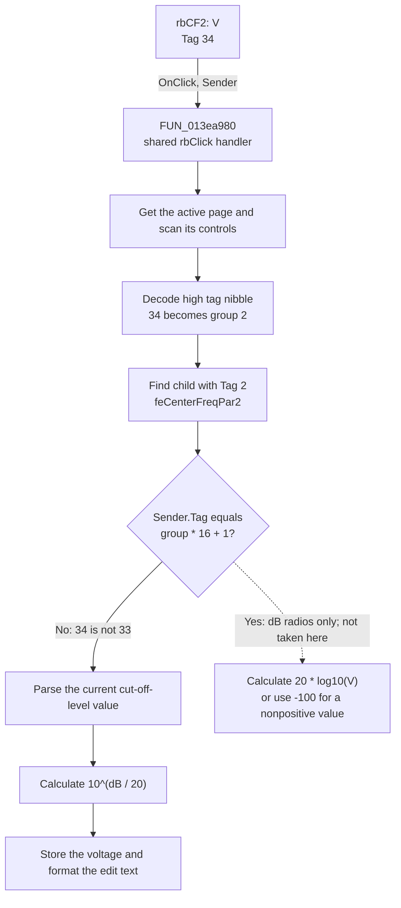

# V

> Analysis status: Source reviewed. The click converts the Center Frequency
> page's cut-off-level value from decibels to volts.

## Control

| Property | Recovered value |
| --- | --- |
| Form | ACGoalFunctionsDlg |
| Component path | ACGoalFunctionsDlg.pcACGoalFuncPars.tsCenterFreq.rbCF2 |
| Control class | TRadioButton |
| Caption | V |
| Component tag | 34 |
| Hint | Not present in the recovered resource. |
| Text | Not present in the recovered resource. |
| Handler name | rbClick |
| Handler address | 013ea980 |
| Graph node | `resource:dfm:ACGoalFunctionsDlg/ACGoalFunctionsDlg.pcACGoalFuncPars.tsCenterFreq.rbCF2` |
| Handler node | `function:013ea980` |
| Graph layer | UI |

## What happens when clicked

`rbCF2` selects volts as the unit for the **Cut-off level** value on the Center
Frequency page. It does not convert the target center-frequency value.

The radio button uses the shared `rbClick` handler. The handler uses component
tags, not captions, to identify the source and its related numeric edit:

1. It gets the active page from `pcACGoalFuncPars` and scans the page's child
   controls until it finds the sender object.
2. It reads `rbCF2.Tag`, which is `34` (`0x22`). The high nibble gives group
   number `2`.
3. It scans the same page for the child whose complete tag is `2`. This is
   `feCenterFreqPar2`, the edit next to the **Cut-off level** label.
4. It tests whether the sender tag is `group * 16 + 1`. For group `2`, that
   value is `33`. `rbCF2.Tag` is `34`, so this control takes the other branch.
5. It parses and validates the current edit value as a floating-point number.
   The selected branch calculates `10^(value / 20)`. This converts a decibel
   amplitude value to its linear voltage value.
6. It stores the converted number in the same edit control and formats the
   visible text.

The VCL changes the radio-button selection before it calls this handler. The
handler does not set the radio button again. Its observable output is the new
numeric text in `feCenterFreqPar2`.

The numeric parser can raise an error for invalid text, a value outside its
accepted range, or a failed edit-specific validator. `FUN_013ea980` does not
catch that error. The handler also has no fallback for a sender or target with
an unexpected tag. With the recovered DFM, both searches have valid matches.
After it finds those matches, there is no no-op branch: it parses, converts,
and formats the edit value.

## Click flow

## Handler evidence

- Source: [DecompiledSources/Tina16/functions/00000000013EA980__FUN_013ea980.c](../../../DecompiledSources/Tina16/functions/00000000013EA980__FUN_013ea980.c)
- Recovered role: Not present in the recovered resource.
- Current graph summary: Handles 12 Delphi UI events: ACGoalFunctionsDlg.pcACGoalFuncPars.tsCenterFreq.rbCF1.OnClick, ACGoalFunctionsDlg.pcACGoalFuncPars.tsCenterFreq.rbCF2.OnClick, ACGoalFunctionsDlg.pcACGoalFuncPars.tsLowPass.rbLP1.OnClick.
- Current graph behavior: Not present in the recovered resource.
- Current graph evidence: Not present in the recovered resource.
- Complexity: complex
- Distinct outgoing calls: 7
- Article finding: Shared radio-button unit converter. For `rbCF2`, it changes
  the cut-off-level edit from decibels to volts.

## Direct calls

- [`FUN_00654bc0`](../../../DecompiledSources/Tina16/functions/0000000000654BC0__FUN_00654bc0.c)
  gets a child control by index while the handler scans the active page.
- [`FUN_006d7610`](../../../DecompiledSources/Tina16/functions/00000000006D7610__FUN_006d7610.c)
  gets the page selected by the page index.
- [`FUN_006d8150`](../../../DecompiledSources/Tina16/functions/00000000006D8150__FUN_006d8150.c)
  gets the active page index.
- [`FUN_00b90090`](../../../DecompiledSources/Tina16/functions/0000000000B90090__FUN_00b90090.c)
  parses and validates the target edit's floating-point value.
- [`FUN_00b90440`](../../../DecompiledSources/Tina16/functions/0000000000B90440__FUN_00b90440.c)
  stores the converted value and formats the edit text.
- [`FUN_00c43d30`](../../../DecompiledSources/Tina16/functions/0000000000C43D30__FUN_00c43d30.c)
  calculates `10^(value / 20)`. This is the branch used by `rbCF2`.
- [`FUN_00c44470`](../../../DecompiledSources/Tina16/functions/0000000000C44470__FUN_00c44470.c)
  calculates `20 * log10(value)` for a positive value and returns `-100` for
  a nonpositive value. This is the opposite branch and is not used by `rbCF2`.

## Resource evidence

- Kind: Not present in the recovered resource.
- Modal result: Not present in the recovered resource.
- Checked state: Not present in the recovered resource.
- List items: Not present in the recovered resource.
- Image reference: Not present in the recovered resource.
- Extracted glyph: None.
- Targeted DFM property recovery gives `rbCF2.Tag = 34` and
  `feCenterFreqPar2.Tag = 2`.
- The sibling `rbCF1` control has caption `dB`, tag `33`, and recovered checked
  state `true`. This matches the handler's `group * 16 + 1` branch.
- `feCenterFreqPar2` is next to the direct **Cut-off level** label. Its
  recovered initial text is `3`.

## Nearby label candidates

Nearby labels are layout candidates only. They are not proof of behavior.

- Rank 1: [Hz] at distance 44.
- Rank 2: Tol. at distance 98.
- Rank 3: [%] at distance 180.

## Analysis limits

- The Delphi field names and the original names of the seven recovered helper
  functions are not available.
- The **Cut-off level** label supports the target field's meaning, but the tag
  match and handler data flow establish which edit is changed.
- The handler is shared by 12 dB and V radio buttons. This article describes
  only the proven `rbCF2` path.
