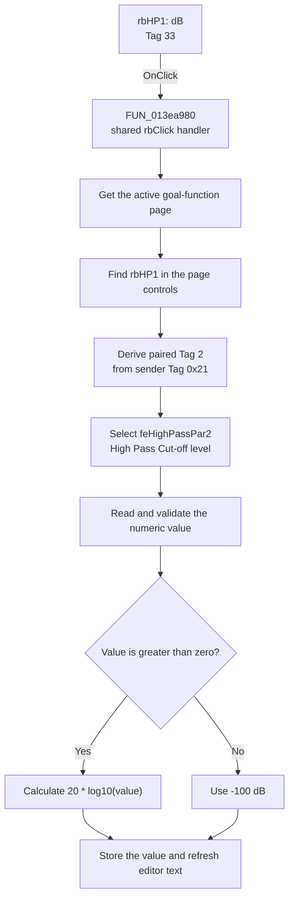

# dB

> Analysis status: Source, graph, and form evidence reviewed.

## Control

| Property | Recovered value |
| --- | --- |
| Form | ACGoalFunctionsDlg |
| Component path | ACGoalFunctionsDlg.pcACGoalFuncPars.tsHighPass.rbHP1 |
| Control class | TRadioButton |
| Caption | dB |
| Hint | Not present in the recovered resource. |
| Text | Not present in the recovered resource. |
| Handler name | rbClick |
| Handler address | 013ea980 |
| Graph node | `resource:dfm:ACGoalFunctionsDlg/ACGoalFunctionsDlg.pcACGoalFuncPars.tsHighPass.rbHP1` |
| Handler node | `function:013ea980` |
| Graph layer | UI |
| DFM Tag | 33 (`0x21`) |

## What happens when clicked

This radio button selects dB as the unit for the High Pass **Cut-off level** value. The handler is shared by 12 dB and V radio buttons. It uses the sender and the Delphi `Tag` properties to select the correct numeric editor.

For this sender, the handler does these operations:

1. It gets the active goal-function page.
2. It finds `rbHP1` in that page's child controls.
3. It calculates the paired-control Tag as `(33 & 0xF0) >> 4`, which gives `2`.
4. It finds `feHighPassPar2`, whose recovered DFM Tag is `2`. This editor contains the High Pass Cut-off level. Its initial resource text is `3`.
5. It reads and validates the editor's numeric value.
6. Because the sender Tag is `0x21`, it takes the dB branch. For a positive value, it calculates `20 * log10(value)`. For zero or a negative value, it uses `-100` dB.
7. It stores the converted value in the same float editor and updates the visible text.

The recovered handler does not write the radio button's checked state. The radio-control implementation owns that state change. This handler changes only the paired numeric editor in this path.

There is no explicit no-op branch. The float-edit reader can report its normal parse or validation error before conversion. The handler does not catch that error. A non-positive value is not an error in the conversion function; it produces the `-100` dB sentinel.

## Click flow

## Handler evidence

- Source: [DecompiledSources/Tina16/functions/00000000013EA980__FUN_013ea980.c](../../../DecompiledSources/Tina16/functions/00000000013EA980__FUN_013ea980.c)
- Recovered role: Shared dB and V unit-conversion handler for goal-function numeric editors.
- Current graph summary: Handles 12 Delphi UI events: ACGoalFunctionsDlg.pcACGoalFuncPars.tsCenterFreq.rbCF1.OnClick, ACGoalFunctionsDlg.pcACGoalFuncPars.tsCenterFreq.rbCF2.OnClick, ACGoalFunctionsDlg.pcACGoalFuncPars.tsLowPass.rbLP1.OnClick.
- Sender-specific branch: `rbHP1.Tag` is 33 (`0x21`). The handler pairs it with the component whose Tag is `2`, `feHighPassPar2`, and selects the dB branch because the low nibble is `1`.
- Conversion evidence: `FUN_00c44470` returns `20 * log10(value)` for a positive value and returns its `-100` fallback argument for other values.
- Output evidence: `FUN_00b90440` stores the converted double, formats it, and sets the editor text.
- Complexity: complex
- Distinct outgoing calls: 7

## Direct calls

- `function:006d8150` — Gets the selected page index.
- `function:006d7610` — Gets a page by index.
- `function:00654bc0` — Gets a child control by index.
- `function:00b90090` — Reads and validates a float-edit value.
- `function:00c44470` — Converts a positive linear value to dB, with a supplied fallback for other values. This is the branch used by `rbHP1`.
- `function:00b90440` — Stores the converted value and refreshes the formatted editor text.
- `function:00c43d30` — Converts dB to a linear value with `10^(value / 20)`. Only the alternate V radio branch uses this call.

## Resource evidence

- Kind: Not present in the recovered resource.
- Modal result: Not present in the recovered resource.
- Checked state: true
- Sender Tag: 33 (`0x21`).
- Paired editor: `feHighPassPar2`, Tag 2, initial text `3`.
- Field meaning: `Label17` identifies this row as `Cut-off level`.
- List items: Not present in the recovered resource.
- Image reference: Not present in the recovered resource.
- Extracted glyph: None.

## Nearby label candidates

Nearby labels are layout candidates only. They are not proof of behavior.

- Rank 1: [Hz] at distance 28.
- Rank 2: Tol. at distance 82.
- Rank 3: [%] at distance 164.

## Analysis limits

- The normal graph export does not include Delphi `Tag`. A temporary read-only extraction from the same DFM stream supplied the sender and editor Tag values.
- The article documents the `rbHP1` branch only. The same handler has different sender Tags and can select other pages, editors, or the V conversion branch.
- The nearby-label ranks do not identify the target editor. The handler's Tag match identifies it. The `Cut-off level` label and the editor position are supporting form evidence.
