# V

> Analysis status: Source reviewed. The `rbHP2` sender path is documented.

## Control

| Property | Recovered value |
| --- | --- |
| Form | ACGoalFunctionsDlg |
| Component path | ACGoalFunctionsDlg.pcACGoalFuncPars.tsHighPass.rbHP2 |
| Control class | TRadioButton |
| Caption | V |
| Hint | Not present in the recovered resource. |
| Text | Not present in the recovered resource. |
| Handler name | rbClick |
| Handler address | 013ea980 |
| Graph node | `resource:dfm:ACGoalFunctionsDlg/ACGoalFunctionsDlg.pcACGoalFuncPars.tsHighPass.rbHP2` |
| Handler node | `function:013ea980` |
| Graph layer | UI |

## What happens when clicked

`rbHP2` changes the High Pass cut-off level from a decibel display to a
voltage display. The handler is shared by 12 radio buttons, so it uses the
`Sender` object and DFM `Tag` values to select the correct input field and
conversion.

For this control, the recovered flow is:

1. The VCL selects `rbHP2` and calls `FUN_013ea980` with `rbHP2` as `Sender`.
2. The handler gets the active page from `pcACGoalFuncPars` and finds the
   sender in that page's component list.
3. `rbHP2` has DFM tag `34` (`0x22`). The handler extracts the upper nibble,
   which gives group `2`.
4. It finds the component on the same page whose tag is `2`. On the High Pass
   page, this is `feHighPassPar2`. The recovered labels identify this field as
   the cut-off level.
5. The low tag value selects the unit branch. The sibling `dB` radio has tag
   `33` (`0x21`). `rbHP2` has tag `34`, so the handler takes the voltage branch.
6. `FUN_00b90090` reads and validates the current numeric value in
   `feHighPassPar2`. `FUN_00c43d30` converts the decibel value with
   `10^(value / 20)`. `FUN_00b90440` stores the result and writes its formatted
   text back to the same edit control.

The click changes the radio selection and the displayed value in
`feHighPassPar2`. It does not submit the dialog, and it does not change the
cut-off frequency or tolerance fields.

There is no normal no-op branch for `rbHP2`. An invalid numeric value is
rejected by the float-edit reader, and this handler has no local exception
handler. The two component searches have no missing-item fallback. The
recovered DFM supplies both the sender and the tag-2 target during normal use.

## Click flow

```mermaid
flowchart LR
    control["rbHP2: V, tag 34"] -->|OnClick| handler["FUN_013ea980"]
    handler --> page["Get active goal-function page"]
    page --> sender["Find rbHP2 in the page components"]
    sender --> group["Extract group 2 from tag 34"]
    group --> target["Find tag 2: feHighPassPar2"]
    target --> read["Read and validate the current dB value"]
    read --> convert["Convert with 10^(value / 20)"]
    convert --> write["Store and format the voltage value"]
```

## Handler evidence

- Source: [DecompiledSources/Tina16/functions/00000000013EA980__FUN_013ea980.c](../../../DecompiledSources/Tina16/functions/00000000013EA980__FUN_013ea980.c)
- Recovered role: Shared decibel and voltage conversion handler for AC goal-function fields.
- Current graph summary: Handles 12 Delphi UI events: ACGoalFunctionsDlg.pcACGoalFuncPars.tsCenterFreq.rbCF1.OnClick, ACGoalFunctionsDlg.pcACGoalFuncPars.tsCenterFreq.rbCF2.OnClick, ACGoalFunctionsDlg.pcACGoalFuncPars.tsLowPass.rbLP1.OnClick.
- Sender-specific behavior: `rbHP2` selects `feHighPassPar2` by tags `34` and `2`, converts its current decibel value to `10^(value / 20)`, and writes the voltage value back to that field.
- Evidence: The handler masks and shifts `Sender.Tag`, finds a page component with the derived tag, and selects the conversion from the sender's low tag value. A direct DFM re-extraction recovered `rbHP2.Tag = 34`, `rbHP1.Tag = 33`, and `feHighPassPar2.Tag = 2`.
- Complexity: complex
- Distinct outgoing calls: 7

## Direct calls

- `function:006d8150` — gets the active page index.
- `function:006d7610` — gets that page from `pcACGoalFuncPars`.
- `function:00654bc0` — gets a child component from the page by index.
- `function:00b90090` — reads and validates the float-edit value.
- `function:00c43d30` — converts decibels to a linear value with
  `10^(value / 20)`. This is the branch used by `rbHP2`.
- `function:00b90440` — stores the converted value and updates the formatted
  control text.
- `function:00c44470` — converts a positive linear value to decibels with
  `20 * log10(value)`, with `-100` as the fallback. This sibling `dB` branch is
  not used by `rbHP2`.

## Resource evidence

- Kind: Not present in the recovered resource.
- Modal result: Not present in the recovered resource.
- Checked state: Not present in the recovered resource.
- DFM tag: `34` (`0x22`).
- Paired High Pass `dB` radio: `rbHP1`, tag `33` (`0x21`), initially checked.
- Converted field: `feHighPassPar2`, tag `2`, initial text `3`.
- Field context: High Pass page, `Cut-off level` label.
- List items: Not present in the recovered resource.
- Image reference: Not present in the recovered resource.
- Extracted glyph: None.

## Nearby label candidates

Nearby labels are layout candidates only. They are not proof of behavior.

- Rank 1: [Hz] at distance 44.
- Rank 2: Tol. at distance 98.
- Rank 3: [%] at distance 180.

## Analysis limits

- The graph does not yet store the DFM `Tag` properties. They were recovered by
  re-running the pinned DFM extractor with `Tag` included for this review.
- The decompiler loses some floating-point call arguments in the displayed C
  signatures. The called function bodies still establish the formulas
  `10^(x / 20)` and `20 * log10(x)`.
- This analysis covers the `rbHP2` sender path only. Other controls share the
  handler but can select a different page field and conversion branch.
