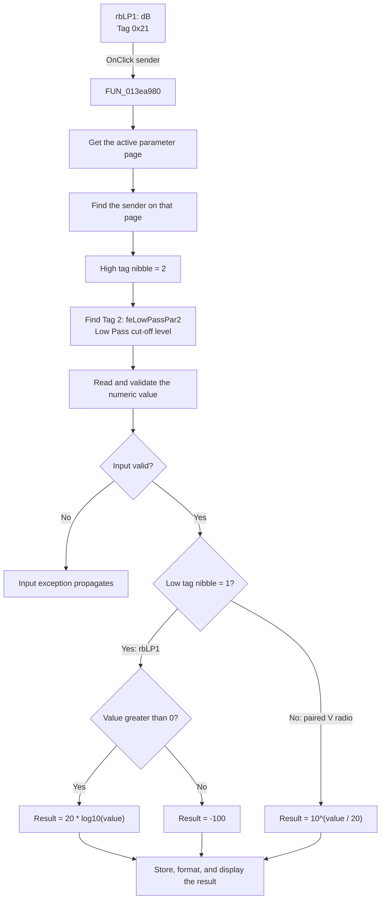

# dB

> Analysis status: Source reviewed with direct handler, numeric-helper, and Delphi `Tag` evidence.

## Control

| Property | Recovered value |
| --- | --- |
| Form | ACGoalFunctionsDlg |
| Component path | ACGoalFunctionsDlg.pcACGoalFuncPars.tsLowPass.rbLP1 |
| Control class | TRadioButton |
| Caption | dB |
| Hint | Not present in the recovered resource. |
| Text | Not present in the recovered resource. |
| Checked | `true` in the design-time resource. Form initialization can select the paired radio from loaded goal-function data. |
| Delphi `Tag` | `33` (`0x21`) |
| Handler name | rbClick |
| Handler address | 013ea980 |
| Graph node | `resource:dfm:ACGoalFunctionsDlg/ACGoalFunctionsDlg.pcACGoalFuncPars.tsLowPass.rbLP1` |
| Handler node | `function:013ea980` |
| Graph layer | UI |

## What happens when clicked

`FUN_013ea980` is a shared handler for six pairs of `dB` and `V` radio buttons. It uses the clicked control as the sender. For `rbLP1`, the recovered Delphi `Tag` is `33` (`0x21`). The handler uses this value as follows:

1. It gets the active page of `pcACGoalFuncPars` and scans that page for the sender. The Low Pass page contains `rbLP1`, so this establishes the page that owns the conversion controls.
2. It takes the high nibble of the sender tag. For `0x21`, this gives `2`.
3. It scans the active page for the component whose tag is `2`. The recovered resource identifies that component as `feLowPassPar2`. The nearby page label identifies this field as the Low Pass **Cut-off level**.
4. It reads the numeric value from `feLowPassPar2` through `FUN_00b90090`.
5. Because the low nibble of `rbLP1.Tag` is `1`, it uses the dB branch. For a positive input, `FUN_00c44470` calculates `20 * log10(value)`. For zero or a negative input, it returns the explicit fallback value `-100`.
6. `FUN_00b90440` stores the converted `double`, formats it, and updates the visible text in `feLowPassPar2`.

The handler treats the current Low Pass cut-off-level value as the paired `V` representation and converts it to dB. It does not test the previous radio selection. If this `OnClick` handler runs, it performs the conversion. It does not change the target cut-off frequency or the tolerance field.

The other sender branch is also clear from the shared handler. A paired radio whose low tag nibble is not `1`, such as `rbLP2.Tag = 34` (`0x22`), converts the same tagged editor in the opposite direction with `10^(value / 20)`.

`FUN_00b90090` parses and validates the edit text. Invalid text, a value outside its accepted range, or rejection by its optional validator raises the recovered input exception. `FUN_013ea980` does not catch that exception. If the converted number is equal to the edit's cached value, the setter keeps the cached number but still formats it and updates the control text. There is no separate no-op branch in this handler.

## Click flow

## Handler evidence

- Source: [DecompiledSources/Tina16/functions/00000000013EA980__FUN_013ea980.c](../../../DecompiledSources/Tina16/functions/00000000013EA980__FUN_013ea980.c)
- Recovered role: Shared dB and linear-value radio conversion handler.
- Current graph summary: Handles 12 Delphi UI events: ACGoalFunctionsDlg.pcACGoalFuncPars.tsCenterFreq.rbCF1.OnClick, ACGoalFunctionsDlg.pcACGoalFuncPars.tsCenterFreq.rbCF2.OnClick, ACGoalFunctionsDlg.pcACGoalFuncPars.tsLowPass.rbLP1.OnClick.
- Proven behavior for this sender: Converts `feLowPassPar2` from its linear `V` value to `20 * log10(value)` and writes the dB result back to the same edit.
- Evidence: `rbLP1.Tag = 0x21`, `feLowPassPar2.Tag = 2`, the sender-specific branch in `FUN_013ea980`, and the recovered logarithm and edit setter helpers.
- Complexity: complex
- Distinct outgoing calls: 7

## Direct calls

- `function:00654bc0` — Gets a component by index from the active page.
- `function:006d7610` — Gets a page from the page-control collection.
- `function:006d8150` — Gets the active page index.
- `function:00b90090` — Parses and validates a `TFloatEdit` value.
- `function:00b90440` — Stores, formats, and displays a `TFloatEdit` value.
- `function:00c43d30` — Converts dB to a linear value with `10^(value / 20)` for the paired radio branch.
- `function:00c44470` — Converts a positive linear value to `20 * log10(value)` and otherwise returns the supplied fallback.

## Resource evidence

- Kind: Not present in the recovered resource.
- Modal result: Not present in the recovered resource.
- Checked state: true
- Recovered sender tag: `33` (`0x21`).
- Recovered target edit tag: `feLowPassPar2.Tag = 2`.
- List items: Not present in the recovered resource.
- Image reference: Not present in the recovered resource.
- Extracted glyph: None.

## Nearby label candidates

Nearby labels are layout candidates only. They are not proof of behavior.

- Rank 1: [Hz] at distance 28.
- Rank 2: Tol. at distance 82.
- Rank 3: [%] at distance 164.

## Analysis limits

- The resource caption supports the unit name, but the behavior is established by the sender tag, target tag, handler branch, and numeric helper code.
- The recovered code does not state the physical reference that is used for the dB value. This article therefore documents the exact numeric formula and does not label it as dBV, dBu, or another reference-specific unit.
- The two component scans have no explicit termination condition in the decompiled handler. The valid DFM supplies both the sender and the matching tagged edit. Behavior for a malformed page without either component is not defined by the recovered code.
