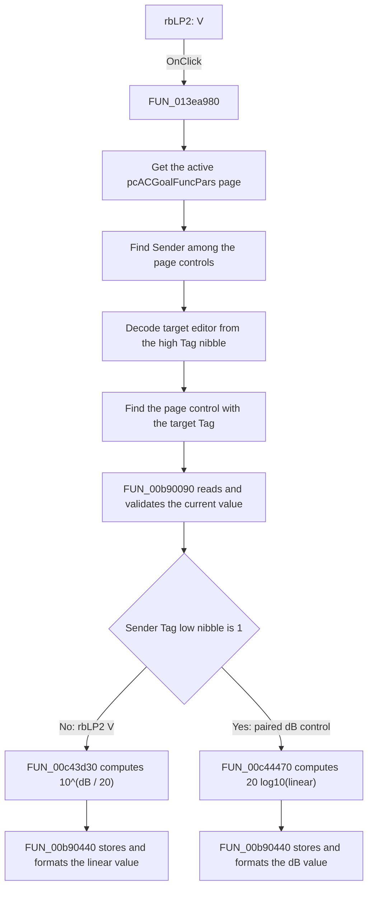

# V

> Analysis status: Source reviewed. The behavior is supported by the recovered
> shared handler, its conversion callees, the graph binding, and the Low Pass
> page resource.

## Control

| Property | Recovered value |
| --- | --- |
| Form | ACGoalFunctionsDlg |
| Component path | ACGoalFunctionsDlg.pcACGoalFuncPars.tsLowPass.rbLP2 |
| Control class | TRadioButton |
| Caption | V |
| Hint | Not present in the recovered resource. |
| Text | Not present in the recovered resource. |
| Handler name | rbClick |
| Handler address | 013ea980 |
| Graph node | `resource:dfm:ACGoalFunctionsDlg/ACGoalFunctionsDlg.pcACGoalFuncPars.tsLowPass.rbLP2` |
| Handler node | `function:013ea980` |
| Graph layer | UI |

## What happens when clicked

`rbLP2` changes the Low Pass cut-off level from its dB representation to its
linear V representation. The radio button does not have a private handler.
Twelve dB/V radio buttons on six parameter pages share `FUN_013ea980`.

The shared handler uses the event `Sender` and the active page to distinguish
the controls:

1. It gets the active page from `pcACGoalFuncPars`.
2. It scans the active page's child controls until it finds the same object as
   `Sender`.
3. It reads `Sender.Tag`. The high nibble identifies the numeric editor. The
   handler scans the same page again until it finds the child control whose
   complete `Tag` equals this decoded target value.
4. The low nibble selects the conversion direction. A value of `1` uses the
   linear-to-dB branch. The paired `*2` V controls, including `rbLP2`, use the
   other branch.
5. `FUN_00b90090` reads and validates the current numeric value from the target
   `TFloatEdit`.
6. `FUN_00c43d30` converts the dB value to a linear value:

   `linear value = 10^(dB value / 20)`

7. `FUN_00b90440` stores the converted double, formats it with the edit's
   numeric display settings, and writes the new text to the same editor.

On the Low Pass page, the dB/V pair is in the `Cut-off level` row beside
`feLowPassPar2`. This resource placement identifies `feLowPassPar2` as the
editor that the encoded tag selects. The extracted resource does not retain
the numeric tag values, so the exact tag number is not available.

The handler does not set the radio button's checked state. The VCL radio-button
control changes that state before it calls `OnClick`. The handler also does not
save the goal-function settings or start a filter calculation. It only converts
and rewrites the displayed editor value.

There is no explicit no-op branch. `FUN_00b90440` skips the cached-double
assignment when the converted value is already equal, but it still formats and
writes the text. `FUN_00b90090` can raise an error for a value outside its
accepted range or for a failed validation callback. `FUN_013ea980` does not
catch that error. Both control scans assume the sender and target tag exist on
the active page; the handler has no local fallback for malformed form state.

## Click flow

## Handler evidence

- Source: [DecompiledSources/Tina16/functions/00000000013EA980__FUN_013ea980.c](../../../DecompiledSources/Tina16/functions/00000000013EA980__FUN_013ea980.c)
- Recovered role: Shared dB/linear-unit converter for AC goal-function numeric editors.
- Current graph summary: The handler is bound to 12 radio-button `OnClick`
  events. These are the dB/V pairs on Center Frequency, Low Pass, Band Pass,
  High Pass, Maximum, and Minimum pages.
- Current graph behavior: The checked-in graph does not yet contain a curated
  behavior description for this function.
- Current graph evidence: The handler is in the `UI` layer. The graph connects
  `rbLP2.OnClick` to `FUN_013ea980` and records seven direct calls.
- Complexity: complex
- Distinct outgoing calls: 7

The recovered code uses `param_1 + 0x6D0` as `pcACGoalFuncPars`. This mapping is
also used by the dialog's checklist handler when it selects the active
parameter page. In `FUN_013ea980`, `param_2` is the event `Sender`. The two
loops compare child-control pointers and `Tag` values, so the handler does not
select behavior from the caption text.

## Direct calls

- `function:006d8150` — [FUN_006d8150](../../../DecompiledSources/Tina16/functions/00000000006D8150__FUN_006d8150.c)
  gets the active page index from `pcACGoalFuncPars`.
- `function:006d7610` — [FUN_006d7610](../../../DecompiledSources/Tina16/functions/00000000006D7610__FUN_006d7610.c)
  gets the active page object used for both child-control scans.
- `function:00654bc0` — [FUN_00654bc0](../../../DecompiledSources/Tina16/functions/0000000000654BC0__FUN_00654bc0.c)
  gets one child control by index from the active page.
- `function:00b90090` — [FUN_00b90090](../../../DecompiledSources/Tina16/functions/0000000000B90090__FUN_00b90090.c)
  parses and validates the target `TFloatEdit` text and returns its double
  value.
- `function:00c43d30` — [FUN_00c43d30](../../../DecompiledSources/Tina16/functions/0000000000C43D30__FUN_00c43d30.c)
  calculates `10^(value / 20)` through the recovered base-10 power helper. This
  is the branch used by `rbLP2`.
- `function:00c44470` — [FUN_00c44470](../../../DecompiledSources/Tina16/functions/0000000000C44470__FUN_00c44470.c)
  calculates `20 * log10(value)` for a positive linear value and returns the
  supplied `-100` floor for a nonpositive value. This is the other radio
  button's branch.
- `function:00b90440` — [FUN_00b90440](../../../DecompiledSources/Tina16/functions/0000000000B90440__FUN_00b90440.c)
  stores the converted double, formats it, and updates the edit text.

## Resource evidence

- Kind: Not present in the recovered resource.
- Modal result: Not present in the recovered resource.
- Checked state: Not present in the recovered resource. The paired `rbLP1`
  control has `Checked = true` in the DFM evidence.
- List items: Not present in the recovered resource.
- Image reference: Not present in the recovered resource.
- Extracted glyph: None.
- `rbLP2` is on `tsLowPass`, has caption `V`, and uses `rbClick` at
  `013ea980`.
- `rbLP1` and `rbLP2` form the dB/V pair in the cut-off-level row. The row also
  contains `feLowPassPar2`, whose initial text is `3`.

## Nearby label candidates

Nearby labels are layout evidence only. They do not prove the conversion by
themselves.

- `Cut-off level` is the same-row label for `feLowPassPar2` and the dB/V radio
  pair.
- `[Hz]` and `Tol.` belong to the target-frequency and tolerance row above.
- `[%]` is the tolerance unit and is not an output of this click handler.

## Analysis limits

- The extracted UI evidence does not include the numeric `Tag` properties. The
  source proves the tag-decoding algorithm and the resource proves the Low Pass
  row structure, but the exact numeric tags cannot be quoted.
- The `V` meaning is supported by the resource caption and by the inverse
  dB-to-linear formula. The handler itself does not inspect the caption.
- The decompilation omits some floating-point arguments at call sites because
  of the recovered calling convention. The callee bodies establish the two
  formulas.
- The handler assumes a valid DFM structure. It does not bound either control
  scan or provide a recovery path for a missing sender or target tag.
