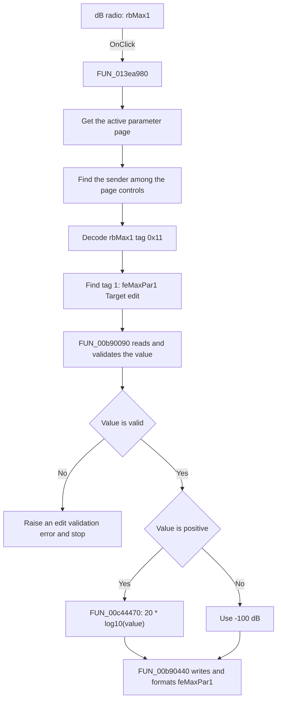

# dB

> Analysis status: Source reviewed. The click behavior is supported by the
> recovered handler, its conversion callees, and the form resource.

## Control

| Property | Recovered value |
| --- | --- |
| Form | ACGoalFunctionsDlg |
| Component path | ACGoalFunctionsDlg.pcACGoalFuncPars.tsMax.rbMax1 |
| Control class | TRadioButton |
| Caption | dB |
| Hint | Not present in the recovered resource. |
| Text | Not present in the recovered resource. |
| Handler name | rbClick |
| Handler address | 013ea980 |
| Graph node | `resource:dfm:ACGoalFunctionsDlg/ACGoalFunctionsDlg.pcACGoalFuncPars.tsMax.rbMax1` |
| Handler node | `function:013ea980` |
| Graph layer | UI |
| Control tag | 17 (`0x11`) |
| Paired edit | `feMaxPar1`, tag 1, initial text `0` |

## What happens when clicked

This radio button selects decibels as the display unit for the **Maximum**
page's Target value. The click does not only change the radio-button state. It
also converts the current numeric value in `feMaxPar1` from volts to decibels.

The shared `rbClick` handler serves 12 radio buttons on six parameter pages. It
distinguishes this control as follows:

1. It reads the active page index from `pcACGoalFuncPars`.
2. It gets the active tab sheet and scans its child controls until it finds the
   event sender.
3. It reads the sender's Delphi `Tag`. The DFM resource gives `rbMax1` the tag
   `0x11`. The high nibble selects tag 1, and the low nibble selects conversion
   mode 1.
4. It scans the same tab sheet for the child whose tag is 1. On the Maximum
   page, this child is `feMaxPar1`, the Target value edit. The tolerance edit
   has tag 2, so this click does not change it.
5. It reads and validates the current numeric value from `feMaxPar1`.
6. If the value is positive, it calculates `20 * log10(value)`. If the value is
   zero or negative, it uses `-100` dB as a floor value.
7. It stores the result in `feMaxPar1` and formats the displayed text again.

For example, a target of `1 V` becomes `0 dB`, and a target of `10 V` becomes
`20 dB`. The paired `V` radio button uses the other branch of the same handler
and calculates `10^(dB / 20)`.

The Delphi radio-button control changes its checked state during normal VCL
click processing. The recovered event handler does not set the checked state
itself. It also does not save the converted target to the goal-function model.
It changes the edit control only. A later dialog action must read and accept
the value.

`FUN_00b90090` can reject invalid edit text, values outside the recovered
`-1e50` to `1e50` range, or a value rejected by the edit's validation callback.
It raises an error in these cases. `FUN_013ea980` has no local recovery or
no-op path, so it stops before it writes the converted value. The child scans
also have no explicit bounds checks in this handler. They depend on the DFM
invariant that the sender and the tag-matched edit exist on the active page.

## Click flow

## Handler evidence

- Source: [DecompiledSources/Tina16/functions/00000000013EA980__FUN_013ea980.c](../../../DecompiledSources/Tina16/functions/00000000013EA980__FUN_013ea980.c)
- Recovered role: Shared AC goal-function unit selector and value converter.
- Current graph summary: Handles 12 Delphi UI events: ACGoalFunctionsDlg.pcACGoalFuncPars.tsCenterFreq.rbCF1.OnClick, ACGoalFunctionsDlg.pcACGoalFuncPars.tsCenterFreq.rbCF2.OnClick, ACGoalFunctionsDlg.pcACGoalFuncPars.tsLowPass.rbLP1.OnClick.
- Current graph behavior: The checked-in graph does not yet contain a curated
  behavior description for this function.
- Current graph evidence: The handler is in the `UI` layer. The form resource
  and handler data flow identify the paired edit and the conversion direction.
- Complexity: complex
- Distinct outgoing calls: 7

The recovered form data gives the exact selector mapping:

- `rbMax1.Tag` is `0x11`. Its high nibble is 1, which selects the edit whose
  tag is 1. Its low nibble is 1, which selects the volts-to-decibels branch.
- `feMaxPar1.Tag` is 1 and its nearby label is `Target`.
- `feMaxPar2.Tag` is 2 and its nearby label is `Tol.`. It is not selected by
  this click.
- `rbMax2.Tag` is `0x12`. It selects tag 1 but uses the reverse conversion
  branch. This paired design confirms that the two radio buttons change the
  unit of the same Target edit.

## Direct calls

- `function:006d8150` — [FUN_006d8150](../../../DecompiledSources/Tina16/functions/00000000006D8150__FUN_006d8150.c)
  gets the active page index from `pcACGoalFuncPars`.
- `function:006d7610` — [FUN_006d7610](../../../DecompiledSources/Tina16/functions/00000000006D7610__FUN_006d7610.c)
  gets the tab sheet at that page index.
- `function:00654bc0` — [FUN_00654bc0](../../../DecompiledSources/Tina16/functions/0000000000654BC0__FUN_00654bc0.c)
  gets one child control from the active tab sheet.
- `function:00b90090` — [FUN_00b90090](../../../DecompiledSources/Tina16/functions/0000000000B90090__FUN_00b90090.c)
  parses and validates the current `TFloatEdit` text and returns its numeric
  value.
- `function:00c44470` — [FUN_00c44470](../../../DecompiledSources/Tina16/functions/0000000000C44470__FUN_00c44470.c)
  converts a positive linear value to `20 * log10(value)`. It returns the
  supplied `-100` fallback for a zero or negative value. This is the converter
  used by `rbMax1`.
- `function:00c43d30` — [FUN_00c43d30](../../../DecompiledSources/Tina16/functions/0000000000C43D30__FUN_00c43d30.c)
  starts the reverse `10^(dB / 20)` conversion. This direct call belongs to the
  shared handler's `V` branch and does not run for `rbMax1`.
- `function:00b90440` — [FUN_00b90440](../../../DecompiledSources/Tina16/functions/0000000000B90440__FUN_00b90440.c)
  stores the converted floating-point value and updates the edit text.

## Resource evidence

- Kind: Not present in the recovered resource.
- Modal result: Not present in the recovered resource.
- Checked state: true
- List items: Not present in the recovered resource.
- Image reference: Not present in the recovered resource.
- Extracted glyph: None.

## Nearby label candidates

Nearby labels are layout candidates only. They are not proof of behavior.

- Rank 1: Tol. at distance 64.
- Rank 2: [%] at distance 146.
- Rank 3: Target at distance 188.

## Analysis limits

- The `dB` caption identifies the selected unit, but the tag pairing and the
  converter call prove which edit changes and in which direction.
- The handler uses the active tab sheet. It assumes that the clicked control is
  on that sheet and that the tag-matched edit exists there. It has no explicit
  missing-control branch.
- The recovered code proves the edit conversion. It does not prove when a later
  OK action copies the value into the goal-function model.
