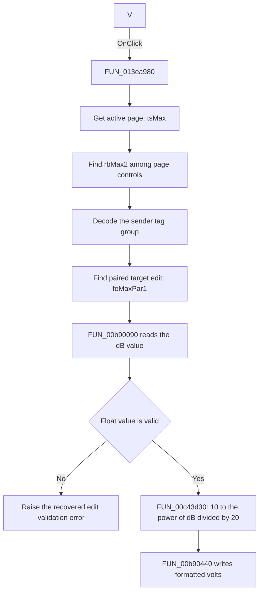

# V

> Analysis status: Source reviewed. The V conversion is supported by the
> resource pair, the sender-tag branch, and the recovered math call chain.

## Control

| Property | Recovered value |
| --- | --- |
| Form | ACGoalFunctionsDlg |
| Component path | ACGoalFunctionsDlg.pcACGoalFuncPars.tsMax.rbMax2 |
| Control class | TRadioButton |
| Caption | V |
| Hint | Not present in the recovered resource. |
| Text | Not present in the recovered resource. |
| Handler name | rbClick |
| Handler address | 013ea980 |
| Graph node | `resource:dfm:ACGoalFunctionsDlg/ACGoalFunctionsDlg.pcACGoalFuncPars.tsMax.rbMax2` |
| Handler node | `function:013ea980` |
| Graph layer | UI |

## What happens when clicked

`rbMax2` selects volts as the unit for the Maximum goal's target value. Its
paired radio button, `rbMax1`, has caption `dB` and is initially checked.

When this V radio calls `FUN_013ea980`, the handler:

1. Gets the active page index from `pcACGoalFuncPars`.
2. Searches that page's child controls for the sender object. For this event,
   the sender is `rbMax2` on `tsMax`.
3. Uses the sender's encoded tag group to find the target-value float edit on
   the same page. On `tsMax`, the resource layout identifies this as
   `feMaxPar1`. The separate `feMaxPar2` edit is the `Tol.` value in percent.
4. Reads and validates the current target value with `FUN_00b90090`.
5. Runs the V branch through `FUN_00c43d30`. That helper divides the current dB
   value by 20 and calls the recovered base-10 power helper. The result is:

   `volts = 10^(dB / 20)`

6. Writes the voltage result back to `feMaxPar1` with `FUN_00b90440`. That
   setter formats the number and updates the edit text.

The handler does not change the active page, the tolerance value, the goal
checklist, or the stored goal-function model. `TRadioButton` supplies the radio
selection behavior. The recovered event method uses the sender to choose and
apply the numerical conversion.

There is no no-op branch that tests whether V was already selected. When this
event method runs for `rbMax2`, it applies the V conversion. The float-value
getter can raise its recovered validation error if the edit text is invalid,
outside the accepted range, or rejected by the edit's validation callback. The
handler has no local error recovery. Its two child-control searches also assume
that the sender and its tag-paired target edit exist on the active page; the
resource satisfies these assumptions.

## Click flow

## Handler evidence

- Source: [DecompiledSources/Tina16/functions/00000000013EA980__FUN_013ea980.c](../../../DecompiledSources/Tina16/functions/00000000013EA980__FUN_013ea980.c)
- Recovered role: Shared AC goal target-unit converter; this control selects the volts branch for the Maximum goal.
- Current graph summary: Handles 12 Delphi UI events: ACGoalFunctionsDlg.pcACGoalFuncPars.tsCenterFreq.rbCF1.OnClick, ACGoalFunctionsDlg.pcACGoalFuncPars.tsCenterFreq.rbCF2.OnClick, ACGoalFunctionsDlg.pcACGoalFuncPars.tsLowPass.rbLP1.OnClick.
- Current graph behavior: The checked-in graph does not yet contain a curated behavior description for this function.
- Current graph evidence: The function is in the `UI` layer. Twelve dB/V radio controls trigger it. The graph records seven distinct direct callees.
- Complexity: complex
- Distinct outgoing calls: 7

All six goal pages use the same resource pattern: a radio whose name ends in
`1` has caption `dB` and is initially checked, and the paired radio whose name
ends in `2` has caption `V`. The handler extracts a group and variant from the
sender tag. The variant-one branch calls the recovered `20 * log10(value)`
helper for dB. The other branch calls the recovered `10^(value / 20)` helper.
Thus, `rbMax2` selects the V conversion. The raw tag value is not included in
the current UI evidence JSON, but the handler's two math branches, the repeated
resource pairs, and this control's `V` caption agree on the mapping.

## Direct calls

- `function:006d8150` — [FUN_006d8150](../../../DecompiledSources/Tina16/functions/00000000006D8150__FUN_006d8150.c)
  gets the active page index, or `-1` when the page control has no active page.
- `function:006d7610` — [FUN_006d7610](../../../DecompiledSources/Tina16/functions/00000000006D7610__FUN_006d7610.c)
  gets a page by index.
- `function:00654bc0` — [FUN_00654bc0](../../../DecompiledSources/Tina16/functions/0000000000654BC0__FUN_00654bc0.c)
  gets a child control from that page. The handler uses it to find the sender
  and then the tag-paired target edit.
- `function:00b90090` — [FUN_00b90090](../../../DecompiledSources/Tina16/functions/0000000000B90090__FUN_00b90090.c)
  parses and validates the target edit's floating-point value.
- `function:00c43d30` — [FUN_00c43d30](../../../DecompiledSources/Tina16/functions/0000000000C43D30__FUN_00c43d30.c)
  performs the V branch by calculating a base-10 power with exponent
  `dB / 20`.
- `function:00b90440` — [FUN_00b90440](../../../DecompiledSources/Tina16/functions/0000000000B90440__FUN_00b90440.c)
  stores the result and writes its formatted text to the target edit.
- `function:00c44470` — [FUN_00c44470](../../../DecompiledSources/Tina16/functions/0000000000C44470__FUN_00c44470.c)
  performs the paired dB branch as `20 * log10(value)` for positive values and
  returns `-100` for a nonpositive value. The `rbMax2` V click does not take
  this branch.

## Resource evidence

- Kind: Not present in the recovered resource.
- Modal result: Not present in the recovered resource.
- Checked state: Not present in the recovered resource.
- List items: Not present in the recovered resource.
- Image reference: Not present in the recovered resource.
- Extracted glyph: None.

## Nearby label candidates

Nearby labels are layout candidates only. They are not proof of behavior.

- Rank 1: Tol. at distance 60.
- Rank 2: [%] at distance 142.
- Rank 3: Target at distance 184.

The nearest-label rank is misleading in this case. `Tol.` and `[%]` describe
`feMaxPar2`. The handler's tag-pair search and numerical dB/V conversion target
the other float edit, `feMaxPar1`, which is the value beside `Target`.

## Analysis limits

- The current resource evidence does not retain the numeric component tags.
  The specific V branch is established from the handler's tag encoding, the
  repeated `dB`/`V` resource pairs, and the recovered inverse math functions.
- The source does not contain bounds checks for its sender and paired-control
  searches. It relies on the form resource structure and normal event routing.
- The handler converts only the edit text. Persistence occurs later through the
  dialog's OK path and is not part of this click.
