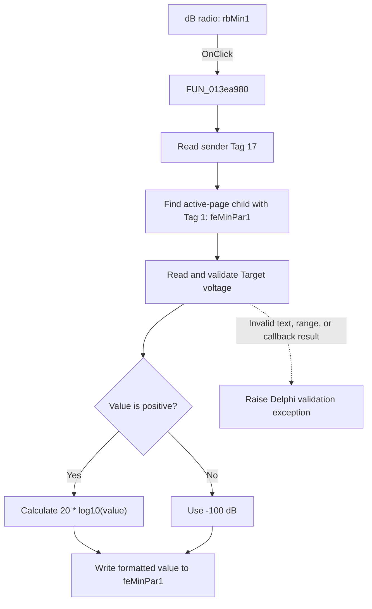

# dB

> Analysis status: Evidence-backed source review complete.

## Control

| Property | Recovered value |
| --- | --- |
| Form | ACGoalFunctionsDlg |
| Component path | ACGoalFunctionsDlg.pcACGoalFuncPars.tsMin.rbMin1 |
| Control class | TRadioButton |
| Caption | dB |
| Hint | Not present in the recovered resource. |
| Text | Not present in the recovered resource. |
| Handler name | rbClick |
| Handler address | 013ea980 |
| Graph node | `resource:dfm:ACGoalFunctionsDlg/ACGoalFunctionsDlg.pcACGoalFuncPars.tsMin.rbMin1` |
| Handler node | `function:013ea980` |
| Graph layer | UI |

## What happens when clicked

This **dB** radio button converts the Minimum page's **Target** value from a
linear voltage value to decibels. The shared handler uses the sender's DFM
`Tag` value, `17`, to select the child editor whose `Tag` is `1`. On this page,
that editor is `feMinPar1`.

The handler reads and validates the current `feMinPar1` value. For a positive
value, it calculates `20 * log10(value)`. For zero or a negative value, it uses
`-100 dB`. It then writes and formats the result in the same Target editor.
The handler does not change a model object or close the dialog.

If the editor text is invalid, outside the supported numeric range, or rejected
by its validation callback, the numeric getter raises a Delphi validation
exception. This handler has no local recovery path and does not perform the
conversion after that exception.

## Click flow

## Handler evidence

- Source: [DecompiledSources/Tina16/functions/00000000013EA980__FUN_013ea980.c](../../../DecompiledSources/Tina16/functions/00000000013EA980__FUN_013ea980.c)
- Recovered role: Converts the active parameter page's paired Target editor
  between linear volts and decibels. This control selects volts-to-dB.
- Current graph summary: Handles 12 Delphi UI events: ACGoalFunctionsDlg.pcACGoalFuncPars.tsCenterFreq.rbCF1.OnClick, ACGoalFunctionsDlg.pcACGoalFuncPars.tsCenterFreq.rbCF2.OnClick, ACGoalFunctionsDlg.pcACGoalFuncPars.tsLowPass.rbLP1.OnClick.
- Current graph behavior: The handler uses DFM tags to find the sender's paired
  editor and converts its numeric value for the selected unit.
- Current graph evidence: `rbMin1.Tag = 17`, `feMinPar1.Tag = 1`, the handler's
  tag-selection loops, and the recovered logarithm and numeric-edit callees.
- Complexity: complex
- Distinct outgoing calls: 7

## Direct calls

- `function:00654bc0` — Returns a child control by index.
- `function:006d7610` — Returns a page-control tab by index.
- `function:006d8150` — Returns the active page index.
- `function:00b90090` — Reads and validates a `TFloatEdit` numeric value.
- `function:00b90440` — Stores, formats, and displays a `TFloatEdit` value.
- `function:00c43d30` — Converts dB to linear amplitude for the other radio
  branch. The `rbMin1` click does not take this branch.
- `function:00c44470` — Converts a positive linear amplitude to dB and returns
  `-100` for a non-positive input.

## Resource evidence

- Kind: Not present in the recovered resource.
- Modal result: Not present in the recovered resource.
- Checked state: true
- Raw DFM tag: 17
- List items: Not present in the recovered resource.
- Image reference: Not present in the recovered resource.
- Extracted glyph: None.

## Nearby label candidates

Nearby labels are layout candidates only. They are not proof of behavior.

- Rank 1: Tol. at distance 64.
- Rank 2: [%] at distance 146.
- Rank 3: Target at distance 188.

## Analysis limits

- Do not infer behavior from the control class, caption, hint, glyph, or nearby label alone.
- The handler is shared by 12 radio buttons on six parameter pages. This
  article describes only `tsMin.rbMin1` and its paired `feMinPar1` editor.
- The recovered code proves the conversion and editor update. It does not show
  any direct write to the analysis model; that occurs later when the dialog is
  accepted.
- The exact text of validation errors is assembled by shared numeric-editor
  code and is not identified here.
