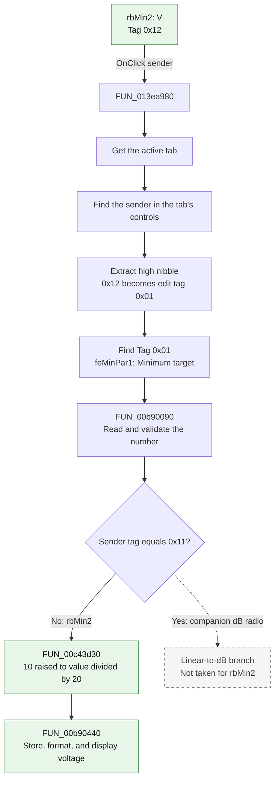

# V

> Analysis status: Complete. The recovered handler, its direct call path, and the embedded DFM properties agree on this control's behavior.

## Control

| Property | Recovered value |
| --- | --- |
| Form | ACGoalFunctionsDlg |
| Component path | ACGoalFunctionsDlg.pcACGoalFuncPars.tsMin.rbMin2 |
| Control class | TRadioButton |
| Caption | V |
| DFM Tag | `0x12` |
| Hint | Not present in the recovered resource. |
| Text | Not present in the recovered resource. |
| Handler name | rbClick |
| Handler address | 013ea980 |
| Graph node | `resource:dfm:ACGoalFunctionsDlg/ACGoalFunctionsDlg.pcACGoalFuncPars.tsMin.rbMin2` |
| Handler node | `function:013ea980` |
| Graph layer | UI |

## What happens when clicked

The click converts the **Minimum** goal function's **Target** value from decibels to a linear voltage value. The conversion is:

`voltage = 10^(decibels / 20)`

`FUN_013ea980` is shared by 12 `dB` and `V` radio buttons. It does not use the caption to identify the sender or target edit. It uses the active tab, the sender pointer, and the Delphi `Tag` properties:

1. It gets the active tab from `pcACGoalFuncPars`.
2. It scans the controls on that tab until it finds the sender pointer.
3. It reads `rbMin2.Tag`, which is `0x12` in the embedded DFM.
4. It takes the high nibble, `(0x12 & 0xF0) >> 4`, to get edit tag `0x01`.
5. It scans the same tab for the control whose tag is `0x01`. The DFM identifies this control as `feMinPar1`. This edit belongs to the **Target** value and has the initial text `0`.
6. It tests whether the sender tag is `edit tag * 0x10 + 1`. That value is `0x11`, which belongs to the companion `dB` radio. `rbMin2.Tag` is `0x12`, so the handler takes the `V` branch.
7. `FUN_00b90090` reads and validates the current number in `feMinPar1`.
8. `FUN_00c43d30` calculates `10^(value / 20)`.
9. `FUN_00b90440` stores the converted number in the edit control, formats it, and updates its visible text.

The tolerance field `feMinPar2`, which has tag `0x02` and the nearby **Tol.** and **[%]** labels, is not selected by this click. The handler does not save the goal-function record. The OK-button path reads the edit controls later. The handler also does not write the radio button's `Checked` property. The VCL radio-button processing selects the control before it sends the click event.

## Inputs, decisions, and outputs

| Stage | Proven behavior |
| --- | --- |
| Input | The sender is `rbMin2`, the active page is `tsMin`, and the current `feMinPar1` text supplies the numeric value. |
| Control lookup | `rbMin2.Tag = 0x12` selects the control with `Tag = 0x01`, which is `feMinPar1` on this tab. |
| Unit decision | The tag's low nibble is `2`, so the handler selects the V branch. A low nibble of `1` selects the dB branch. |
| State change | The cached `double` and visible text of `feMinPar1` change to the linear voltage value. |
| Output | The Minimum target remains in the same edit control, but it is now displayed in volts. |
| Unchanged state | `feMinPar2`, the tolerance value, is not read or written by this click. |
| Persistence | None in this handler. The dialog's OK handler collects the values. |

## Click flow

## Handler evidence

- Handler source: [FUN_013ea980](../../../DecompiledSources/Tina16/functions/00000000013EA980__FUN_013ea980.c)
- Numeric reader: [FUN_00b90090](../../../DecompiledSources/Tina16/functions/0000000000B90090__FUN_00b90090.c)
- dB-to-voltage conversion: [FUN_00c43d30](../../../DecompiledSources/Tina16/functions/0000000000C43D30__FUN_00c43d30.c)
- Numeric writer: [FUN_00b90440](../../../DecompiledSources/Tina16/functions/0000000000B90440__FUN_00b90440.c)
- Recovered role from this review: Shared dB/V edit conversion handler.
- Current graph summary: Handles 12 Delphi radio-button click events on the AC goal-function parameter tabs.
- Complexity: complex
- Distinct outgoing calls: 7

The embedded DFM supplies the identifiers that are not present in the selected graph properties:

| Component | Caption or role | DFM Tag |
| --- | --- | --- |
| `feMinPar1` | Minimum target numeric edit | `0x01` |
| `feMinPar2` | Tolerance numeric edit | `0x02` |
| `rbMin1` | dB | `0x11` |
| `rbMin2` | V | `0x12` |

These values match both handler decisions: the high nibble selects the target edit, and the low nibble selects the conversion direction.

## Direct calls

- `function:006d8150` - Gets the active page index from the page control.
- `function:006d7610` - Gets a tab sheet by page index.
- `function:00654bc0` - Gets a child control by index.
- `function:00b90090` - Parses and validates the numeric edit value.
- `function:00c43d30` - Converts dB to a linear value with `10^(dB / 20)`. This is the branch used by `rbMin2`.
- `function:00b90440` - Stores, formats, and displays the converted numeric value.
- `function:00c44470` - Converts a positive linear value to dB. This is the alternative branch for the companion `dB` controls and is not used by this click.

## Resource evidence

- The `tsMin` tab has the caption **Minimum**.
- The tab contains the labels **Target**, **Tol.**, and **[%]**.
- `feMinPar1` has `Tag = 0x01`, the initial text `0`, and the layout position of the Target field.
- `feMinPar2` has `Tag = 0x02`, the initial text `5`, and the layout position of the tolerance field.
- `rbMin1` has caption `dB`, `Tag = 0x11`, and the recovered initial checked state.
- `rbMin2` has caption `V`, `Tag = 0x12`, and the shared `rbClick` event.
- No hint or glyph is present for `rbMin2`.

## Nearby label candidates

The graph ranks **Tol.**, **[%]**, and **Target** from nearest to farthest by coordinate distance. This order does not establish meaning. The matching DFM tags and the handler lookup prove that this radio button operates on `feMinPar1`, the Minimum target edit. It does not operate on the closer tolerance labels.

## Error and no-op behavior

- `FUN_00b90090` raises a localized input exception if it cannot produce a value in its accepted range of `-1e50` through `1e50`.
- The reader also calls an optional edit validator. It raises a second localized exception if that validator rejects the value.
- If either check raises an exception, the handler does not call the conversion writer.
- The V branch has no explicit no-op path. It converts every accepted input and asks the edit setter to format and publish the result.
- The shared handler does not have a bounds check in either control-search loop. The recovered DFM provides both the sender and the matching tag, so this control follows the valid path. Behavior for a malformed form or a foreign sender is not defined by this source.
- The power helper limits its internal natural exponent to the range `-300` through `300`. Extreme accepted dB input therefore saturates at a finite very small or very large linear value.

## Analysis limits

- The selected graph properties do not include Delphi `Tag`. The values in this article come from the embedded binary DFM stream in the rebuilt executable.
- The decompiler gives some thin forwarding helpers a `void` return type even when the caller uses their return register. The caller data flow and descendant implementations establish the values used here.
- The recovered code proves the formula and target edit. It does not provide the original Delphi variable names or comments.
