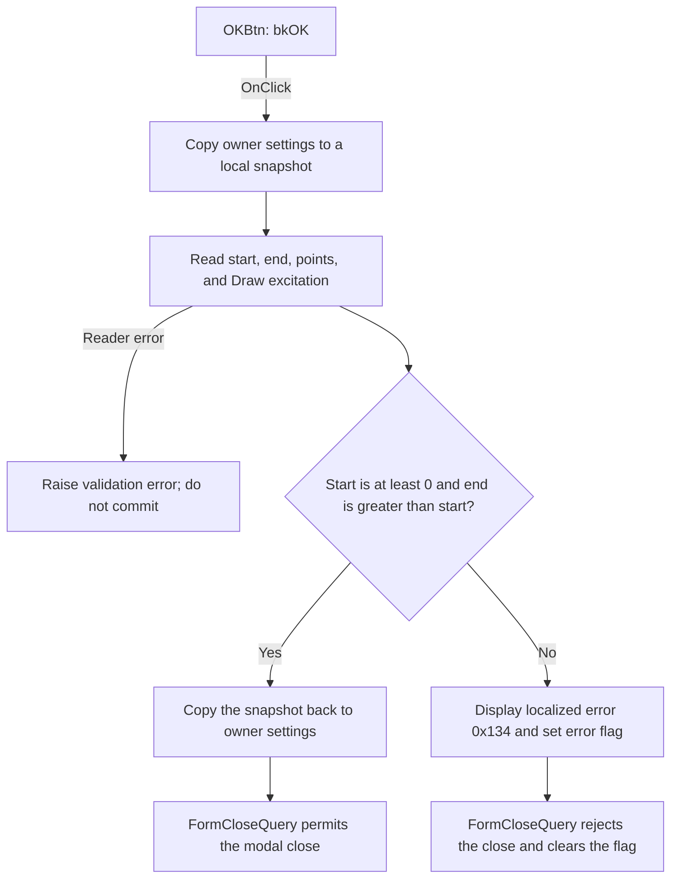

# OKBtn

> Analysis status: Source reviewed. The OK validation and commit path is documented.

## Control

| Property | Recovered value |
| --- | --- |
| Form | ACTimeFunctionDlg |
| Component path | ACTimeFunctionDlg.OKBtn |
| Control class | TBitBtn |
| Caption | Not present in the recovered resource. |
| Hint | Not present in the recovered resource. |
| Text | Not present in the recovered resource. |
| Handler name | OKBtnClick |
| Handler address | 01528290 |
| Graph node | `resource:dfm:ACTimeFunctionDlg/ACTimeFunctionDlg.OKBtn` |
| Handler node | `function:01528290` |
| Graph layer | UI |

## What happens when clicked

`OKBtn` validates the Time Function inputs and commits them to the owning
analysis object. The handler first copies the owner's 712-byte settings record
to a local snapshot. It then replaces four fields in that snapshot:

- `EditStartVal` supplies the start time in seconds.
- `EditEndVal` supplies the end time in seconds.
- `EditPoints` supplies the number of points.
- `DrawExcitCB` supplies the Draw excitation Boolean value.

The float-edit readers parse and validate both time values. The integer-edit
reader parses the point count and checks the edit control's runtime minimum and
maximum. The handler then applies two time rules:

- The start time must be zero or greater.
- The end time must be greater than the start time.

If both rules pass, `FUN_00417c40` copies the complete local snapshot back to
the owner record. The four output fields are at owner offsets `0x8A0`, `0x8A8`,
`0x8B0`, and `0x8B2`. `FormCreate` reads the same four offsets to initialize the
controls, which confirms the mapping.

If either time rule fails, the handler loads localized string resource `0x134`
and calls `FUN_01528230`. That path displays the validation message and sets the
form's error flag. The handler then skips the record copy. `FormCloseQuery`
sees the flag, rejects this close attempt, and clears the flag for the next
attempt. The exact English text of resource `0x134` is not present in the
recovered resource set.

The input readers can also raise their own Delphi validation exceptions for
invalid text, an out-of-range float, or an out-of-range point count. This
handler has no local exception handler, and it does not commit the owner record
after such an error. There is no successful no-op path: a valid click commits
the snapshot and the built-in `bkOK` button can close the dialog.

## Click flow

## Handler evidence

- Source: [DecompiledSources/Tina16/functions/0000000001528290__FUN_01528290.c](../../../DecompiledSources/Tina16/functions/0000000001528290__FUN_01528290.c)
- Recovered role: Time Function settings validation and commit handler.
- Current graph summary: Handles 1 Delphi UI event: ACTimeFunctionDlg.OKBtn.OnClick.
- Behavior: Reads start time, end time, point count, and Draw excitation into a local settings snapshot. It commits the snapshot only when the start time is nonnegative and the end time is later than the start time.
- Evidence: The handler writes the four control values into local record offsets that match the owner offsets read by `FormCreate`. Its condition is `(end <= start) || (start < 0)`. The error helper displays a message and sets the byte that `FormCloseQuery` uses to reject the close.
- Complexity: complex
- Distinct outgoing calls: 9

## Direct calls

- `function:00417580` — initializes the local managed-record snapshot.
- `function:00417c40` — copies the managed settings record in both directions.
- `function:00b90090` — reads and validates each float-edit value.
- `function:00f04d50` — reads the integer point count and checks its configured
  range.
- `function:00b89270` — gets the application string-resource manager.
- `function:00b8e520` — loads localized validation string `0x134`.
- `function:01528230` — displays the validation message and sets the form error
  flag.
- `function:00414480` — clears the temporary Delphi UnicodeString.
- `function:00417740` — finalizes the local managed-record snapshot.

## Resource evidence

- Kind: bkOK
- Modal result: Not present in the recovered resource.
- Checked state: Not present in the recovered resource.
- Inputs: `EditStartVal`, `EditEndVal`, `EditPoints`, and `DrawExcitCB`.
- Labels: `Start time`, `End time`, `Number of points`, and `Draw excitation`.
- Time units: Both time labels have an adjacent `[s]` resource.
- List items: Not present in the recovered resource.
- Image reference: Not present in the recovered resource.
- Extracted glyph: None.

## Nearby label candidates

Nearby labels are layout candidates only. They are not proof of behavior.

- Rank 1: [s] at distance 40.
- Rank 2: [s] at distance 69.
- Rank 3: &Start time at distance 211.

## Analysis limits

- The exact text for localized string resource `0x134` is not available in the
  recovered files.
- The DFM does not override the point edit's minimum and maximum. The integer
  reader still checks the control's runtime bounds, but this analysis does not
  assign numeric limits to them.
- The built-in `bkOK` behavior supplies the modal close request. The handler
  validates and commits data; `FormCloseQuery` makes the final close decision.
