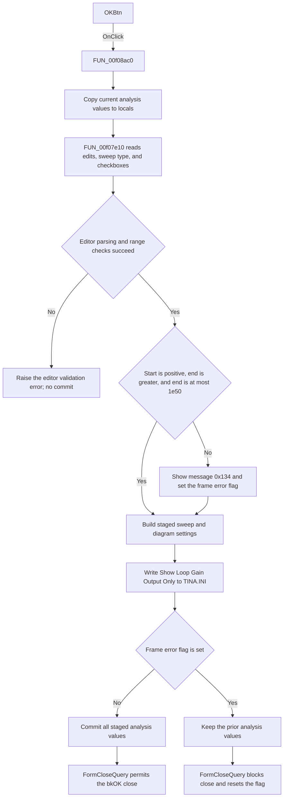

# OKBtn

> Analysis status: Source reviewed. The staged validation and commit behavior
> is supported by the handler, frame helper, and form-close query.

## Control

| Property | Recovered value |
| --- | --- |
| Form | ACTransferDlg |
| Component path | ACTransferDlg.OKBtn |
| Control class | TBitBtn |
| Caption | Not present in the recovered resource. |
| Hint | Not present in the recovered resource. |
| Text | Not present in the recovered resource. |
| Handler name | OKBtnClick |
| Handler address | 00f08ac0 |
| Graph node | `resource:dfm:ACTransferDlg/ACTransferDlg.OKBtn` |
| Handler node | `function:00f08ac0` |
| Graph layer | UI |

## What happens when clicked

The OK click validates the AC transfer settings and commits them as one staged
set. It does not write each edit directly to the analysis state.

`FUN_00f08ac0` first copies the current packed analysis values into local
variables. These values are the start frequency, end frequency, point count,
sweep type, and diagram-option flags. It then gives the locals and the
`ACTransferDlgFrame` to `FUN_00f07e10`.

The frame helper reads:

- `EditStartVal` and `EditEndVal` as floating-point frequencies.
- `EditPoints` as the number of points.
- `SweepTypeRG` as the linear or logarithmic selection.
- `AmplitudeCB`, `PhaseCB`, `BodeCB`, `NyquistCB`, and `GRDelayCB` into bits
  `0x01`, `0x02`, `0x04`, `0x08`, and `0x10` of the diagram flags.
- `ShowLGOutCB` as the separate `Show Loop Gain Output Only` preference.

The recovered frequency rule accepts the staged range only when all these
conditions are true:

- Start frequency is greater than zero.
- End frequency is greater than start frequency.
- End frequency is not greater than `1e50`.

The float editors also perform their own parsing, range, and callback
validation. The integer editor validates the point count against its configured
minimum and maximum. These editor failures raise their recovered validation
errors before the staged state is committed.

If the frequency rule fails, `FUN_00f07e10` gets localized message `0x134` and
passes it to `FUN_00f07c40`. That path shows the error once and sets the frame's
error flag. The helper then still collects the diagram checkboxes and writes
`Show Loop Gain Output Only` to the `Analysis Setup` section of `TINA.INI`.

After the helper returns, `FUN_00f08ac0` checks the frame error flag:

- If the flag is clear, it copies all staged start, end, point, sweep, and
  diagram values to the packed analysis state.
- If the flag is set, it does not copy any staged value. The previous analysis
  state stays unchanged.

The button has built-in kind `bkOK`, so a click also starts the modal close
path. `FUN_00f089c0`, the form-close query, permits the close only when the
frame error flag is clear. For a range error, it rejects the close and resets
the flag for the next attempt. Thus, a valid click commits the values and lets
the dialog close. A range-invalid click shows the error, preserves the prior
analysis values, and keeps the dialog open.

The INI preference is a separate output. Because it is written inside the
frame helper before the commit check, a range-invalid click can still update
`Show Loop Gain Output Only` even though the packed analysis values are not
committed.

## Click flow

## Handler evidence

- Source: [DecompiledSources/Tina16/functions/0000000000F08AC0__FUN_00f08ac0.c](../../../DecompiledSources/Tina16/functions/0000000000F08AC0__FUN_00f08ac0.c)
- Recovered role: AC transfer settings validator and staged commit handler.
- Current graph summary: Handles 1 Delphi UI event: ACTransferDlg.OKBtn.OnClick.
- Current graph behavior: The checked-in graph does not yet contain a curated behavior description for this function.
- Current graph evidence: The handler is in the `UI` layer. It has one direct call edge to `FUN_00f07e10`.
- Complexity: simple
- Distinct outgoing calls: 1

The packed state fields copied by this handler are at offsets `0x963` through
`0x977` of the analysis object. The handler initializes the local staging
values from that object before it reads the frame. It copies the locals back
only when `ACTransferDlgFrame + 0x540`, the recovered error flag, is zero.

The close-query handler reads the same error flag. It assigns `CanClose` from
the inverse of the flag and then clears the flag. This gives the validation
flag both effects that are visible to the user: it prevents the state commit
and prevents the failed OK attempt from closing the dialog.

## Direct calls

- `function:00f07e10` — [FUN_00f07e10](../../../DecompiledSources/Tina16/functions/0000000000F07E10__FUN_00f07e10.c)
  reads all frame inputs, applies the frequency relationship rule, updates the
  staged sweep and diagram values, and writes the separate loop-gain-output INI
  preference.

Relevant calls below `FUN_00f07e10`:

- [FUN_00b90090](../../../DecompiledSources/Tina16/functions/0000000000B90090__FUN_00b90090.c)
  parses and validates each floating-point edit.
- [FUN_00f04d50](../../../DecompiledSources/Tina16/functions/0000000000F04D50__FUN_00f04d50.c)
  parses the integer point count and checks the edit's configured bounds.
- [FUN_00f07c40](../../../DecompiledSources/Tina16/functions/0000000000F07C40__FUN_00f07c40.c)
  routes the frequency-range message to the one-shot error path at frame offset
  `0x540`.
- [FUN_01b1cf30](../../../DecompiledSources/Tina16/functions/0000000001B1CF30__FUN_01b1cf30.c)
  displays the message when no prior error is active and then sets the error
  flag.
- [FUN_00f06730](../../../DecompiledSources/Tina16/functions/0000000000F06730__FUN_00f06730.c)
  writes the Boolean `Show Loop Gain Output Only` value under `Analysis Setup`
  in `TINA.INI`.

## Resource evidence

- Kind: bkOK
- Modal result: Not present in the recovered resource.
- Checked state: Not present in the recovered resource.
- List items: Not present in the recovered resource.
- Image reference: Not present in the recovered resource.
- Extracted glyph: None.

`ACTransferDlg` embeds an inherited `TACTransferDlgFrame`. The embedded instance
does not repeat its inherited captions. The separate frame resource supplies
the control text used by this handler: `Start frequency`, `End frequency`,
`Number of points`, `Linear`, `Logarithmic`, `Amplitude`, `Phase`,
`Ampl & Phase (Bode)`, `Nyquist`, `Group Delay`, and
`Show Loop Gain output only`.

## Nearby label candidates

Nearby labels are layout candidates only. They are not proof of behavior.

- No same-parent label candidate is available.

## Analysis limits

- The exact localized text for message resource `0x134` is not present in the
  recovered UI evidence. The source proves its frequency-range condition and
  error-flag effect, but this article does not invent the message wording.
- The recovered resource does not expose the integer edit's numeric minimum and
  maximum. `FUN_00f04d50` proves that it enforces both configured bounds.
- The button's `bkOK` kind supplies the standard modal accept behavior. The
  resource does not contain an explicit `ModalResult` property.
- This click updates dialog settings and one INI preference. It does not run
  the AC transfer analysis itself.
