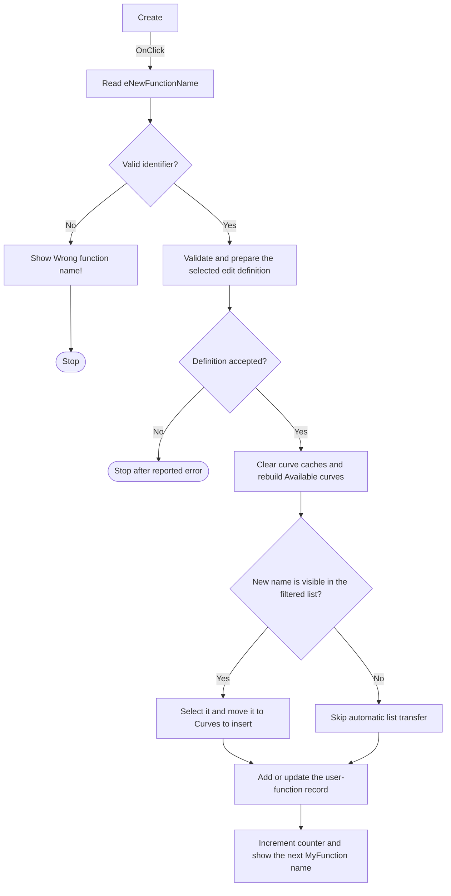

# Create

> Analysis status: Source, graph, and form evidence reviewed.

## Control

| Property | Recovered value |
| --- | --- |
| Form | AddCurveDlg |
| Component path | AddCurveDlg.AdvancedPanel.Add |
| Control class | TButton |
| Caption | Create |
| Hint | Not present in the recovered resource. |
| Text | Not present in the recovered resource. |
| Handler name | AddClick |
| Handler address | 013cf0e0 |
| Graph node | `resource:dfm:AddCurveDlg/AddCurveDlg.AdvancedPanel.Add` |
| Handler node | `function:013cf0e0` |
| Graph layer | UI |

## What happens when clicked

The button creates a named user-defined curve from the current Line Edit or Advanced Edit definition. A successful click keeps the dialog open. It refreshes the curve lists, adds the new curve to **Curves to insert** when the active filters show it, and prepares the next default function name.

The handler does these operations:

1. It clears its temporary curve collection and reads `eNewFunctionName`. The recovered resource initializes this field to `MyFunction1`.
2. `FUN_00f60aa0` checks that the name is a valid identifier. The first character must be an allowed identifier character. Later characters can also be digits.
3. If the name is invalid, the handler shows `Wrong function name!` and stops. It does not rebuild the lists or advance the name counter.
4. `FUN_013ce890` validates and prepares the selected Line Edit or Advanced Edit definition. This helper checks required inputs and reports its own missing-input, selection, or compile error. A nonzero result stops the Create path.
5. On success, the handler clears cached curve records, rebuilds the internal available-curve collection, and applies the current curve filters to `AvailableCurvesLB`.
6. It searches `AvailableCurvesLB` for the new function name. If found, it selects that item and calls the same transfer routine as **Add >>**. That routine moves the selected entry to `CurveToInsertLB`, whose label is **Curves to insert:**.
7. `FUN_013cf3e0` adds or updates the named user-function record from the selected edit mode. It supports the one-input and two-input forms that the dialog uses.
8. The handler increments the counter at form offset `0x908`. `FUN_013cb350` then writes `MyFunction` plus the new counter value to `eNewFunctionName`.

If the newly created name is not present in the filtered Available curves list, the handler skips only the automatic list transfer. It still publishes the function record and advances the default name. Nil global curve registries also skip their cache-clear calls without stopping creation.

The handler has no success message and does not close the dialog. Temporary objects and strings are finalized on every exit path.

## Click flow

## Handler evidence

- Source: [DecompiledSources/Tina16/functions/00000000013CF0E0__FUN_013cf0e0.c](../../../DecompiledSources/Tina16/functions/00000000013CF0E0__FUN_013cf0e0.c)
- Recovered role: User-defined curve Create handler.
- Current graph summary: Handles 1 Delphi UI event: AddCurveDlg.AdvancedPanel.Add.OnClick.
- Input evidence: The handler reads `eNewFunctionName`; the form labels the field `New function name:` and initializes it to `MyFunction1`.
- Validation evidence: `FUN_00f60aa0` performs the identifier check. `FUN_013ce890` validates or compiles the selected editor content and returns failure after it reports an error.
- List-output evidence: The handler rebuilds `AvailableCurvesLB`, finds the new name, selects it, and calls `FUN_013ca310`. That routine transfers selected entries to `CurveToInsertLB` and removes them from the available list.
- Model-output evidence: `FUN_013cf3e0` calls the named-record add-or-update routines for the current function name and edit source.
- Follow-up UI evidence: `FUN_013cb350` builds `MyFunction` plus the incremented counter and writes it to `eNewFunctionName`.
- Complexity: complex
- Distinct outgoing calls: 17

## Direct calls

- `function:0064dd90` — Reads the new function name from the edit control.
- `function:00f60aa0` — Validates the identifier characters.
- `function:013cd4e0` — Shows the invalid-name or definition-error message.
- `function:013ce890` — Validates and prepares the selected line or advanced definition.
- `function:01cc7700` — Clears cached entries in an available curve registry.
- `function:004b6930` — Constructs the temporary Delphi string list.
- `function:00f1e090` — Collects available curve definitions from the active registries.
- `function:013ca610` — Copies the collected entries into the dialog's internal master list.
- `function:013cab80` — Rebuilds `AvailableCurvesLB` according to the active filters.
- `function:013c1650` — Copies the new function name for the list lookup.
- `function:0068bd10` — Selects the matching available-list item.
- `function:013ca310` — Moves selected available curves to `CurveToInsertLB` and refreshes the available list.
- `function:013cf3e0` — Adds or updates the backing user-function record.
- `function:013cb350` — Writes the next generated `MyFunction` name.
- `function:00410f20` — Destroys the temporary list when it is not nil.
- `function:00414480` — Finalizes one temporary Delphi UnicodeString.
- `function:00414560` — Finalizes the temporary UnicodeString array.

## Resource evidence

- Kind: Not present in the recovered resource.
- Modal result: Not present in the recovered resource.
- Checked state: Not present in the recovered resource.
- Name field: `eNewFunctionName`, initial text `MyFunction1`.
- Definition inputs: `LineEdit`, `AdvancedEdit`, and `rgProgram` with `Interpreter` and `Python` choices.
- List outputs: `AvailableCurvesLB` and `CurveToInsertLB` under the labels `Available curves:` and `Curves to insert:`.
- List items: Not present in the recovered resource.
- Image reference: Not present in the recovered resource.
- Extracted glyph: None.

## Nearby label candidates

Nearby labels are layout candidates only. They are not proof of behavior.

- Rank 1: New function name: at distance 158.
- Rank 2: Line Edit at distance 204.
- Rank 3: Built-in functions: at distance 330.

## Analysis limits

- `FUN_013ce890` has several editor-mode branches. This article records their common contract: it returns zero on success and reports its own error before a nonzero return. It does not assign names to all internal parser types.
- The new entry is transferred only when the current filters put it in `AvailableCurvesLB`. The source does not provide a separate message when the filtered lookup fails.
- The exact internal class names of the cached curve registries are not recovered. Their clear, enumerate, filter, and list-transfer effects are visible in the call path.
