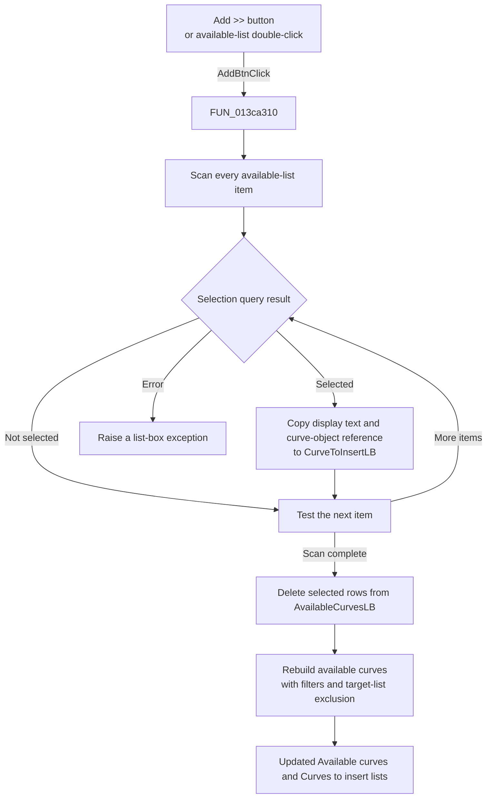

# Add >>

> Analysis status: Source reviewed. The button moves selected curve references
> from the available list to the list of curves to insert.

## Control

| Property | Recovered value |
| --- | --- |
| Form | AddCurveDlg |
| Component path | AddCurveDlg.UpperPl.Panel2.AddBtn |
| Control class | TButton |
| Caption | Add >> |
| Hint | Not present in the recovered resource. |
| Text | Not present in the recovered resource. |
| Handler name | AddBtnClick |
| Handler address | 013ca310 |
| Graph node | `resource:dfm:AddCurveDlg/AddCurveDlg.UpperPl.Panel2.AddBtn` |
| Handler node | `function:013ca310` |
| Graph layer | UI |

## What happens when clicked

`Add >>` moves all selected entries from `AvailableCurvesLB` to
`CurveToInsertLB`. A double-click on `AvailableCurvesLB` runs the same handler
and has the same effect.

The handler uses these inputs from the available list:

- the current item count;
- the selected state of each item;
- each selected item's display string; and
- the curve-object reference attached to that item.

For each selected item, the handler adds the same display string and attached
object reference to `CurveToInsertLB`. It then makes a second pass through
`AvailableCurvesLB` and deletes each selected row. The second pass reads the
current count after each deletion, so a shifted row stays at the same index and
is tested next.

Finally, `FUN_013cab80` clears and rebuilds `AvailableCurvesLB` from the form's
master curve collection. It excludes objects that are already in
`CurveToInsertLB` and applies the current category and text filters. The visible
result is that the selected curves appear under **Curves to insert:** and no
longer appear under **Available curves:**.

This action changes the two UI lists, including their attached object
references. It does not create, delete, or commit a curve object. The OK
handler later reads `CurveToInsertLB` and applies the requested curves.

If the available list is empty or no item is selected, the handler adds and
deletes nothing. It still refreshes the available list. It shows no message and
does not close the dialog. If the native list-box selection query reports an
error, `FUN_0068bca0` raises an exception for that item index. `FUN_013ca310`
does not catch the error. Other list allocation or index errors also propagate
to the caller.

## Click flow

## Handler evidence

- Source: [DecompiledSources/Tina16/functions/00000000013CA310__FUN_013ca310.c](../../../DecompiledSources/Tina16/functions/00000000013CA310__FUN_013ca310.c)
- Recovered role: Not present in the recovered resource.
- Current graph summary: Handles 2 Delphi UI events: AddCurveDlg.UpperPl.Panel2.AvailableCurvesLB.OnDblClick, AddCurveDlg.UpperPl.Panel2.AddBtn.OnClick.
- Current graph behavior: Not present in the recovered resource.
- Current graph evidence: Not present in the recovered resource.
- Complexity: complex
- Distinct outgoing calls: 3
- Article finding: Moves selected curve entries and their object references
  from the available list to the list of curves to insert, then refreshes the
  filtered available list.

## Direct calls

- [`FUN_00414480`](../../../DecompiledSources/Tina16/functions/0000000000414480__FUN_00414480.c)
  finalizes the temporary Delphi UnicodeString used while item text is copied.
- [`FUN_0068bca0`](../../../DecompiledSources/Tina16/functions/000000000068BCA0__FUN_0068bca0.c)
  queries whether one list-box item is selected. It raises an exception if the
  native selection query returns an error.
- [`FUN_013cab80`](../../../DecompiledSources/Tina16/functions/00000000013CAB80__FUN_013cab80.c)
  rebuilds the available list from the master curve collection. It excludes
  objects already in `CurveToInsertLB` and applies the form's current filters.

## Resource evidence

- Kind: Not present in the recovered resource.
- Modal result: Not present in the recovered resource.
- Checked state: Not present in the recovered resource.
- List items: Not present in the recovered resource.
- Image reference: Not present in the recovered resource.
- Extracted glyph: None.
- `AvailableCurvesLB` is the source list. Its direct label is **Available
  curves:**. The DFM contains initial placeholder items `Curve1`, `Curve2`, and
  `Curve3`; the runtime refresh replaces the visible list from the curve
  collection.
- `CurveToInsertLB` is the target list. Its direct label is **Curves to
  insert:**.
- `AvailableCurvesLB.OnDblClick` and `AddBtn.OnClick` both resolve to
  `FUN_013ca310`.

## Nearby label candidates

Nearby labels are layout candidates only. They are not proof of behavior.

- Rank 1: Available curves: at distance 307.

## Analysis limits

- The recovered source does not provide Delphi field names for form offsets
  `0x778`, `0x7e0`, and `0x878`. The paired Add and Remove handlers, DFM event
  bindings, refresh logic, and OK-handler consumer establish their list roles.
- The handler does not check for duplicate target entries. Normal refresh logic
  prevents an object already in `CurveToInsertLB` from appearing in the
  available list.
- The exact exception text used for a native selection-query failure is stored
  in an unresolved resource pointer.
