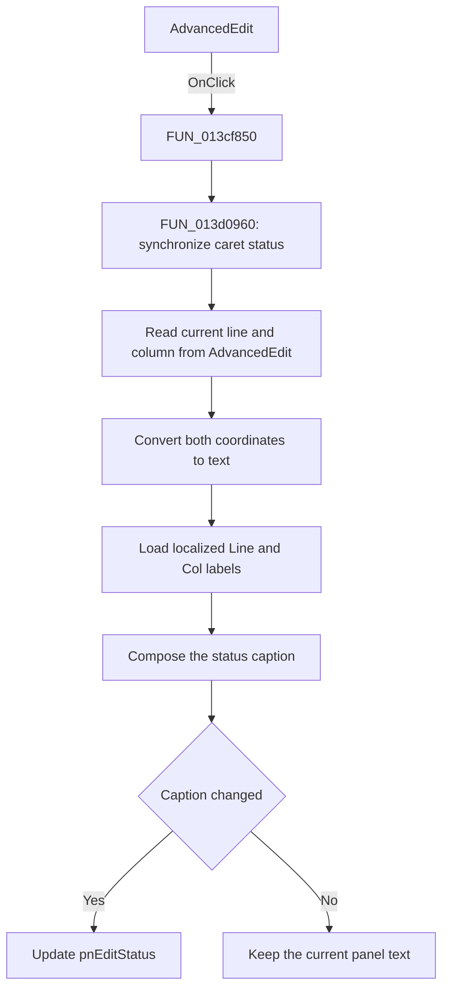

# AdvancedEdit

> Analysis status: Source reviewed. The click behavior is supported by the
> recovered handler, its status-update callee, and the sibling status panel.

## Control

| Property | Recovered value |
| --- | --- |
| Form | AddCurveDlg |
| Component path | AddCurveDlg.AdvancedPanel.Panel1.Panel4.AdvancedEdit |
| Control class | TSynEdit |
| Caption | Not present in the recovered resource. |
| Hint | Not present in the recovered resource. |
| Text | Not present in the recovered resource. |
| Handler name | AdvancedEditClick |
| Handler address | 013cf850 |
| Graph node | `resource:dfm:AddCurveDlg/AddCurveDlg.AdvancedPanel.Panel1.Panel4.AdvancedEdit` |
| Handler node | `function:013cf850` |
| Graph layer | UI |
| Updated control | `pnEditStatus` |
| Initial status caption | `Line:1 Col:1` |

## What happens when clicked

Clicking `AdvancedEdit` updates the line-and-column status below the editor.
The click handler is a thin wrapper. It calls `FUN_013d0960`, which does all of
the work:

1. It reads the current caret column and line from `AdvancedEdit`.
2. It converts both integer coordinates to text.
3. It loads the localized labels for the line and column fields.
4. It joins the labels and coordinates into one status string. The DFM default
   caption shows its form as `Line:1 Col:1`.
5. It gives this string to the text setter for `pnEditStatus`.

The click does not change the editor content, selection, or caret position. It
only reads the position that `TSynEdit` reports and copies it to the status
panel. The normal editor control owns any caret movement caused by the click.

The same update routine is called by the editor's `OnKeyUp`, `OnMouseDown`, and
`OnMouseUp` handlers. This reuse confirms that `FUN_013d0960` synchronizes the
status panel after keyboard and mouse activity. It is not a curve-calculation
or text-edit operation.

The click path has no conditional error or recovery branch. It always tries to
format the current coordinates. The final VCL text setter compares the new
caption with the current caption. If they are equal, it does not send another
text update, so a click that keeps the caret at the same position causes no
visible change. The recovered code does not show an error message or a change
to other dialog state.

## Click flow

## Handler evidence

- Source: [DecompiledSources/Tina16/functions/00000000013CF850__FUN_013cf850.c](../../../DecompiledSources/Tina16/functions/00000000013CF850__FUN_013cf850.c)
- Recovered role: Advanced editor caret-status click synchronizer.
- Current graph summary: Handles 1 Delphi UI event: AddCurveDlg.AdvancedPanel.Panel1.Panel4.AdvancedEdit.OnClick.
- Current graph behavior: The checked-in graph does not yet contain a curated
  behavior description for this function.
- Current graph evidence: The handler is in the `UI` layer. Its only direct
  call is the shared caret-status update routine.
- Complexity: simple
- Distinct outgoing calls: 1

The form fields and resources identify the data flow:

- `param_1 + 0x848` is `AdvancedEdit`. `FUN_013d0960` reads both caret
  coordinates from this control.
- `param_1 + 0x840` is `pnEditStatus`. The routine writes the composed caption
  to this sibling panel.
- The DFM places both controls in `Panel4`. `pnEditStatus` has the initial
  caption `Line:1 Col:1`, which agrees with the two-coordinate string built by
  the callee.
- `FUN_013cf860`, `FUN_013cf880`, and `FUN_013cf900` call the same routine for
  `OnKeyUp`, `OnMouseDown`, and `OnMouseUp`.

## Direct calls

- `function:013d0960` — [FUN_013d0960](../../../DecompiledSources/Tina16/functions/00000000013D0960__FUN_013d0960.c)
  reads the editor caret coordinates, converts them to strings, loads the two
  localized labels, composes the status text, and writes it to `pnEditStatus`.

Relevant functions inside this callee are:

- [FUN_00bfaa40](../../../DecompiledSources/Tina16/functions/0000000000BFAA40__FUN_00bfaa40.c)
  and [FUN_00bfaa50](../../../DecompiledSources/Tina16/functions/0000000000BFAA50__FUN_00bfaa50.c)
  read the two `TSynEdit` caret coordinates.
- [FUN_0040e840](../../../DecompiledSources/Tina16/functions/000000000040E840__FUN_0040e840.c)
  converts each coordinate to text.
- [FUN_00416CD0](../../../DecompiledSources/Tina16/functions/0000000000416CD0__FUN_00416cd0.c)
  joins the label and coordinate fragments.
- [FUN_0064de00](../../../DecompiledSources/Tina16/functions/000000000064DE00__FUN_0064de00.c)
  updates the panel text only when the composed caption differs from the
  current caption.

## Resource evidence

- Kind: Not present in the recovered resource.
- Modal result: Not present in the recovered resource.
- Checked state: Not present in the recovered resource.
- List items: Not present in the recovered resource.
- Image reference: Not present in the recovered resource.
- Extracted glyph: None.
- Companion status resource: `pnEditStatus`, caption `Line:1 Col:1`.

## Nearby label candidates

Nearby labels are layout candidates only. They are not proof of behavior.

- No same-parent label candidate is available.

## Analysis limits

- The editor has no caption, hint, text, glyph, or nearby label. The source data
  flow to `pnEditStatus` and that panel's caption provide the behavior evidence.
- The decompilation does not preserve useful names for the two low-level caret
  getters. Their use and the `Line` and `Col` output prove that they are the two
  caret coordinates, but this article does not assign a stronger internal
  symbol name to either getter.
- The click handler does not change the caret. The exact VCL event order that
  moves the caret and invokes `OnClick` is outside the recovered handler.
