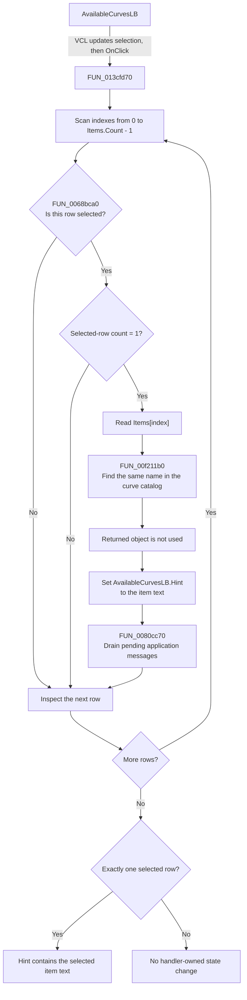

# AvailableCurvesLB

> Analysis status: Source reviewed. The behavior is supported by the recovered
> handler, the VCL list-selection and hint paths, and the dialog's form-show
> logic.

## Control

| Property | Recovered value |
| --- | --- |
| Form | AddCurveDlg |
| Component path | AddCurveDlg.UpperPl.Panel2.AvailableCurvesLB |
| Control class | TListBox |
| Caption | Not present in the recovered resource. |
| Hint | Not present in the recovered resource. |
| Text | Not present in the recovered resource. |
| Handler name | AvailableCurvesLBClick |
| Handler address | 013cfd70 |
| Graph node | `resource:dfm:AddCurveDlg/AddCurveDlg.UpperPl.Panel2.AvailableCurvesLB` |
| Handler node | `function:013cfd70` |
| Graph layer | UI |

## What happens when clicked

The list box supports multiple selected rows, but this click handler acts only
when exactly one row is selected:

1. `FUN_013cfd70` reads the runtime item count and scans each valid index.
2. `FUN_0068bca0` reads `Selected[index]` through the Windows list-box
   `LB_GETSEL` message. For a selected row, the handler also reads the list
   box's selected-row count.
3. If the selected-row count is not 1, the handler does nothing for that row.
   Thus, zero selections and multiple selections do not update the hint.
4. For exactly one selected row, the handler reads its current item text. It
   calls `FUN_00f211b0` to find an entry with the same name in the dialog's
   runtime curve catalog. The recovered handler does not use the returned
   object and does not branch when the lookup returns null.
5. The handler assigns the selected item text to `AvailableCurvesLB.Hint`.
   It then calls `FUN_0080cc70`, which drains pending application messages.
   This lets the VCL process the UI change, including any hint refresh.

The list box changes its selected state before `OnClick` reaches this handler.
The handler only reads that state. It does not add the curve to
`CurveToInsertLB`, remove or delete a curve, or store the selected curve in a
model. The separate `OnDblClick` binding calls `AddBtnClick`, which performs
the add operation.

There is a clear no-op path: no action occurs unless the list has exactly one
selected item. The scan uses indexes from zero to the current item count, so
normal operation does not produce an invalid index. The selection helper can
raise if the native list box rejects an index, and the handler assumes that the
dialog's runtime curve context exists. It has no local error recovery.

## Click flow

## Handler evidence

- Source: [DecompiledSources/Tina16/functions/00000000013CFD70__FUN_013cfd70.c](../../../DecompiledSources/Tina16/functions/00000000013CFD70__FUN_013cfd70.c)
- Recovered role: Single-selection hint updater for the available-curve list.
- Current graph summary: Handles 1 Delphi UI event: AddCurveDlg.UpperPl.Panel2.AvailableCurvesLB.OnClick.
- Current graph behavior: The checked-in graph does not yet contain a curated
  behavior description for this function.
- Current graph evidence: The handler is in the `UI` layer. Its direct calls
  cover selected-state reads, a curve-name lookup, UnicodeString assignment,
  and application message processing.
- Complexity: complex
- Distinct outgoing calls: 5

The recovered form-field and VCL data flow identifies the state used by the
handler:

- `param_1 + 0x778` is `AvailableCurvesLB`. `AddBtnClick`, `RemoveBtnClick`,
  and the list-population logic use the same field.
- The pointer at list-box offset `0x4A0` is its `Items` collection. The handler
  reads its count and the text at each selected index.
- List-box offset `0xF0` is the inherited VCL `Hint` string. The VCL hint
  resolver reads the same offset. The form-show handler also assigns the first
  available item's text to this offset and then calls `FUN_0080cc70`.
- `param_1 + 0x900` is the dialog's runtime curve context. Its field at
  `0x300` is the catalog searched by `FUN_00f211b0`.

The form-show handler rebuilds the available list from the runtime catalog.
Therefore, the DFM strings `Curve1`, `Curve2`, and `Curve3` are design-time
placeholders. The click handler reads the actual runtime item text.

## Direct calls

- `function:0068bca0` — [FUN_0068bca0](../../../DecompiledSources/Tina16/functions/000000000068BCA0__FUN_0068bca0.c)
  sends `LB_GETSEL` for one list index and returns whether that row is
  selected. It raises a list error if Windows returns `LB_ERR`.
- `function:00f211b0` — [FUN_00f211b0](../../../DecompiledSources/Tina16/functions/0000000000F211B0__FUN_00f211b0.c)
  scans the runtime curve catalog for an entry whose stored name matches the
  selected list text. It returns the matching object or null. This handler
  ignores that result.
- `function:00414ad0` — [FUN_00414ad0](../../../DecompiledSources/Tina16/functions/0000000000414AD0__FUN_00414ad0.c)
  assigns the selected UnicodeString to the list box's `Hint` field.
- `function:0080cc70` — [FUN_0080cc70](../../../DecompiledSources/Tina16/functions/000000000080CC70__FUN_0080cc70.c)
  processes pending application messages until no message remains.
- `function:00414560` — [FUN_00414560](../../../DecompiledSources/Tina16/functions/0000000000414560__FUN_00414560.c)
  finalizes the handler's temporary UnicodeString storage.

## Resource evidence

- Kind: Not present in the recovered resource.
- Modal result: Not present in the recovered resource.
- Checked state: Not present in the recovered resource.
- List items: ("Curve1", "Curve2", "Curve3")
- Runtime item source: Rebuilt from the curve catalog when the form is shown.
- Selection behavior: The handler reads per-row selected state and requires a
  selected-row count of 1.
- Double-click action: `AddBtnClick`, which is separate from this click
  handler.
- Image reference: Not present in the recovered resource.
- Extracted glyph: None.

## Nearby label candidates

Nearby labels are layout candidates only. They are not proof of behavior.

- Rank 1: Available curves: at distance 18.

## Analysis limits

- The **Available curves:** label identifies the list, but it does not prove the
  single-selection condition or the hint update. Those effects come from the
  handler and VCL field data flow.
- The purpose of the discarded `FUN_00f211b0` result is not recoverable. The
  source proves that a name lookup occurs, but it does not prove that the
  matching curve object becomes selected or stored.
- `FUN_0080cc70` can dispatch any pending application message. This article
  records that message processing occurs, but it does not attribute unrelated
  queued event effects to this list click.
- This handler does not prove a preview update. It only proves the catalog
  lookup, hint assignment, and message drain described above.
