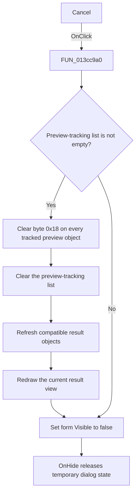

# CancelBtn

> Analysis status: Source, graph, and form evidence reviewed.

## Control

| Property | Recovered value |
| --- | --- |
| Form | AddCurveDlg |
| Component path | AddCurveDlg.UpperPl.Panel3.CancelBtn |
| Control class | TBitBtn |
| Caption | Not present in the recovered resource. |
| Hint | Not present in the recovered resource. |
| Text | Not present in the recovered resource. |
| Handler name | CancelBtnClick |
| Handler address | 013cc9a0 |
| Graph node | `resource:dfm:AddCurveDlg/AddCurveDlg.UpperPl.Panel3.CancelBtn` |
| Handler node | `function:013cc9a0` |
| Graph layer | UI |

## What happens when clicked

The button cancels the active curve **Preview** state and hides the Post-processor dialog. It does not undo curve definitions that the **Create** command has already added or updated.

The handler does these operations:

1. It reads the count of the form-owned list at offset `0x8c0`. The **Preview** handler clears and populates this list with the curve objects used for the current preview.
2. If the list is not empty, the handler visits every attached curve object and writes zero to its byte at offset `0x18`. The recovered source does not contain the Delphi field name, so this article does not assign one. The paired Preview and Delete paths show that this byte is cleared when a displayed curve is withdrawn.
3. It clears the preview-tracking list.
4. It asks the global result-object collection to refresh compatible derived objects through `FUN_01cec4a0`, then calls `FUN_01aceb90` with `1` to redraw the current result view and its child overlays.
5. It always calls `FUN_00805990` for the form. That wrapper passes `false` to the recovered VCL visibility setter, so the dialog is hidden. It does not destroy the form and does not write a modal result in this handler.

When no preview entries exist, steps 2 through 4 are skipped. The dialog is still hidden. There is no validation, confirmation message, error message, or success message.

The form's recovered `OnClose` handler, `FUN_013d0520`, clears a form state byte at offset `0x931` and routes the window-close action through this same cancel handler. After the form becomes hidden, its DFM-bound `OnHide` handler releases the temporary dialog model and resets working state.

This is a preview rollback, not a transaction rollback for user-defined functions. The cancel path does not call the named-curve deletion routines or restore an earlier formula. The **Create** handler commits its function record separately and clears the preview-tracking list before it starts.

## Click flow

## Handler evidence

- Source: [DecompiledSources/Tina16/functions/00000000013CC9A0__FUN_013cc9a0.c](../../../DecompiledSources/Tina16/functions/00000000013CC9A0__FUN_013cc9a0.c)
- Recovered role: Add Curve preview-cancel and dialog-hide handler.
- Current graph summary: Handles 1 Delphi UI event: AddCurveDlg.UpperPl.Panel3.CancelBtn.OnClick.
- Preview-list evidence: `FUN_013cfaa0`, the DFM-bound `PreviewClick` handler, clears and populates the form list at offset `0x8c0` before it builds and redraws a preview.
- Rollback evidence: `FUN_013cc9a0` clears byte `0x18` on every object attached to that list and then clears the list itself. The same byte is cleared when `DeleteBtnClick` withdraws a selected curve.
- Refresh evidence: The refresh calls are inside the nonempty-list branch. `FUN_01cec4a0` walks registered compatible result objects, and `FUN_01aceb90(..., 1)` redraws the current result view when its display rectangle is valid.
- Hide evidence: `FUN_00805990` calls `FUN_007fdf50(form, 0)`. That function is the recovered VCL visibility setter path with `false`.
- Close-path evidence: The DFM binds `AddCurveDlg.OnClose` to `FUN_013d0520`; that function clears offset `0x931` and calls `FUN_013cc9a0`.
- Complexity: complex
- Distinct outgoing calls: 3

## Direct calls

- `function:00805990` — Hides the form through the recovered VCL `Visible := false` path.
- `function:01aceb90` — Redraws the current result view and its registered child overlays.
- `function:01cec4a0` — Walks compatible registered result objects and refreshes their derived state.

## Resource evidence

- Kind: bkCancel
- Modal result: Not present in the recovered resource.
- Checked state: Not present in the recovered resource.
- List items: Not present in the recovered resource.
- Image reference: Not present in the recovered resource.
- Extracted glyph: None.

## Nearby label candidates

Nearby labels are layout candidates only. They are not proof of behavior.

- Rank 1: Curves to insert: at distance 187.

## Analysis limits

- The Delphi name of the preview-object byte at offset `0x18` is not recovered. Its clear operation and its preview-withdrawal context are proven, but a more specific field name would be speculation.
- The handler hides the form. It does not directly destroy it or assign a modal result. The `bkCancel` resource value is supporting UI evidence only.
- The recovered cancel path contains no definition-delete or definition-restore call. It must not be described as undoing a committed **Create** operation.
