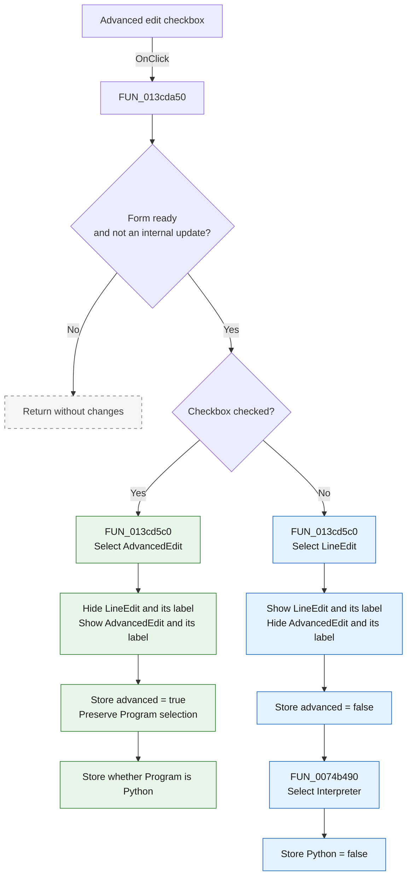

# &Advanced edit

> Analysis status: Complete. The recovered handler, its UI helper, the form field map, and the current-curve state agree on this control's behavior.

## Control

| Property | Recovered value |
| --- | --- |
| Form | AddCurveDlg |
| Form caption | Post-processor |
| Component path | AddCurveDlg.AdvancedPanel.cbEnableAdvancedEdit |
| Control class | TCheckBox |
| Caption | &Advanced edit |
| Hint | Not present in the recovered resource. |
| Text | Not present in the recovered resource. |
| Handler name | cbEnableAdvancedEditClick |
| Handler address | 013cda50 |
| Graph node | `resource:dfm:AddCurveDlg/AddCurveDlg.AdvancedPanel.cbEnableAdvancedEdit` |
| Handler node | `function:013cda50` |
| Graph layer | UI |

## What happens when clicked

The checkbox switches the custom-curve editor between a one-line expression mode and an advanced source-code mode. It also updates the current curve's mode flags.

The handler first checks two form-state bytes:

- The form-ready byte at offset `+0x931` must be true. `FormShow` sets it only after the current curve and editors are ready.
- The internal-update byte at offset `+0x932` must be false. Other code sets this byte while it changes related controls as one operation.

If either condition fails, the handler returns without a state or UI change.

When **Advanced edit is checked**:

1. The handler reads `cbEnableAdvancedEdit.Checked` as true.
2. `FUN_013cd5c0` records `AdvancedEdit` as the active editor and records advanced mode as `1`.
3. It hides `LineEdit` and the `Line Edit` label.
4. It shows `AdvancedEdit` and the `Advanced Edit` label.
5. It stores true in the current curve's advanced-edit flag at offset `+0x309`.
6. It leaves the `Program` radio-group selection unchanged.
7. It stores whether the selected program is item `1`, **Python**, in the current curve's program flag at offset `+0x30a`.

When **Advanced edit is cleared**:

1. `FUN_013cd5c0` records `LineEdit` as the active editor and records advanced mode as `0`.
2. It shows `LineEdit` and the `Line Edit` label.
3. It hides `AdvancedEdit` and the `Advanced Edit` label.
4. It stores false in the current curve's advanced-edit flag.
5. `FUN_0074b490` selects item `0`, **Interpreter**, in the `Program` radio group.
6. It stores false in the current curve's Python-program flag.

The click does not copy, parse, compile, or save editor text. It changes the active editing surface and the current curve's mode flags. Later generation code reads the advanced-edit flag. In line mode, it wraps the stored expressions in a generated `Function F(...)`, `Begin`, and `End;` block. In advanced mode, it uses the stored source lines directly.

## Inputs, decisions, and outputs

| Stage | Proven behavior |
| --- | --- |
| Inputs | The form-ready byte, the internal-update byte, the checkbox's current `Checked` value, and the `Program` radio-group item index. |
| Guard decision | Process the click only when the form is ready and no internal control update is active. |
| Mode decision | Checked selects `AdvancedEdit`; cleared selects `LineEdit`. |
| Visibility state | Exactly one main editor and its matching label are shown by this helper. |
| Active-editor state | Form field `+0x950` points to the selected editor, and mode field `+0x938` stores `1` for advanced or `0` for line mode. |
| Curve state | Offset `+0x309` stores advanced mode. Offset `+0x30a` stores whether the program selection is Python. |
| Program state | Clearing the checkbox forces Interpreter. Checking it preserves the current Interpreter or Python selection. |
| Output | The user sees the editor that matches the selected mode. Later curve generation uses the stored mode. |

## Click flow

## Handler evidence

- Handler source: [FUN_013cda50](../../../DecompiledSources/Tina16/functions/00000000013CDA50__FUN_013cda50.c)
- Editor-mode UI helper: [FUN_013cd5c0](../../../DecompiledSources/Tina16/functions/00000000013CD5C0__FUN_013cd5c0.c)
- Program selection setter: [FUN_0074b490](../../../DecompiledSources/Tina16/functions/000000000074B490__FUN_0074b490.c)
- Later mode consumer: [FUN_013c4af0](../../../DecompiledSources/Tina16/functions/00000000013C4AF0__FUN_013c4af0.c)
- Recovered role from this review: Advanced custom-curve editor mode toggle.
- Current graph summary: Handles `AddCurveDlg.AdvancedPanel.cbEnableAdvancedEdit.OnClick`.
- Complexity: moderate
- Distinct outgoing calls: 2

The Delphi RTTI field map and the DFM component tree identify each form field used by `FUN_013cd5c0`:

| Form offset | Component | UI role |
| --- | --- | --- |
| `+0x700` | `LineEdit` | One-line expression memo |
| `+0x708` | `lLineEdit` | `Line Edit` label |
| `+0x710` | `lAdvancedEdit` | `Advanced Edit` label |
| `+0x728` | `cbEnableAdvancedEdit` | Mode checkbox |
| `+0x848` | `AdvancedEdit` | Advanced syntax editor |
| `+0x870` | `rgProgram` | `Program` group with Interpreter and Python items |

## Direct calls

- `function:013cd5c0` - Selects the active editor and changes the visibility of the line and advanced editors and labels.
- `function:0074b490` - Changes the `Program` radio-group item index. This call occurs only when the checkbox is cleared and selects item `0`.

## Resource evidence

- The checkbox caption is **Advanced edit**. The ampersand defines the keyboard mnemonic.
- The `AdvancedPanel` contains `LineEdit`, `AdvancedEdit`, their labels, and the `Program` radio group.
- The `Program` radio group contains **Interpreter** as item `0` and **Python** as item `1`.
- No hint, image reference, or glyph is present for this checkbox.

## Nearby label candidates

The graph ranks **New function name:**, **Line Edit**, **Built-in functions:**, **User defined curves**, and **Advanced Edit** by coordinate distance. This ranking is not proof of behavior. The handler's form-field accesses and the RTTI map directly identify the two editors and their labels.

## Error and no-op behavior

- The handler has no explicit error or exception path.
- It is a no-op while the form is not ready or while an internal control update is active.
- If the checkbox is cleared when Interpreter is already selected, `FUN_0074b490` keeps the existing index. It still refreshes the stored program flag as false.
- The visibility helper does not test the old mode. It applies the requested active-editor pointer, mode value, and visibility state each time.

## Analysis limits

- The names of the two form-state bytes at offsets `+0x931` and `+0x932` are not recovered. Their write sites prove readiness and internal-update guard roles, but the original Delphi field names are unknown.
- The source proves that item `1` in `rgProgram` means Python because the DFM item order is Interpreter, Python. The original model-field name at offset `+0x30a` is not recovered.
- The click itself does not prove how all editor contents are synchronized during curve selection. It only selects the active editor and changes mode flags and visibility.
