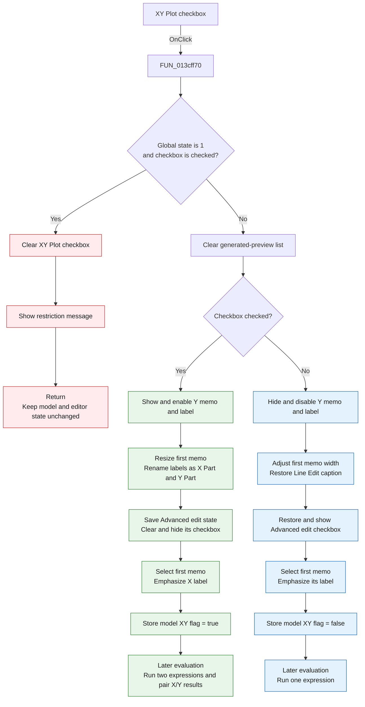

# &XY Plot

> Analysis status: Complete. The recovered handler, form field map, control resources, and the later curve evaluator agree on this control's behavior.

## Control

| Property | Recovered value |
| --- | --- |
| Form | AddCurveDlg |
| Form caption | Post-processor |
| Component path | AddCurveDlg.AdvancedPanel.cbXYPlot |
| Control class | TCheckBox |
| Caption | &XY Plot |
| Hint | Not present in the recovered resource. |
| Text | Not present in the recovered resource. |
| Handler name | cbXYPlotClick |
| Handler address | 013cff70 |
| Graph node | `resource:dfm:AddCurveDlg/AddCurveDlg.AdvancedPanel.cbXYPlot` |
| Handler node | `function:013cff70` |
| Graph layer | UI |

## What happens when clicked

The checkbox switches the custom-curve editor between one expression and separate X and Y expressions. It changes the editor layout immediately and stores the selected XY mode in the current curve model.

An attempt to enable XY mode is rejected when the global analysis-state value at `PTR_DAT_02002a28` is `1`:

1. The handler clears the checkbox again.
2. It shows the message **XY Plot is not allowed after AC Analysis or DC Transfer Characteristic with hysteresis**.
3. It returns without clearing the generated-preview list, changing the editor layout, or changing the current curve's XY flag.

The recovered symbol does not identify the global state field. The message gives direct evidence that value `1` represents a context after AC Analysis or DC Transfer Characteristic with hysteresis. Clearing XY mode is still allowed in this context.

For an allowed change, the handler first clears the temporary list that holds generated or preview curve data.

When **XY Plot is checked**:

1. It shows and enables the second line-editor memo and its label.
2. It reduces the width of the first `LineEdit` so that the second memo starts beside it.
3. It changes the first label to **Line Edit - X Part** and the second label to **Line Edit - Y Part**.
4. It saves the current `Advanced edit` checked state in form byte `+0x92f`.
5. It clears and hides the `Advanced edit` checkbox.
6. `FUN_013d0340` selects the first memo as the active editor and emphasizes its X label.
7. It stores true in the current curve model's XY flag at offset `+0x308`.

When **XY Plot is cleared**:

1. It hides and disables the second line-editor memo and its label.
2. It adjusts the first `LineEdit` width to end before the controls at the right side of the panel.
3. It restores the first label to **Line Edit**.
4. It restores the saved `Advanced edit` checked state and shows that checkbox again.
5. `FUN_013d0340` selects the first memo as the active editor and emphasizes its label.
6. It stores false in the current curve model's XY flag.

Later evaluation code reads the model flag at `+0x308`. A false value evaluates one stored expression. A true value evaluates two stored expressions and combines their result sequences as X and Y coordinate pairs. The click itself does not evaluate or save the expressions.

## Inputs, decisions, and outputs

| Stage | Proven behavior |
| --- | --- |
| Inputs | The global analysis-state value, `cbXYPlot.Checked`, the saved `Advanced edit` state, the current curve object, and the temporary generated-preview list. |
| Restriction decision | A checked value is rejected when the global state is `1`. An unchecked value is not rejected. |
| Mode decision | Checked selects two line editors for X and Y. Cleared selects one line editor. |
| Editor state | The handler changes visibility, enabled state, width, captions, active-editor selection, and label emphasis. |
| Advanced-edit state | XY mode saves, clears, and hides `Advanced edit`. Leaving XY mode restores the saved checked state and shows the checkbox. |
| Curve state | Current curve offset `+0x308` stores the final XY checked value after an allowed change. |
| Cached output | An allowed change clears the temporary generated-preview list so that later preview or apply work does not reuse the old mode's data. |
| Later output | The evaluator produces one expression result in normal mode or paired X and Y results in XY mode. |

## Click flow

## Handler evidence

- Handler source: [FUN_013cff70](../../../DecompiledSources/Tina16/functions/00000000013CFF70__FUN_013cff70.c)
- Active-editor helper: [FUN_013d0340](../../../DecompiledSources/Tina16/functions/00000000013D0340__FUN_013d0340.c)
- Active-editor state writer: [FUN_013d0330](../../../DecompiledSources/Tina16/functions/00000000013D0330__FUN_013d0330.c)
- Later curve evaluator: [FUN_013c55f0](../../../DecompiledSources/Tina16/functions/00000000013C55F0__FUN_013c55f0.c)
- Recovered role from this review: XY custom-curve mode toggle and editor-layout controller.
- Current graph summary: Handles `AddCurveDlg.AdvancedPanel.cbXYPlot.OnClick`.
- Complexity: complex
- Distinct outgoing calls: 6

The Delphi RTTI field map, DFM component tree, and sibling event handlers identify the form fields used by this handler:

| Form offset | Component or state | Role in this handler |
| --- | --- | --- |
| `+0x700` | `LineEdit` | First memo; the X expression in XY mode and the only expression in normal mode. |
| `+0x708` | `lLineEdit` | First memo label. |
| `+0x728` | `cbEnableAdvancedEdit` | Checked state is saved and the control is hidden during XY mode. |
| `+0x740` | `lLineEdit2` | Second memo label; changed to `Line Edit - Y Part`. |
| `+0x748` | `LineEdit2` | Second memo for the Y expression. |
| `+0x750` | `cbXYPlot` | Source checkbox and final mode value. |
| `+0x8c0` | Temporary curve list | Cleared after every allowed mode change. Preview and apply paths also use this list. |
| `+0x900` | Current custom-curve model | Receives the XY flag at model offset `+0x308`. |
| `+0x92f` | Saved checkbox byte | Preserves the prior `Advanced edit` checked state while XY mode is active. |
| `+0x950` | Active editor pointer | Set to `LineEdit` through `FUN_013d0340` and `FUN_013d0330`. |

## Direct calls

- `function:005fce70` - Changes the font-style byte used here to emphasize the active X or primary line-editor label.
- `function:0064cbf0` - Changes the first memo's width and marks its layout for refresh.
- `function:0064dbe0` - Changes the enabled state of the second memo and its label.
- `function:0064de00` - Changes a control caption only when the text differs. The handler uses it for the `Line Edit`, `Line Edit - X Part`, and `Line Edit - Y Part` captions.
- `function:013cd4e0` - Shows the restriction message through the standard dialog path.
- `function:013d0340` - Selects the first memo as the active line editor and changes the two line-editor labels' emphasis.

## Resource evidence

- The checkbox caption is **XY Plot**. The ampersand defines the keyboard mnemonic.
- The same panel contains `LineEdit` and `LineEdit2`, both `TMemo` controls.
- The recovered form gives both associated labels the initial caption **Line Edit**. The handler supplies their X and Y captions at run time.
- The same panel contains the **Advanced edit** checkbox that this handler saves, clears, hides, restores, and shows.
- No hint, image reference, or glyph is present for this checkbox.

## Nearby label candidates

The graph ranks **New function name:**, **Line Edit**, **Built-in functions:**, **User defined curves**, and **Advanced Edit** by coordinate distance. This ranking alone is not proof of behavior. The handler's form-field accesses, DFM component tree, and the exact run-time captions directly identify the two line editors and the advanced-edit checkbox.

## Error and no-op behavior

- The explicit error path applies only when code tries to enable XY mode in global state `1`.
- The error path rolls back the checkbox and shows a message. It does not clear the generated-preview list or write the model flag.
- The allowed path has no no-op check for an unchanged value. It reapplies the matching layout and model state.
- The handler has no local exception handler. It assumes that the current curve object is available during a normal form lifecycle.

## Analysis limits

- The original Delphi names of the global analysis-state field, the temporary list, and the current model fields are not recovered. Their access patterns and consumers establish the roles documented above.
- The error text identifies the prohibited analysis contexts, but the source does not recover an enum name for global value `1`.
- `FUN_005fce70` changes one recovered font-style byte. Its use on the two labels establishes active-label emphasis, but the original style-property name is not recovered.
- The click changes mode and layout. Expression parsing, evaluation, and result pairing occur later in `FUN_013c55f0`.
