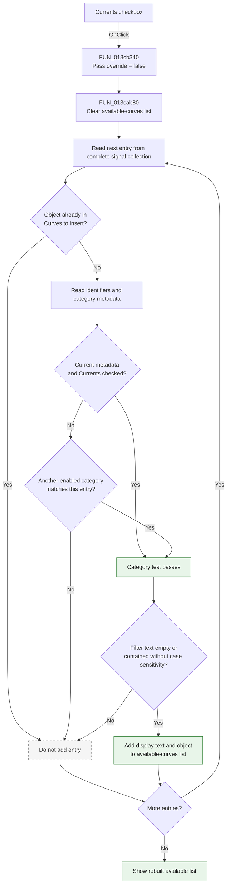

# Currents

> Analysis status: Complete. The recovered click handler, its list-rebuild callee, the form field map, and the DFM control tree agree on this control's behavior.

## Control

| Property | Recovered value |
| --- | --- |
| Form | AddCurveDlg |
| Form caption | Post-processor |
| Component path | AddCurveDlg.UpperPl.Panel2.FilterGB.CurrentsCB |
| Control class | TCheckBox |
| Caption | Currents |
| Initial checked state | true |
| Hint | Not present in the recovered resource. |
| Text | Not present in the recovered resource. |
| Handler name | CurrentsCBClick |
| Handler address | 013cb340 |
| Graph node | `resource:dfm:AddCurveDlg/AddCurveDlg.UpperPl.Panel2.FilterGB.CurrentsCB` |
| Handler node | `function:013cb340` |
| Graph layer | UI |

## What happens when clicked

The checkbox controls whether current-classified signals can appear in the **available curves** list. The handler does not change the checkbox itself. Delphi has already applied the new checked state before it calls `CurrentsCBClick`.

`FUN_013cb340` calls `FUN_013cab80` with the form and a false override value. The callee then rebuilds the available list from the form's complete signal collection:

1. It clears the current contents of `AvailableCurvesLB`.
2. It examines each entry in the complete signal collection at form offset `+0x878`.
3. It skips an entry when its underlying object is already in `CurveToInsertLB`.
4. It classifies the remaining entry from recovered identifiers and metadata fields.
5. For an entry whose metadata identifies it as a current, it reads `CurrentsCB.Checked` from form field `+0x7a8`. With the false override used by this click, the current entry passes this category test only when the checkbox is checked.
6. It also applies the other **Show** category checkboxes. An entry can have more than one recovered classification, so the complete decision is the union of enabled matching categories.
7. If `FilterEB` contains text, it keeps only entries whose display text contains that filter without case sensitivity.
8. It adds each passing display text and its associated object to `AvailableCurvesLB`.

When the checkbox is cleared, current-only entries disappear from the available list. When it is checked, eligible current entries return. The selected **Curves to insert** list is not changed. A current entry that is already selected stays out of the available list in both states.

The click does not add, remove, evaluate, or delete a curve. It only refreshes the set from which the user can select a curve.

## Inputs, decisions, and outputs

| Stage | Proven behavior |
| --- | --- |
| Inputs | `CurrentsCB.Checked`, the other category checkboxes, `FilterEB` text, the complete signal collection, and the objects already in `CurveToInsertLB`. |
| Current decision | Current metadata plus a checked `CurrentsCB` makes the candidate eligible through the current category. The handler passes false, so it does not override an unchecked control. |
| Other category decision | Other enabled categories can also make a candidate eligible when its metadata matches them. |
| Selected-item decision | An object already present in `CurveToInsertLB` is excluded before category and text filtering. |
| Text decision | Empty filter text accepts the category result. Non-empty text requires a case-insensitive occurrence in the candidate's display text. |
| State change | `AvailableCurvesLB` is cleared and repopulated. The checkbox and selected-curves list are not changed by the handler. |
| Output | The available list immediately reflects the new Currents filter together with all other active filters. |

## Click flow

## Handler evidence

- Click handler: [FUN_013cb340](../../../DecompiledSources/Tina16/functions/00000000013CB340__FUN_013cb340.c)
- Available-list rebuild: [FUN_013cab80](../../../DecompiledSources/Tina16/functions/00000000013CAB80__FUN_013cab80.c)
- Case-insensitive text-match helper: [FUN_005b83d0](../../../DecompiledSources/Tina16/functions/00000000005B83D0__FUN_005b83d0.c)
- Recovered handler role: Refresh the available-curve list after the Currents filter changes.
- Likely Delphi method: `TAddCurveDlg.CurrentsCBClick`.
- Complexity: simple
- Distinct outgoing calls: 1

The DFM component order and recovered form field accesses identify the main state used by the call path:

| Form offset | Component or state | Role in the refresh |
| --- | --- | --- |
| `+0x778` | `AvailableCurvesLB` | Its item collection is cleared and receives passing entries. |
| `+0x7a8` | `CurrentsCB` | Supplies the checked state for the current category. |
| `+0x7e0` | `CurveToInsertLB` | Its object collection prevents selected curves from also appearing as available. |
| `+0x810` | `FilterEB` | Supplies the optional display-text filter. |
| `+0x878` | Complete signal collection | Supplies the entries that the callee classifies and filters. |

## Direct call

- `function:013cab80` - Rebuilds `AvailableCurvesLB` from the complete signal collection. It excludes selected objects, applies category checkboxes including `CurrentsCB`, applies the case-insensitive `FilterEB` text, and preserves each accepted entry's associated object.

## Resource evidence

- `CurrentsCB` is in the **Show** group beside **Outputs**, **Nodal Voltages**, **Other Voltages**, **User defined**, and **Measurement** filters.
- The recovered DFM sets `CurrentsCB.Checked` and `State = cbChecked`, so currents are included initially.
- `AvailableCurvesLB` is the source list beside **Add >>**. `CurveToInsertLB` is labeled **Curves to insert:**.
- `FilterEB` shares the **Show** group and provides the additional text filter read by the rebuild function.
- No hint, image reference, or glyph is present for this checkbox.
- There is no same-parent label candidate. The checkbox caption and the recovered metadata test provide direct evidence instead.

## Error and no-op behavior

- The handler has no explicit error dialog or exception path.
- It has no guard for an unchanged checkbox state. Each click clears and rebuilds the available list.
- An empty complete signal collection produces an empty available list.
- A candidate that fails the selected-item, category, or text test is silently omitted.
- The handler does not modify `CurveToInsertLB`, the source collection, or any curve model.

## Analysis limits

- The original Delphi name of `FUN_013cab80` is not recovered. Its callers and data flow establish its available-list rebuild role.
- Several candidate classifications use global collections and unnamed metadata fields. This review identifies the current-category field and the overall filter behavior, but it does not invent names for the other metadata fields.
- An entry can satisfy more than one category test. Therefore, clearing Currents does not prove that every signal with current-related metadata disappears if another enabled category also accepts it.
