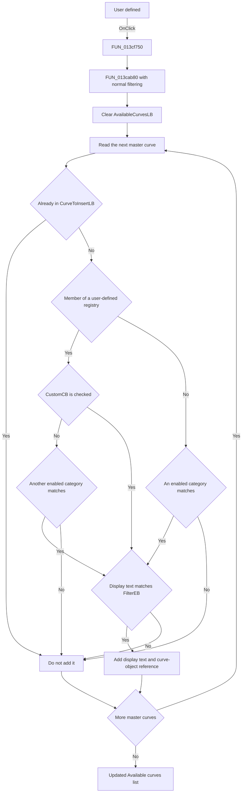

# User defined

> Analysis status: Source reviewed. The handler and shared list-rebuild source
> establish the user-defined category filter and its list effects.

## Control

| Property | Recovered value |
| --- | --- |
| Form | AddCurveDlg |
| Component path | AddCurveDlg.UpperPl.Panel2.FilterGB.CustomCB |
| Control class | TCheckBox |
| Caption | User defined |
| Hint | Not present in the recovered resource. |
| Text | Not present in the recovered resource. |
| Handler name | CustomCBClick |
| Handler address | 013cf750 |
| Graph node | `resource:dfm:AddCurveDlg/AddCurveDlg.UpperPl.Panel2.FilterGB.CustomCB` |
| Handler node | `function:013cf750` |
| Graph layer | UI |

## What happens when clicked

`CustomCB` controls whether the **Available curves:** list admits curves from
the user-defined curve registries. The DFM initializes the checkbox as checked,
so user-defined curves are visible by default when they also pass the other
list conditions.

`FUN_013cf750` does not change a model field itself. After `TCheckBox` changes
the checked state, the handler calls `FUN_013cab80(form, false)`. The false
argument selects normal filtering, so an unchecked category is not bypassed.

The shared rebuild performs these operations:

1. It clears `AvailableCurvesLB`.
2. It scans the form's complete master curve collection.
3. It skips a curve object that is already in `CurveToInsertLB`.
4. It tests curve objects against the recovered category registries. Three
   registries share the `CustomCB` gate at form offset `0x7B8`. Membership in
   one of these registries is the source-level evidence for the **User
   defined** category.
5. It applies the other category gates to their curve types. A curve that can
   match more than one registry can still be admitted by another enabled
   category.
6. If `FilterEB` is not empty, it performs a case-insensitive substring test
   against the curve display text.
7. It adds each accepted display text and its attached curve-object reference
   to `AvailableCurvesLB`.

When `CustomCB` is checked, its user-defined registry matches can continue to
the selected-list exclusion and text-filter tests. When it is unchecked, this
category no longer admits those matches. The complete list is rebuilt on each
click, so newly accepted items reappear and rejected items disappear at once.

The click changes only the visible available-list contents and their attached
object references. It does not modify the master curve collection, delete a
user-defined function, or change `CurveToInsertLB`. A curve that is already in
`CurveToInsertLB` stays there and remains absent from the available list even
when the checkbox is checked.

If the master collection is empty, or no user-defined curve passes the other
filters, the rebuilt list can be unchanged or empty. The handler shows no
message and has no separate no-match branch. It has no local exception
handling; list, string, or registry errors propagate to the caller.

## Click flow

## Handler evidence

- Source: [DecompiledSources/Tina16/functions/00000000013CF750__FUN_013cf750.c](../../../DecompiledSources/Tina16/functions/00000000013CF750__FUN_013cf750.c)
- Recovered role: User-defined curve visibility-filter click handler.
- Current graph summary: Handles 1 Delphi UI event: AddCurveDlg.UpperPl.Panel2.FilterGB.CustomCB.OnClick.
- Current graph behavior: The checked-in graph does not yet contain a curated behavior description for this function.
- Current graph evidence: The handler is in the `UI` layer. Its only direct call edge goes to `FUN_013cab80`.
- Complexity: simple
- Distinct outgoing calls: 1

The source-level form offsets identify the data flow:

- `0x7B8` is `CustomCB`, whose checked state gates three user-defined curve
  registries.
- `0x778` is `AvailableCurvesLB`, which the rebuild clears and repopulates.
- `0x7E0` is `CurveToInsertLB`, whose attached objects are excluded from the
  available list.
- `0x878` is the complete master curve collection scanned by the rebuild.
- `0x810` is `FilterEB`, whose text provides the optional name filter.

The paired Add and Remove handlers, their DFM labels, the OK-handler consumer,
and `FUN_013cab80` establish these list roles. The shared rebuild is also called
after category changes, text-filter key events, curve transfers, curve creation,
and curve deletion.

## Direct calls

- `function:013cab80` — [FUN_013cab80](../../../DecompiledSources/Tina16/functions/00000000013CAB80__FUN_013cab80.c)
  rebuilds `AvailableCurvesLB` from the master curve collection under the
  category, selected-list, and text-filter rules.

Relevant calls below `FUN_013cab80`:

- [FUN_00f1e290](../../../DecompiledSources/Tina16/functions/0000000000F1E290__FUN_00f1e290.c)
  tests whether one curve object belongs to a recovered registry. The shared
  rebuild uses it for the user-defined and other curve categories.
- [FUN_005b83d0](../../../DecompiledSources/Tina16/functions/00000000005B83D0__FUN_005b83d0.c)
  uppercases the display text and filter text, then tests whether the filter is
  a substring of the display text.

## Resource evidence

- Kind: Not present in the recovered resource.
- Modal result: Not present in the recovered resource.
- Checked state: true
- List items: Not present in the recovered resource.
- Image reference: Not present in the recovered resource.
- Extracted glyph: None.

## Nearby label candidates

Nearby labels are layout candidates only. They are not proof of behavior.

- No same-parent label candidate is available.

## Analysis limits

- The three internal user-defined registry types do not have recovered Delphi
  class names. Their common `CustomCB` gate and the user-function create path
  establish their category role.
- Curves can be members of more than one recovered registry. Unchecking this
  box removes the user-defined category match; another enabled category can
  still admit the same object.
- The handler rebuilds a UI view. It does not change the checked state itself,
  persist the filter, or mutate the backing curve registries.
