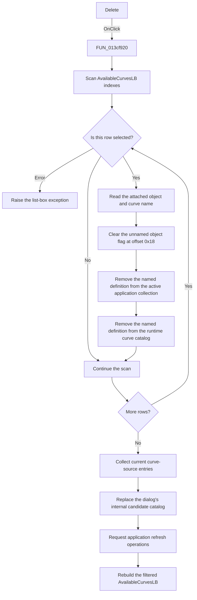

# Delete

> Analysis status: Evidence-backed source review complete.

## Control

| Property | Recovered value |
| --- | --- |
| Form | AddCurveDlg |
| Component path | AddCurveDlg.UpperPl.Panel2.DeleteBtn |
| Control class | TButton |
| Caption | Delete |
| Hint | Not present in the recovered resource. |
| Text | Not present in the recovered resource. |
| Handler name | DeleteBtnClick |
| Handler address | 013cf920 |
| Graph node | `resource:dfm:AddCurveDlg/AddCurveDlg.UpperPl.Panel2.DeleteBtn` |
| Handler node | `function:013cf920` |
| Graph layer | UI |

## What happens when clicked

The handler processes every selected row in `AvailableCurvesLB`. For each selected row, it reads the attached curve object and display name. It clears one unnamed Boolean flag at offset `0x18` in the attached object. It then removes a curve definition with the same name from both of these stores when a match exists:

- the active application's curve-definition collection; and
- the dialog's runtime user-defined curve catalog.

The two removal helpers use name lookups. They do nothing when the named record is not present. A selected user-defined curve that exists in both stores is removed and destroyed in both stores.

After the scan, the handler always rebuilds the dialog's internal candidate catalog from the current application source registries. It requests application-wide refresh operations and rebuilds `AvailableCurvesLB` from that catalog. The list rebuild applies the current filters and excludes objects that are already in `CurveToInsertLB`. A successfully deleted user-defined curve therefore disappears from the visible available list.

The button supports multiple selected rows. It does not ask for confirmation. If no row is selected, it deletes nothing, but it still rebuilds and refreshes the catalogs. It does not close the dialog or directly change `CurveToInsertLB`.

`FUN_0068bca0` can raise a list-box exception if the native selected-state query rejects an index. The handler has no local error recovery and assumes that the form model and active application context exist.

## Click flow

## Handler evidence

- Source: [DecompiledSources/Tina16/functions/00000000013CF920__FUN_013cf920.c](../../../DecompiledSources/Tina16/functions/00000000013CF920__FUN_013cf920.c)
- Recovered role: Deletes selected user-defined curve definitions and refreshes the Add Curve dialog's available catalog.
- Current graph summary: Handles 1 Delphi UI event: AddCurveDlg.UpperPl.Panel2.DeleteBtn.OnClick.
- Current graph behavior: The checked-in graph does not yet contain the source-derived behavior in this article.
- Current graph evidence: The DFM binding, caption, call edges, and recovered handler body identify the button and handler.
- Complexity: complex
- Distinct outgoing calls: 12

The recovered field and call-site data flow gives these checks:

- `param_1 + 0x778` is `AvailableCurvesLB`. The handler reads its `Items.Count`, `Selected[index]`, item text, and attached object reference.
- [`FUN_019ae710`](../../../DecompiledSources/Tina16/functions/00000000019AE710__FUN_019ae710.c) performs a case-sensitive name lookup in the active application's curve collection, removes the matching record, and destroys it. The paired curve creation functions update this same collection.
- [`FUN_013c5ac0`](../../../DecompiledSources/Tina16/functions/00000000013C5AC0__FUN_013c5ac0.c) uses the dialog model's exact curve-name lookup, removes the matching runtime record, and destroys it.
- [`FUN_00f1e090`](../../../DecompiledSources/Tina16/functions/0000000000F1E090__FUN_00f1e090.c) collects entries from the current global curve/source registries. [`FUN_013ca610`](../../../DecompiledSources/Tina16/functions/00000000013CA610__FUN_013ca610.c) replaces the form's internal candidate collection with that list.
- [`FUN_013cab80`](../../../DecompiledSources/Tina16/functions/00000000013CAB80__FUN_013cab80.c) clears and rebuilds `AvailableCurvesLB` from the candidate collection. It applies the dialog filters and excludes objects found in `CurveToInsertLB`.

## Direct calls

- `function:00410f20` — Nil-safe Delphi object destruction helper
- `function:00414480` — Delphi UnicodeString clear and finalization helper
- `function:004b6930` — Constructs the temporary Delphi list used during catalog rebuild
- `function:0068bca0` — Reads `TListBox.Selected[index]` and raises on a native index error
- `function:00f1e090` — Collects the current global curve/source entries
- `function:013c5ac0` — Removes a named curve from the runtime user-defined curve catalog
- `function:013ca610` — Replaces the form's internal candidate catalog
- `function:013cab80` — Rebuilds the filtered visible available-curves list
- `function:019a45d0` — Gets the active application object that owns the synchronized curve collection
- `function:019ae710` — Removes and destroys a named curve in that active collection
- `function:01aceb90` — Refreshes an optional application display object
- `function:01cec4a0` — Requests updates from registered application view objects

## Resource evidence

- Kind: Not present in the recovered resource.
- Modal result: Not present in the recovered resource.
- Checked state: Not present in the recovered resource.
- List items: Not present in the recovered resource.
- Image reference: Not present in the recovered resource.
- Extracted glyph: None.
- Caption: **Delete**.
- Source list: `AvailableCurvesLB`, under the label **Available curves:**. Its DFM strings `Curve1`, `Curve2`, and `Curve3` are design-time placeholders; the runtime rebuild replaces them.
- The caption identifies delete intent. The handler and synchronized name-removal calls prove what is deleted.

## Nearby label candidates

Nearby labels are layout candidates only. They are not proof of behavior.

- Rank 1: Available curves: at distance 366.

## Analysis limits

- The attached curve object's field at offset `0x18` has no recovered Delphi name. The source proves that the handler clears it, but it does not prove the flag's domain meaning.
- The sources prove that `FUN_01cec4a0` and `FUN_01aceb90` refresh application objects after deletion. Their class names and exact visible targets are not recovered, so this article does not assign a more specific UI effect.
- The handler does not test whether a selected row is deletable before it calls the name-removal helpers. If neither collection has a matching record, those helpers make no deletion and the rebuilt source can remain visible.
- This review did not run the original application. It does not claim a live test of multi-selection, error handling, or the downstream display refresh.
