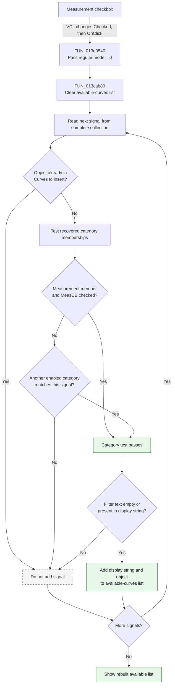

# Measurement

> Analysis status: Complete. The recovered click handler, the shared list-rebuild function, the form field map, and the DFM resource agree on this control's behavior.

## Control

| Property | Recovered value |
| --- | --- |
| Form | AddCurveDlg |
| Form caption | Post-processor |
| Component path | AddCurveDlg.UpperPl.Panel2.FilterGB.MeasCB |
| Control class | TCheckBox |
| Caption | Measurement |
| Initial checked state | false (the DFM does not override the standard unchecked state) |
| Hint | Not present in the recovered resource. |
| Text | Not present in the recovered resource. |
| Handler name | MeasCBClick |
| Handler address | 013d0540 |
| Graph node | `resource:dfm:AddCurveDlg/AddCurveDlg.UpperPl.Panel2.FilterGB.MeasCB` |
| Handler node | `function:013d0540` |
| Graph layer | UI |

## What happens when clicked

The checkbox controls whether measurement-classified signals can appear in the **available curves** list. Delphi changes `MeasCB.Checked` before it calls the event handler. The recovered handler does not toggle the checkbox and does not inspect a `Sender` argument.

`FUN_013d0540` calls `FUN_013cab80` with the Add Curve form and `0`. This selects the regular filter mode. The shared function does not distinguish which control caused the call. It reads the current state of every **Show** checkbox, including `MeasCB.Checked` at form field `+0x7c8`, and rebuilds `AvailableCurvesLB`:

1. It clears `AvailableCurvesLB` at form field `+0x778`.
2. It scans the complete signal collection at `+0x878`.
3. It skips a signal when the same object is already in `CurveToInsertLB` at `+0x7e0`.
4. It tests the signal object against recovered category collections. A match in the collection referenced by `PTR_DAT_02001d00` passes the measurement category only when `MeasCB.Checked` is true.
5. It also applies the other category checkboxes. A signal that matches more than one category can still pass through another enabled category when **Measurement** is cleared.
6. It applies the optional `FilterEB` text at `+0x810`.
7. It adds each accepted display string and associated signal object to `AvailableCurvesLB`.

When the checkbox is cleared, signals that depend only on the measurement category disappear from the available list. When it is checked, eligible measurement signals return. The click does not change `CurveToInsertLB`, the complete signal collection, or the curve objects.

## Inputs, decisions, and outputs

| Stage | Proven behavior |
| --- | --- |
| Inputs | `MeasCB.Checked`, the other category checkboxes, `FilterEB` text, the complete signal collection, and objects already in `CurveToInsertLB`. |
| Measurement decision | Membership in the collection referenced by `PTR_DAT_02001d00` plus a checked `MeasCB` makes the signal eligible through the measurement category. |
| Other category decision | Another enabled category can also make the same signal eligible. |
| Selected-item decision | A signal object already in `CurveToInsertLB` is excluded before category and text filtering. |
| Text decision | Empty filter text accepts the category result. Non-empty text must occur in the display string under the recovered case-insensitive comparison. |
| State change | `AvailableCurvesLB` is cleared and repopulated. VCL changes the checkbox state before the handler runs. |
| Output | The available list immediately reflects the new Measurement filter together with all other active filters. |

## Click flow

## Handler evidence

- Click handler: [FUN_013d0540](../../../DecompiledSources/Tina16/functions/00000000013D0540__FUN_013d0540.c)
- Available-list rebuild: [FUN_013cab80](../../../DecompiledSources/Tina16/functions/00000000013CAB80__FUN_013cab80.c)
- Case-insensitive text-match helper: [FUN_005b83d0](../../../DecompiledSources/Tina16/functions/00000000005B83D0__FUN_005b83d0.c)
- Recovered handler role: Refresh the available-curve list after the Measurement filter changes.
- Likely Delphi method: `TAddCurveDlg.MeasCBClick`.
- Complexity: simple
- Distinct outgoing calls: 1

The DFM component order and recovered form field accesses identify the state used by this call path:

| Form offset | Component or state | Role in the refresh |
| --- | --- | --- |
| `+0x778` | `AvailableCurvesLB` | Its item collection is cleared and receives accepted signals. |
| `+0x7c8` | `MeasCB` | Supplies the checked state for the measurement category test. |
| `+0x7e0` | `CurveToInsertLB` | Its object collection prevents selected curves from also appearing as available. |
| `+0x810` | `FilterEB` | Supplies the optional display-text filter. |
| `+0x878` | Complete signal collection | Supplies the signal entries that the function classifies and filters. |

## Direct call

- `function:013cab80` - Clears and rebuilds `AvailableCurvesLB`. It excludes selected objects, applies the category controls including `MeasCB`, applies the text filter, and preserves each accepted entry's associated object.

## Resource evidence

- `MeasCB` has the direct caption **Measurement** and is in the **Show** group with the other signal-category filters.
- The DFM has no `Checked` or `State` property for `MeasCB`; the standard initial state is unchecked. The five other category checkboxes are explicitly checked in the DFM.
- `AvailableCurvesLB` is labeled **Available curves:** and is the source list beside **Add >>**. `CurveToInsertLB` is labeled **Curves to insert:**.
- `FilterEB` shares the **Show** group and supplies the additional text filter that the rebuild function reads.
- No hint, image reference, glyph, or same-parent label candidate is present for this checkbox.

## Error and no-op behavior

- The handler has no explicit error dialog, exception path, or guard for an unchanged state.
- Each click clears and rebuilds the available list, even when no signal passes the filters.
- A signal that fails the selected-item, category, or text test is silently omitted.
- The handler does not add, remove, evaluate, or delete a curve.

## Analysis limits

- The original Delphi name of `FUN_013cab80` is not recovered. Its callers and list data flow establish its available-list rebuild role.
- The measurement collection at `PTR_DAT_02001d00` and the complete signal collection have no recovered Delphi field names. This article keeps their address- and offset-based identities.
- A signal can satisfy more than one recovered category test. Clearing **Measurement** does not prove that every signal with measurement membership disappears when another enabled category also accepts it.
