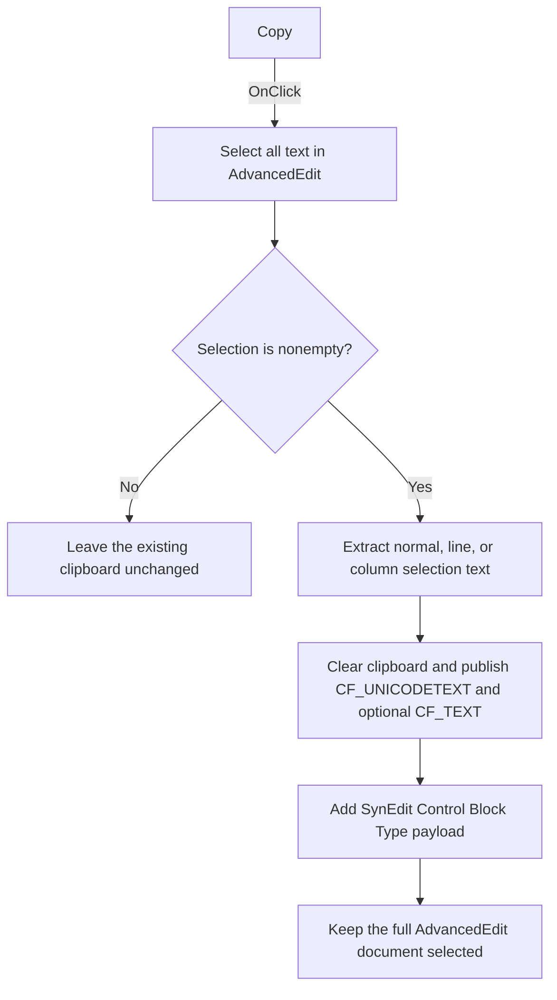

# Copy

> Analysis status: Source, graph, and form evidence reviewed.

## Control

| Property | Recovered value |
| --- | --- |
| Form | AddCurveDlg |
| Component path | AddCurveDlg.pmMain.mnCopy |
| Control class | TMenuItem |
| Caption | Copy |
| Hint | Not present in the recovered resource. |
| Text | Not present in the recovered resource. |
| Handler name | mnCopyClick |
| Handler address | 013d0550 |
| Graph node | `resource:dfm:AddCurveDlg/AddCurveDlg.pmMain.mnCopy` |
| Handler node | `function:013d0550` |
| Graph layer | UI |

## What happens when clicked

This menu item copies the complete content of `AdvancedEdit` to the Windows
clipboard. It does not copy only the user's current selection. It does not read
`LineEdit`, `LineEdit2`, or the `Terminal` editor.

The handler does these operations in a fixed order:

1. It passes the editor at form offset `0x848` to `FUN_00bfa390`.
   `AdvancedEditMouseDown` and the other Advanced Edit handlers use the same
   field, which identifies this object as `AdvancedEdit`.
2. `FUN_00bfa390` selects from line 1, column 1 through the last character of
   the final editor line. This is the same helper that the separate **Select
   All** menu handler calls.
3. `FUN_00bf1d60` checks whether the resulting selection is nonempty. If it is
   empty, the function returns without opening or changing the clipboard.
4. For a nonempty selection, `FUN_00bf2ed0` extracts the selected text. It has
   separate paths for normal, whole-line, and column/block selection modes and
   inserts the editor's line separator between selected source lines.
5. `FUN_00bd1c50` opens and clears the clipboard. It always publishes the text
   as `CF_UNICODETEXT` (format `13`). It also publishes `CF_TEXT` (format `1`)
   unless the recovered platform-mode check returns `2`.
6. `FUN_00bf1bf0` reopens the clipboard and adds the registered
   `SynEdit Control Block Type` format. This payload starts with the current
   SynEdit selection-mode byte and then contains the copied text. SynEdit can
   use this extra format to preserve normal, line, or column selection type on
   paste.

The click has no success message and does not modify the editor text. It leaves
the complete document selected after the copy operation.

An empty `AdvancedEdit` document is the explicit no-op case: Select All leaves
equal selection endpoints, the copy helper returns, and the previous clipboard
content remains unchanged. The clipboard writers test global-memory allocation
and lock results. A failed allocation or lock skips that payload; the recovered
path does not show an error message or retry. `FUN_013d0550` does not inspect a
status result and has no local error handler.

## Click flow

## Handler evidence

- Source: [DecompiledSources/Tina16/functions/00000000013D0550__FUN_013d0550.c](../../../DecompiledSources/Tina16/functions/00000000013D0550__FUN_013d0550.c)
- Recovered role: Select-all-and-copy handler for the Add Curve Advanced Edit
  control.
- Current graph summary: Handles 1 Delphi UI event:
  `AddCurveDlg.pmMain.mnCopy.OnClick`.
- Target evidence: Both calls receive the object at form offset `0x848`.
  `AdvancedEditMouseDown` at `013cf880` also uses this field for its bound
  `AdvancedEdit` event.
- Selection evidence: The first direct call is identical to the only call in
  `mnSelectAllClick` at `013d0590`.
- Clipboard evidence: The second direct call checks the selection, extracts its
  text, writes standard clipboard formats, and adds the registered SynEdit
  block-type format.
- Complexity: moderate
- Distinct outgoing calls: 2

## Direct calls

- `function:00bfa390` — [FUN_00bfa390](../../../DecompiledSources/Tina16/functions/0000000000BFA390__FUN_00bfa390.c)
  selects the complete SynEdit document and requests a selection-state update.
- `function:00bf1d60` — [FUN_00bf1d60](../../../DecompiledSources/Tina16/functions/0000000000BF1D60__FUN_00bf1d60.c)
  copies the current nonempty SynEdit selection and preserves the selection
  mode in a custom clipboard payload.

## Relevant descendant calls

- `function:00bf2c80` — [FUN_00bf2c80](../../../DecompiledSources/Tina16/functions/0000000000BF2C80__FUN_00bf2c80.c)
  compares the selection endpoints and reports whether text is selected.
- `function:00bf2ed0` — [FUN_00bf2ed0](../../../DecompiledSources/Tina16/functions/0000000000BF2ED0__FUN_00bf2ed0.c)
  extracts selection text for normal, whole-line, and column/block modes.
- `function:00bd1c50` — [FUN_00bd1c50](../../../DecompiledSources/Tina16/functions/0000000000BD1C50__FUN_00bd1c50.c)
  clears the Windows clipboard and writes `CF_TEXT` and `CF_UNICODETEXT` data.
- `function:00bf1bf0` — [FUN_00bf1bf0](../../../DecompiledSources/Tina16/functions/0000000000BF1BF0__FUN_00bf1bf0.c)
  calls the standard text writer and then adds the SynEdit-specific payload.
- `function:00c116d0` — [FUN_00c116d0](../../../DecompiledSources/Tina16/functions/0000000000C116D0__FUN_00c116d0.c)
  registers the custom clipboard format under the name
  `SynEdit Control Block Type`.

## Resource evidence

- `mnCopy` is a `TMenuItem` under the `pmMain` popup menu. Its caption is
  `Copy`, and its `OnClick` event resolves to `mnCopyClick` at `013d0550`.
- The same popup menu also contains `mnSelectAll` and `mnSaveAs`.
- `AdvancedEdit` is a `TSynEdit` on
  `AdvancedPanel.Panel1.Panel4`. Its mouse and key events resolve to handlers
  that use the same form field as `mnCopyClick`.
- Hint, text, kind, modal result, image reference, and shortcut are not present
  for this menu item. It has no extracted glyph.

## Nearby label candidates

No label is a child of `pmMain`. Layout labels on `AdvancedPanel` are not direct
evidence for this popup-menu command.

## Analysis limits

- The extracted DFM evidence does not retain a PopupMenu property that links
  `pmMain` to an editor. The hardcoded form field and the independently bound
  `AdvancedEdit` handlers establish the target.
- The symbolic name of the platform-mode test that controls the additional
  `CF_TEXT` write is not recovered. The numeric comparison with `2` and the
  unconditional `CF_UNICODETEXT` write are visible.
- The clipboard wrapper's Delphi class name is not recovered. Its open, clear,
  format-write, and close sequence and the standard Windows clipboard format
  identifiers establish its responsibility.
