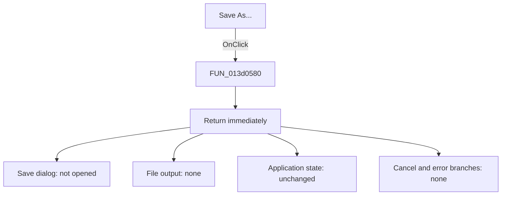

# Save As...

> Analysis status: Source and executable bytes reviewed. This menu handler is
> an evidence-backed no-op.

## Control

| Property | Recovered value |
| --- | --- |
| Form | AddCurveDlg |
| Component path | AddCurveDlg.pmMain.mnSaveAs |
| Control class | TMenuItem |
| Caption | Save As... |
| Hint | Not present in the recovered resource. |
| Text | Not present in the recovered resource. |
| Handler name | mnSaveAsClick |
| Handler address | 013d0580 |
| Graph node | `resource:dfm:AddCurveDlg/AddCurveDlg.pmMain.mnSaveAs` |
| Handler node | `function:013d0580` |
| Graph layer | UI |

## What happens when clicked

Nothing is saved. `mnSaveAs` is connected to `FUN_013d0580`, but that function
returns immediately. Its complete recovered body contains no statement before
`return`. The mapped executable contains the single `C3` return instruction at
the function entry, followed by `CC` padding.

As a result, this click has none of the behavior that the `Save As...` caption
normally suggests:

- It does not create or execute a save dialog.
- It does not propose or read a file name.
- It does not serialize the advanced curve text or any other form data.
- It does not create, replace, or modify a file.
- It does not update a current-file path or dirty state.
- It has no accepted, cancelled, overwrite, or file-error branch.

The Add Curve form resource also contains no `TSaveDialog` component. The graph
contains no outgoing call edge from the handler. These independent findings
agree with the one-instruction function.

Normal VCL menu processing can still dismiss the popup menu after the click.
That framework behavior is outside this event method. The application handler
itself changes no recovered state and reports no error.

## Click flow

## Handler evidence

- Source: [DecompiledSources/Tina16/functions/00000000013D0580__FUN_013d0580.c](../../../DecompiledSources/Tina16/functions/00000000013D0580__FUN_013d0580.c)
- Recovered role: No-op Save As menu handler for the Add Curve dialog.
- Current graph summary: Handles 1 Delphi UI event: AddCurveDlg.pmMain.mnSaveAs.OnClick.
- Current graph behavior: The checked-in graph does not yet contain a curated
  behavior description for this function.
- Current graph evidence: The handler is in the `UI` layer and has zero
  outgoing calls.
- Complexity: simple
- Distinct outgoing calls: 0

## Direct calls

- No direct call edge is present in the recovered graph. The handler has no
  callee to execute a dialog, write a stream, or handle a file error.

## Resource evidence

- Kind: Not present in the recovered resource.
- Modal result: Not present in the recovered resource.
- Checked state: Not present in the recovered resource.
- List items: Not present in the recovered resource.
- Image reference: Not present in the recovered resource.
- Extracted glyph: None.

## Nearby label candidates

Nearby labels are layout candidates only. They are not proof of behavior.

- No same-parent label candidate is available.

## Analysis limits

- The `Save As...` caption states an intended command, but it does not prove an
  implementation. The source, raw instruction, call graph, and form resources
  prove that this recovered handler is a no-op.
- This result applies to `AddCurveDlg.pmMain.mnSaveAs`. Other Save As commands
  in the application have separate handlers and can have real file behavior.
- The handler has no dialog to cancel and no file operation that can fail.
  Therefore, cancellation and save-error behavior are not merely unknown; they
  are absent from this click path.
