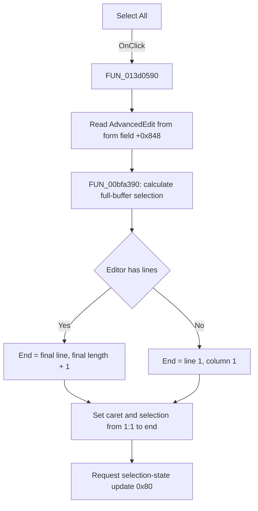

# Select All

> Analysis status: Source reviewed. The menu handler, SynEdit selection helper,
> and sibling Copy command establish the behavior.

## Control

| Property | Recovered value |
| --- | --- |
| Form | AddCurveDlg |
| Component path | AddCurveDlg.pmMain.mnSelectAll |
| Control class | TMenuItem |
| Caption | Select All |
| Hint | Not present in the recovered resource. |
| Text | Not present in the recovered resource. |
| Handler name | mnSelectAllClick |
| Handler address | 013d0590 |
| Graph node | `resource:dfm:AddCurveDlg/AddCurveDlg.pmMain.mnSelectAll` |
| Handler node | `function:013d0590` |
| Graph layer | UI |
| Target control | `AdvancedEdit` (`TSynEdit`) |

## What happens when clicked

Clicking **Select All** selects the complete text buffer in `AdvancedEdit`.
The handler reads the editor from form field `+0x848` and passes it to
`FUN_00bfa390`, the shared SynEdit select-all routine.

The selection routine calculates the range from the editor content:

1. It sets the selection start to line 1, column 1.
2. It reads the number of lines in the editor.
3. For a nonempty line collection, it reads the final line and sets the end to
   that line's length plus one. This position is immediately after the final
   character.
4. For an empty line collection, it uses line 1, column 1 as the end. The
   selection is then empty.
5. It applies the end position as the caret position and applies the calculated
   start and end as the selection bounds.
6. It requests an editor selection-state update with internal flag `0x80`.

The command changes the caret and selection state. It does not modify the text,
copy data to the clipboard, save a file, or close the dialog. The sibling
**Copy** handler calls the same select-all routine and then calls its clipboard
routine. That call order independently confirms the role of `FUN_00bfa390` and
also shows that this Select All command stops before clipboard access.

There is no application-level error branch or message. An empty editor is a
handled no-op selection at `(1,1)`. For nonempty content, the helper depends on
the editor's line collection to return its final line. Any lower-level SynEdit
failure is not handled by this click method.

## Click flow

## Handler evidence

- Source: [DecompiledSources/Tina16/functions/00000000013D0590__FUN_013d0590.c](../../../DecompiledSources/Tina16/functions/00000000013D0590__FUN_013d0590.c)
- Recovered role: Selects all content in the Add Curve advanced editor.
- Current graph summary: Handles 1 Delphi UI event: AddCurveDlg.pmMain.mnSelectAll.OnClick.
- Current graph behavior: The checked-in graph does not yet contain a curated
  behavior description for this function.
- Current graph evidence: The handler is in the `UI` layer. Its only call edge
  targets the shared SynEdit select-all helper.
- Complexity: simple
- Distinct outgoing calls: 1

The form field mapping is supported by independent event code. The
`AdvancedEditMouseDown` handler also uses field `+0x848` for its bound
`AdvancedEdit` event. The DFM identifies this component as the `TSynEdit` text
box in `AdvancedPanel.Panel1.Panel4`.

## Direct calls

- `function:00bfa390` — [FUN_00bfa390](../../../DecompiledSources/Tina16/functions/0000000000BFA390__FUN_00bfa390.c)
  builds a selection from `(1,1)` through the end of the final line, applies
  the caret and both selection bounds, and requests a selection update.

Relevant internal calls are:

- [FUN_00c0a5f0](../../../DecompiledSources/Tina16/functions/0000000000C0A5F0__FUN_00c0a5f0.c)
  applies the caret position and selection endpoints while it brackets the
  changes with editor update calls.
- [FUN_00c0a950](../../../DecompiledSources/Tina16/functions/0000000000C0A950__FUN_00c0a950.c)
  adds the supplied update flag and delivers the pending update immediately
  when the editor is not under an update lock.

## Resource evidence

- Kind: Not present in the recovered resource.
- Modal result: Not present in the recovered resource.
- Checked state: Not present in the recovered resource.
- List items: Not present in the recovered resource.
- Image reference: Not present in the recovered resource.
- Extracted glyph: None.

## Nearby label candidates

Nearby labels are layout candidates only. They are not proof of behavior.

- No same-parent label candidate is available.

## Analysis limits

- The `Select All` caption agrees with the behavior, but the complete-buffer
  coordinate calculation and the Copy handler's call order prove it.
- The source exposes buffer coordinates but does not preserve the original
  SynEdit method names. The role is documented without assigning names to the
  lower-level selection-bound setters.
- This click does not copy the selected text. Clipboard behavior belongs to the
  separate Copy menu handler.
