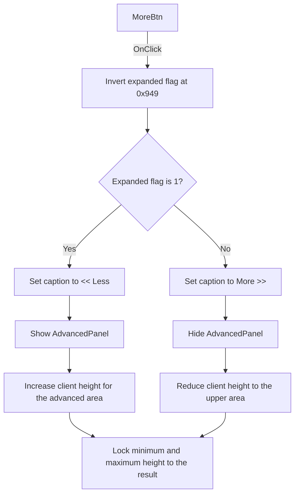

# More

> Analysis status: Source reviewed. The expanded and collapsed states are documented.

## Control

| Property | Recovered value |
| --- | --- |
| Form | AddCurveDlg |
| Component path | AddCurveDlg.UpperPl.Panel3.MoreBtn |
| Control class | TBitBtn |
| Caption | More |
| Hint | Not present in the recovered resource. |
| Text | Not present in the recovered resource. |
| Handler name | MoreBtnClick |
| Handler address | 013cf760 |
| Graph node | `resource:dfm:AddCurveDlg/AddCurveDlg.UpperPl.Panel3.MoreBtn` |
| Handler node | `function:013cf760` |
| Graph layer | UI |

## What happens when clicked

`MoreBtn` toggles the Post-processor dialog's advanced editor area. The handler
uses the byte at form offset `0x949` as its expanded-state flag. `FormCreate`
sets this flag to `0`, assigns the runtime caption `More >>`, and applies the
collapsed layout.

Each click inverts the flag:

- When the new value is `1`, the handler reads item 13 from the hidden
  `ResStrs` list. That item is `<< Less `. It sets this text as the button
  caption, shows `AdvancedPanel`, and increases the form's client height.
- When the new value is `0`, the handler reads item 12, `More >>`. It sets this
  caption, hides `AdvancedPanel`, and reduces the form's client height.

`FUN_013cd390` applies the layout. It temporarily clears the form's minimum and
maximum height constraints, changes `AdvancedPanel.Visible`, calculates the
client height from the current panel sizes, and then locks both height
constraints to the form's resulting height. With the recovered DFM dimensions,
the client-height formulas give 282 for the collapsed state and 769 for the
expanded state. Runtime scaling can change the component dimensions, so the
function calculates these values instead of storing constants.

The click does not add, remove, or change a curve. It does not modify text in
the advanced editors. There is no validation, error, or no-op branch: every
call flips the state and reapplies the layout. The recovered DFM contains
`ModalResult = 2`, but this handler does not read or change a modal result and
does not call a close function. That resource value alone does not establish a
close action for this modeless Post-processor window.

## Click flow

## Handler evidence

- Source: [DecompiledSources/Tina16/functions/00000000013CF760__FUN_013cf760.c](../../../DecompiledSources/Tina16/functions/00000000013CF760__FUN_013cf760.c)
- Recovered role: Add Curve advanced-panel expansion toggle handler.
- Current graph summary: Handles 1 Delphi UI event: AddCurveDlg.UpperPl.Panel3.MoreBtn.OnClick.
- Behavior: Inverts the expanded flag, changes the button caption between `More >>` and `<< Less `, and calls the shared layout function to hide or show `AdvancedPanel` and resize the form.
- Evidence: The source toggles byte `0x949`, reads `ResStrs` items 12 or 13, updates the control at offset `0x808`, and calls `FUN_013cd390`. `FormCreate` initializes the same flag, caption, and layout.
- Complexity: complex
- Distinct outgoing calls: 3

## Direct calls

- `function:0064de00` — sets the button caption when the text changed.
- `function:013cd390` — applies advanced-panel visibility, client height, and
  fixed-height constraints from the expanded flag.
- `function:00414560` — finalizes the two temporary Delphi strings.

## Resource evidence

- Kind: Not present in the recovered resource.
- Modal result: 2
- Checked state: Not present in the recovered resource.
- Initial DFM caption: `More`.
- Collapsed runtime caption: `More >>` from `ResStrs` item 12.
- Expanded runtime caption: `<< Less ` from `ResStrs` item 13.
- Controlled area: `AdvancedPanel`, which contains the line editors, advanced
  editor, terminal, function creation controls, and preview controls.
- List items: Not present in the recovered resource.
- Image reference: Not present in the recovered resource.
- Extracted glyph: None.

## Nearby label candidates

Nearby labels are layout candidates only. They are not proof of behavior.

- Rank 1: Curves to insert: at distance 364.

## Analysis limits

- The design-time dimensions produce client heights 282 and 769. The runtime
  function uses the current component dimensions, so display scaling can change
  the final pixel values.
- The DFM modal-result property is not used in the recovered handler path. This
  article does not infer modal-close behavior from that property.
- The knowledge-graph JSON export was absent during review. The same graph node,
  edge, layer, and source checks used the canonical DuckDB graph.
