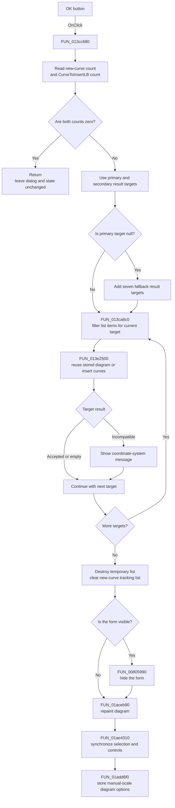

# OKBtn

> Analysis status: Source reviewed through target filtering, curve insertion,
> dialog hiding, diagram refresh, option persistence, and insertion-error paths.

## Control

| Property | Recovered value |
| --- | --- |
| Form | AddCurveDlg |
| Component path | AddCurveDlg.UpperPl.Panel3.OKBtn |
| Control class | TBitBtn |
| Caption | Not present in the recovered resource. |
| Hint | Not present in the recovered resource. |
| Text | Not present in the recovered resource. |
| Handler name | OKBtnClick |
| Handler address | 013cc680 |
| Graph node | `resource:dfm:AddCurveDlg/AddCurveDlg.UpperPl.Panel3.OKBtn` |
| Handler node | `function:013cc680` |
| Graph layer | UI |

## What happens when clicked

`FUN_013cc680` accepts the curves that the user moved under **Curves to
insert:**. It also accepts curves that the dialog created during this session
and tracks in its internal list at form offset `0x8c0`.

The handler first reads the internal new-curve count. If that count is zero, it
reads the item count from `CurveToInsertLB`. If both counts are zero, it returns
immediately. This no-op does not hide the dialog, refresh the diagram, clear
either list, or show a message.

When at least one count is nonzero, the handler performs these operations:

1. It creates a temporary Delphi string/object list.
2. It processes the primary global result target at `02001288` and the
   secondary target at `02005188`.
3. For each target, `FUN_013ca8c0` clears the temporary list and scans every
   `CurveToInsertLB` item. It tests the item's attached curve object against the
   target's curve collection. It copies only matching display-text and object
   pairs to the temporary list. A null target produces an empty list.
4. `FUN_013e2500` submits that target-specific list to the application's
   diagram manager. The helper first tries the stored-diagram path. If that
   path does not return a diagram, it inserts the curves into compatible
   coordinate systems.
5. If the primary target at `02001288` is null, the handler repeats the filter
   and submit steps for seven fallback global targets: `020059d8`, `02001d00`,
   `02001dd8`, `02004fb8`, `02005118`, `02001630`, and `02003118`. The
   recovered symbols do not identify these targets by Delphi field name, so
   this article does not assign analysis names to them.
6. It destroys the temporary list and clears the internal new-curve tracking
   list at offset `0x8c0`. Unlike the Cancel handler, this path does not reset
   byte `0x18` on the tracked curve objects before it clears the list.
7. If the form is visible, `FUN_00805990` hides it by setting its visible state
   to false. The recovered handler does not assign a modal-result value.
8. It repaints the current diagram through `FUN_01aceb90`, synchronizes the
   main-window controls and active coordinate-system state through
   `FUN_01ae4310`, and calls `FUN_01add6f0` to store the diagram options.
   The last helper writes coordinate-system, axis, curve, and figure settings
   only when `Diagram Page Setup/ManualScale` is enabled in `TINA.INI`.

The insert helper can accept some target-specific lists and reject others. The
handler calls the targets in sequence and has no rollback path, so earlier
changes remain if a later target cannot accept its curves.

## Validation and error behavior

The only handler-local precondition is that at least one of the two input
counts is nonzero. Compatibility validation occurs later in
`FUN_01adb8e0`, below `FUN_013e2500`.

When a nonempty target-specific list is incompatible with the available
coordinate system, the lower helper builds and shows a message whose recovered
text includes **curves cannot be inserted into this coordinate system** and
**Please select another diagram!**. It returns false. `FUN_013cc680` does not
read that result. It continues with later target groups and then clears its
tracking list, hides the form, repaints, synchronizes the UI, and tries to
store the diagram options.

If the global diagram manager is null, `FUN_013e2500` returns false without an
insertion. The handler also ignores this result and continues the same final
sequence. A selected item that matches none of the processed result targets
also produces no insertion message because every target-specific list is
empty. The handler has no recovered exception block. An exception from list
allocation, filtering, insertion, repainting, or persistence can therefore
stop the later operations and leave a partial result.

## Click flow

## Handler evidence

- Source: [DecompiledSources/Tina16/functions/00000000013CC680__FUN_013cc680.c](../../../DecompiledSources/Tina16/functions/00000000013CC680__FUN_013cc680.c)
- Recovered role: Accepts pending Add Curve selections, submits them to
  matching result targets, hides the form, and refreshes the diagram UI.
- Current graph summary: Handles 1 Delphi UI event:
  AddCurveDlg.UpperPl.Panel3.OKBtn.OnClick.
- Proven inputs: The `CurveToInsertLB` string/object pairs, the new-curve
  tracking list at offset `0x8c0`, global result targets, and the current
  diagram manager.
- Proven state changes: Inserts accepted curves, clears the tracking list,
  hides a visible form, repaints and synchronizes the diagram UI, and can store
  manual-scale diagram options.
- Complexity: complex
- Distinct outgoing calls: 8

## Direct calls

- [`FUN_00410f20`](../../../DecompiledSources/Tina16/functions/0000000000410F20__FUN_00410f20.c)
  destroys the temporary list after all target groups are processed.
- [`FUN_004b6930`](../../../DecompiledSources/Tina16/functions/00000000004B6930__FUN_004b6930.c)
  creates the temporary Delphi string/object list.
- [`FUN_00805990`](../../../DecompiledSources/Tina16/functions/0000000000805990__FUN_00805990.c)
  hides the form by setting its visible state to false.
- [`FUN_013ca8c0`](../../../DecompiledSources/Tina16/functions/00000000013CA8C0__FUN_013ca8c0.c)
  builds one target-specific list from `CurveToInsertLB`.
- [`FUN_013e2500`](../../../DecompiledSources/Tina16/functions/00000000013E2500__FUN_013e2500.c)
  routes a target-specific curve list through stored-diagram reuse or direct
  insertion. Its insertion path can show the incompatible-coordinate-system
  message in
  [`FUN_01adb8e0`](../../../DecompiledSources/Tina16/functions/0000000001ADB8E0__FUN_01adb8e0.c).
- [`FUN_01aceb90`](../../../DecompiledSources/Tina16/functions/0000000001ACEB90__FUN_01aceb90.c)
  repaints the diagram surface and its registered drawing objects.
- [`FUN_01ae4310`](../../../DecompiledSources/Tina16/functions/0000000001AE4310__FUN_01ae4310.c)
  synchronizes active coordinate-system selection and main-window controls.
- [`FUN_01add6f0`](../../../DecompiledSources/Tina16/functions/0000000001ADD6F0__FUN_01add6f0.c)
  serializes manual-scale diagram options to the current result's diagram
  option storage.

## Resource evidence

- Kind: `bkOK`.
- Modal result: Not explicitly present in the recovered resource or handler.
- Checked state: Not present in the recovered resource.
- List items: Not present on this button. The adjacent `CurveToInsertLB`
  supplies the pending display-text and curve-object pairs.
- Image reference: Not present in the recovered resource.
- Extracted glyph: None. `bkOK` is a built-in `TBitBtn` kind.
- `CurveToInsertLB` has the direct label **Curves to insert:**. The list and
  handler data flow, not label proximity alone, establish its role.

## Nearby label candidates

Nearby labels are layout candidates only. They are not proof of behavior.

- Rank 1: Curves to insert: at distance 155.

## Analysis limits

- The recovered source does not name the global result pointers. Their
  target-specific curve collections and repeated submit pattern are clear, but
  their analysis-type names remain unknown.
- The exact Delphi class name of the internal list at offset `0x8c0` is not
  recovered. Its constructors, item access, clearing, and Cancel-path object
  reset establish its new-curve tracking role.
- `bkOK` normally supplies standard `TBitBtn` behavior, but this analysis does
  not infer a modal result that is absent from the recovered DFM and handler.
