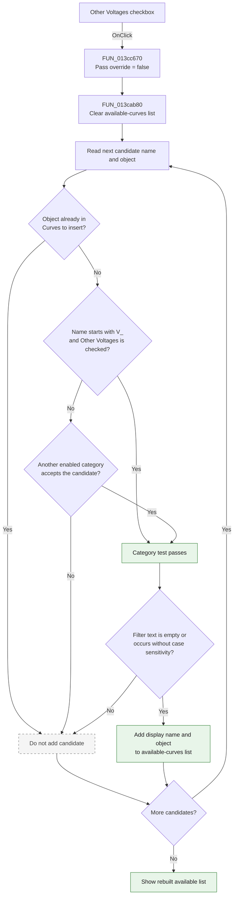

# Other Voltages

> Analysis status: Complete. The recovered click handler, shared list-rebuild
> function, form field map, and DFM control tree agree on this behavior.

## Control

| Property | Recovered value |
| --- | --- |
| Form | AddCurveDlg |
| Form caption | Post-processor |
| Component path | AddCurveDlg.UpperPl.Panel2.FilterGB.OtherVCB |
| Control class | TCheckBox |
| Caption | Other Voltages |
| Initial checked state | true |
| Hint | Not present in the recovered resource. |
| Text | Not present in the recovered resource. |
| Handler name | OtherVCBClick |
| Handler address | 013cc670 |
| Graph node | `resource:dfm:AddCurveDlg/AddCurveDlg.UpperPl.Panel2.FilterGB.OtherVCB` |
| Handler node | `function:013cc670` |
| Graph layer | UI |

## What happens when clicked

The checkbox controls whether signals whose recovered display name starts with
`V_` can appear in the **available curves** list. This prefix test is the code
evidence for the **Other Voltages** category. The handler does not change the
checkbox. Delphi applies the new checked state before it calls
`OtherVCBClick`.

`FUN_013cc670` calls `FUN_013cab80` with the form and a false override value.
The callee then rebuilds the available list:

1. It clears `AvailableCurvesLB`.
2. It scans the complete signal collection at form offset `+0x878`.
3. It skips a candidate when its attached object is already in
   `CurveToInsertLB`.
4. It reads the candidate display name. A non-empty name that starts with
   `V_` enters the other-voltage category test.
5. For that category, it reads `OtherVCB.Checked` from form offset `+0x7b0`.
   The false override from this click means the category passes only when the
   checkbox is checked.
6. It also tests the other **Show** categories. These tests form a union. Thus,
   a candidate that also matches another enabled category can still pass when
   **Other Voltages** is cleared.
7. It applies the optional `FilterEB` text. Empty text accepts the category
   result. Non-empty text must occur in the candidate display name without
   case sensitivity.
8. It adds each passing display name and its attached object to
   `AvailableCurvesLB`.

When the checkbox is checked, eligible `V_` candidates can appear. When it is
cleared, `V_`-only candidates disappear. The click does not change
`CurveToInsertLB`, the complete signal collection, or any curve object. It only
refreshes the source list from which the user can select curves.

## Inputs, decisions, and outputs

| Stage | Proven behavior |
| --- | --- |
| Inputs | `OtherVCB.Checked`, candidate display names and attached objects, the other category checkboxes, `FilterEB` text, and objects already in `CurveToInsertLB`. |
| Other-voltage decision | A non-empty display name must start with `V_`. Because this handler passes a false override, `OtherVCB` must also be checked for this category to accept it. |
| Other category decision | Another enabled category can accept the same candidate even when `OtherVCB` is cleared. |
| Selected-item decision | A candidate object already in `CurveToInsertLB` is excluded before it can be added to the available list. |
| Text decision | Empty filter text accepts the category result. Non-empty text requires a case-insensitive occurrence in the display name. |
| State change | `AvailableCurvesLB` is cleared and repopulated. The handler does not write the checkbox state or change the selected-curves list. |
| Output | The visible available list immediately reflects the new Other Voltages state together with all other active filters. |

## Click flow

## Handler evidence

- Click handler: [FUN_013cc670](../../../DecompiledSources/Tina16/functions/00000000013CC670__FUN_013cc670.c)
- Available-list rebuild: [FUN_013cab80](../../../DecompiledSources/Tina16/functions/00000000013CAB80__FUN_013cab80.c)
- Prefix search helper: [FUN_0044f900](../../../DecompiledSources/Tina16/functions/000000000044F900__FUN_0044f900.c)
- Case-insensitive text-match helper: [FUN_005b83d0](../../../DecompiledSources/Tina16/functions/00000000005B83D0__FUN_005b83d0.c)
- Recovered handler role: Refresh the available-curve list after the Other
  Voltages filter changes.
- Likely Delphi method: `TAddCurveDlg.OtherVCBClick`.
- Complexity: simple.
- Distinct outgoing calls: 1.

The recovered form field table and data flow identify the important fields:

| Form offset | Component or state | Role in the refresh |
| --- | --- | --- |
| `+0x778` | `AvailableCurvesLB` | Its item collection is cleared and receives passing candidates. |
| `+0x7b0` | `OtherVCB` | Supplies the checked state for the `V_` category. |
| `+0x7e0` | `CurveToInsertLB` | Its attached objects prevent selected curves from also appearing as available. |
| `+0x810` | `FilterEB` | Supplies the optional display-name filter. |
| `+0x878` | Complete signal collection | Supplies the names and attached objects that the callee filters. |

The executable stores Delphi UnicodeString constants `I_` and `V_` directly
before the checkbox handlers. `FUN_013cab80` uses its `V_` constant with the
Delphi substring-position helper and requires a result of 1 before it reads the
checkbox at `+0x7b0`. This means the prefix must start at the first character.

## Direct call

- `function:013cab80` - Clears and rebuilds `AvailableCurvesLB`. It excludes
  selected objects, applies the `V_`/`OtherVCB` test and the other category
  tests, applies `FilterEB`, and preserves each accepted candidate's attached
  object.

## Resource evidence

- `OtherVCB` is in the **Show** group beside **Outputs**, **Nodal Voltages**,
  **Currents**, **User defined**, and **Measurement**.
- The recovered DFM sets `OtherVCB.Checked` and `State = cbChecked`, so the
  category is enabled initially.
- `AvailableCurvesLB` is the source list beside **Add >>**.
  `CurveToInsertLB` is labeled **Curves to insert:**.
- `FilterEB` shares the **Show** group and supplies the additional text filter.
- No hint, image reference, glyph, or same-parent label candidate is present.
  The checkbox caption and the recovered `V_` prefix test provide direct
  evidence.

## Error and no-op behavior

- The handler has no explicit error message, exception handler, or guard.
- Each click clears and rebuilds the available list, even when no candidate can
  pass.
- An empty complete signal collection produces an empty available list.
- A candidate that fails the selected-item, category, or text test is silently
  omitted.
- The click does not add, remove, evaluate, or delete a curve object.

## Analysis limits

- The original Delphi name of `FUN_013cab80` is not recovered. Its callers and
  list data flow establish its refresh role.
- The source proves that this control gates names that start with `V_`. It does
  not recover the rule that created each signal name, so this article does not
  assign a more specific electrical subtype to those candidates.
- The category tests form a union. Clearing **Other Voltages** does not prove
  that every candidate with a `V_` name disappears if another enabled category
  also accepts it.
