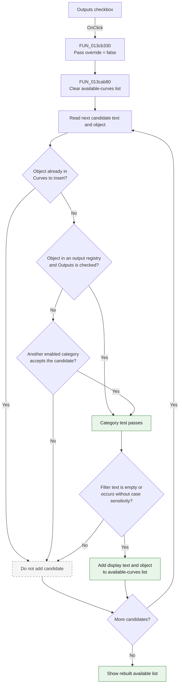

# Outputs

> Analysis status: Complete. The recovered click handler, shared list-rebuild
> function, published form field map, and DFM control tree agree on this
> behavior.

## Control

| Property | Recovered value |
| --- | --- |
| Form | AddCurveDlg |
| Form caption | Post-processor |
| Component path | AddCurveDlg.UpperPl.Panel2.FilterGB.OutputsCB |
| Control class | TCheckBox |
| Caption | Outputs |
| Initial checked state | true |
| Hint | Not present in the recovered resource. |
| Text | Not present in the recovered resource. |
| Handler name | VoltagesCBClick |
| Handler address | 013cb330 |
| Graph node | `resource:dfm:AddCurveDlg/AddCurveDlg.UpperPl.Panel2.FilterGB.OutputsCB` |
| Handler node | `function:013cb330` |
| Graph layer | UI |

## What happens when clicked

The checkbox controls whether output-classified signals can appear in the
**available curves** list. The handler does not change the checkbox. Delphi has
already applied the new checked state before it calls `VoltagesCBClick`.

`FUN_013cb330` calls `FUN_013cab80` with the form and a false override value.
The callee then rebuilds the available list:

1. It clears `AvailableCurvesLB`.
2. It scans the complete signal collection at form offset `+0x878`.
3. It skips a candidate when its attached object is already present in
   `CurveToInsertLB`.
4. It tests the candidate object against three recovered registries that share
   the Outputs filter.
5. If a registry contains the candidate, it reads `OutputsCB.Checked` from form
   field `+0x7c0`. The false override from this click means this category
   accepts the candidate only when Outputs is checked.
6. It also tests the other **Show** categories. The category tests form a
   union, so another enabled category can accept a candidate that also has an
   output classification.
7. It applies the optional `FilterEB` text. Empty text accepts the category
   result. Non-empty text must occur in the candidate display text without
   case sensitivity.
8. It adds each passing display text and attached object to
   `AvailableCurvesLB`.

When the checkbox is checked, eligible output candidates can appear. When it
is cleared, output-only candidates disappear. The click does not change
`CurveToInsertLB`, the complete signal collection, or a curve object. It only
refreshes the source list from which the user can select curves.

The same recovered handler is also bound to `VoltagesCB.OnClick`. It does not
inspect an event sender. It always reads all current filter states, so either
binding causes the same complete list rebuild. The state that Delphi changed
before the call determines which filter result changes.

## Inputs, decisions, and outputs

| Stage | Proven behavior |
| --- | --- |
| Inputs | `OutputsCB.Checked`, candidate display text and attached objects, the other category checkboxes, `FilterEB` text, and objects already in `CurveToInsertLB`. |
| Outputs decision | Membership in any of three recovered output registries plus a checked `OutputsCB` makes the candidate eligible through this category. The false override does not bypass an unchecked control. |
| Other category decision | Another enabled category can accept the same candidate when Outputs is cleared. |
| Selected-item decision | A candidate object already present in `CurveToInsertLB` is excluded before it can be added to the available list. |
| Text decision | Empty filter text accepts the category result. Non-empty text requires a case-insensitive occurrence in the display text. |
| State change | `AvailableCurvesLB` is cleared and repopulated. The handler does not write the checkbox state or change the selected-curves list. |
| Output | The visible available list immediately reflects the new Outputs state together with all other active filters. |

## Click flow

## Handler evidence

- Click handler: [FUN_013cb330](../../../DecompiledSources/Tina16/functions/00000000013CB330__FUN_013cb330.c)
- Available-list rebuild: [FUN_013cab80](../../../DecompiledSources/Tina16/functions/00000000013CAB80__FUN_013cab80.c)
- Registry-membership helper: [FUN_00f1e290](../../../DecompiledSources/Tina16/functions/0000000000F1E290__FUN_00f1e290.c)
- Case-insensitive text-match helper: [FUN_005b83d0](../../../DecompiledSources/Tina16/functions/00000000005B83D0__FUN_005b83d0.c)
- Recovered handler role: Refresh the available-curve list after the Nodal
  Voltages or Outputs filter changes.
- Likely Delphi method: `TAddCurveDlg.VoltagesCBClick`.
- Complexity: simple.
- Distinct outgoing calls: 1.

The published Delphi field table and recovered data flow identify the important
fields:

| Form offset | Component or state | Role in the refresh |
| --- | --- | --- |
| `+0x778` | `AvailableCurvesLB` | Its item collection is cleared and receives passing candidates. |
| `+0x7a0` | `VoltagesCB` | Supplies the sibling Nodal Voltages state read by the same shared handler path. |
| `+0x7c0` | `OutputsCB` | Supplies the checked state for the three output-registry tests. |
| `+0x7e0` | `CurveToInsertLB` | Its attached objects prevent selected curves from also appearing as available. |
| `+0x810` | `FilterEB` | Supplies the optional display-text filter. |
| `+0x878` | Complete signal collection | Supplies the display text and attached objects that the callee filters. |

The call graph shows one outgoing edge from `FUN_013cb330` to
`FUN_013cab80`. The DFM supplies two trigger edges, from `VoltagesCB.OnClick`
and `OutputsCB.OnClick`, to this same function.

## Direct call

- `function:013cab80` - Clears and rebuilds `AvailableCurvesLB`. It excludes
  selected objects, applies `OutputsCB` to three recovered output registries,
  applies the other category tests and `FilterEB`, and preserves each accepted
  candidate's attached object.

## Resource evidence

- `OutputsCB` is in the **Show** group beside **Nodal Voltages**, **Currents**,
  **Other Voltages**, **User defined**, and **Measurement**.
- The recovered DFM sets `OutputsCB.Checked` and `State = cbChecked`, so the
  category is enabled initially.
- `AvailableCurvesLB` is the source list beside **Add >>**.
  `CurveToInsertLB` is labeled **Curves to insert:**.
- `FilterEB` shares the **Show** group and supplies the additional text filter.
- No hint, image reference, glyph, or same-parent label candidate is present.
  The checkbox caption, published field map, and registry gates give the direct
  evidence.

## Error and no-op behavior

- The handler has no explicit error message, exception handler, or guard.
- Each click clears and rebuilds the available list, even when no candidate can
  pass.
- An empty complete signal collection produces an empty available list.
- A candidate that fails the selected-item, category, or text test is silently
  omitted.
- The click does not add, remove, evaluate, or delete a curve object.

## Analysis limits

- The original Delphi name of `FUN_013cab80` is not recovered. Its callers and
  list data flow establish its refresh role.
- The three output registries have no recovered Delphi field names. Their
  repeated membership tests are all gated by the published `OutputsCB` field;
  this article does not invent more specific output subtypes for them.
- The category tests form a union. Clearing Outputs does not prove that every
  candidate with an output classification disappears if another enabled
  category also accepts it.
