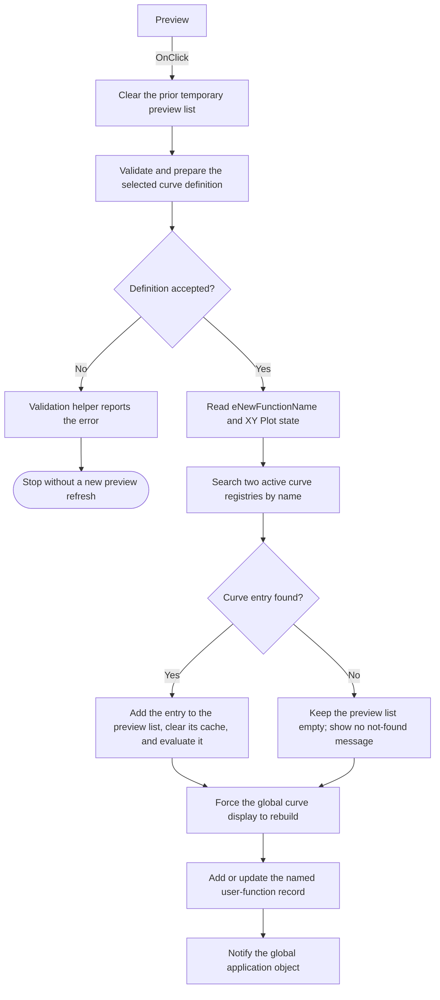

# Preview

> Analysis status: Source, graph, and form evidence reviewed.

## Control

| Property | Recovered value |
| --- | --- |
| Form | AddCurveDlg |
| Component path | AddCurveDlg.AdvancedPanel.Preview |
| Control class | TButton |
| Caption | Preview |
| Hint | Not present in the recovered resource. |
| Text | Not present in the recovered resource. |
| Handler name | PreviewClick |
| Handler address | 013cfaa0 |
| Graph node | `resource:dfm:AddCurveDlg/AddCurveDlg.AdvancedPanel.Preview` |
| Handler node | `function:013cfaa0` |
| Graph layer | UI |

## What happens when clicked

The button prepares and evaluates the current user-defined curve, inserts that
curve into the active analysis diagram as a temporary preview, and forces the
curve display to rebuild. It does not add the curve to **Curves to insert:** or
close the dialog.

The handler does these operations:

1. It clears the dialog's previous temporary preview string/object list.
2. `FUN_013ce890` validates and prepares the current Line Edit or Advanced Edit
   definition. This routine selects its path from the edit mode, Program, and
   XY Plot settings. It returns zero when it accepts the definition.
3. The handler reads `eNewFunctionName` and the XY Plot state. It copies the
   name as the registry lookup key.
4. `FUN_013c0c30` searches the first active curve registry for that name. If
   the first search fails, the handler searches the second registry.
5. When either search succeeds, the handler adds the recovered name/object pair
   to the temporary preview list. `FUN_00f1e290` identifies which registry owns
   the first preview entry.
6. It clears that registry's cached curve records with `FUN_01cc7700`. It then
   passes the preview list to `FUN_013e2500`, which loads or inserts the selected
   curve into the active analysis result and evaluates its diagram data.
7. `FUN_01cec9c0` forces the global curve display to rebuild. The handler passes
   the last curve index and a force flag of `1`, so this call does not depend on
   a changed selection.
8. `FUN_013cf3e0` adds or updates the named user-function record from the
   selected edit source. Its one-input or two-input path follows the current XY
   Plot state. The handler then sends a final notification to the global
   application object.

The successful path has no confirmation message. It keeps the current function
name and does not increment the `MyFunction` counter. It also does not change
`AvailableCurvesLB` or `CurveToInsertLB`.

If `FUN_013ce890` returns a nonzero result, the handler stops after it clears the
old temporary preview list. It does not search the registries, evaluate a new
preview, rebuild the curve display, or update the named user-function record.
The validation helper reports its own error. Recovered cases include a required
input followed by ` must be filled!`, the instruction to select an Available
curves entry, and a returned compile error message.

If neither registry contains the prepared name, the temporary preview list
stays empty and `FUN_013e2500` is not called. The handler does not show a
not-found message. It still runs the forced display rebuild, updates the named
user-function record, and sends the final notification. The handler does not
check the return value from `FUN_013e2500` and has no local exception handler.

## Click flow

## Handler evidence

- Source: [DecompiledSources/Tina16/functions/00000000013CFAA0__FUN_013cfaa0.c](../../../DecompiledSources/Tina16/functions/00000000013CFAA0__FUN_013cfaa0.c)
- Recovered role: User-defined curve preview evaluator and display-refresh
  handler.
- Current graph summary: Handles 1 Delphi UI event:
  `AddCurveDlg.AdvancedPanel.Preview.OnClick`.
- Input evidence: The handler reads the current name from `eNewFunctionName`
  and the checked state from `cbXYPlot`. `FUN_013ce890` reads the selected
  editor-mode inputs.
- Registry evidence: Two calls to `FUN_013c0c30` implement the ordered registry
  lookup. `FUN_00f1e290` tests which registry contains the recovered entry.
- Preview-output evidence: The handler clears and repopulates a temporary
  string/object list, clears the owning registry's cached records, and passes
  the list to the curve insertion/evaluation routine.
- Display-output evidence: The force flag passed to `FUN_01cec9c0` causes the
  active curve display path to rebuild. `FUN_013cf3e0` updates the named
  user-function record after this rebuild call.
- Complexity: complex
- Distinct outgoing calls: 11

## Direct calls

- `function:00414480` — [FUN_00414480](../../../DecompiledSources/Tina16/functions/0000000000414480__FUN_00414480.c)
  finalizes the temporary Delphi UnicodeStrings on every exit path.
- `function:0064dd90` — [FUN_0064dd90](../../../DecompiledSources/Tina16/functions/000000000064DD90__FUN_0064dd90.c)
  reads `eNewFunctionName` into a Delphi UnicodeString.
- `function:0064e1d0` — [FUN_0064e1d0](../../../DecompiledSources/Tina16/functions/000000000064E1D0__FUN_0064e1d0.c)
  sends the final recovered interface notification to the global application
  object. The exact notification name is not recovered.
- `function:00f1e290` — [FUN_00f1e290](../../../DecompiledSources/Tina16/functions/0000000000F1E290__FUN_00f1e290.c)
  tests whether the first preview entry belongs to a given registry.
- `function:013c0c30` — [FUN_013c0c30](../../../DecompiledSources/Tina16/functions/00000000013C0C30__FUN_013c0c30.c)
  searches a curve registry by name and returns the matching entry and index.
- `function:013c1650` — [FUN_013c1650](../../../DecompiledSources/Tina16/functions/00000000013C1650__FUN_013c1650.c)
  copies the current function name for the registry lookup.
- `function:013ce890` — [FUN_013ce890](../../../DecompiledSources/Tina16/functions/00000000013CE890__FUN_013ce890.c)
  validates and prepares the selected Line Edit or Advanced Edit definition and
  reports its own errors.
- `function:013cf3e0` — [FUN_013cf3e0](../../../DecompiledSources/Tina16/functions/00000000013CF3E0__FUN_013cf3e0.c)
  adds or updates the named one-input or two-input user-function record.
- `function:013e2500` — [FUN_013e2500](../../../DecompiledSources/Tina16/functions/00000000013E2500__FUN_013e2500.c)
  delegates the temporary preview list to the active analysis-result curve
  insertion and evaluation path.
- `function:01cc7700` — [FUN_01cc7700](../../../DecompiledSources/Tina16/functions/0000000001CC7700__FUN_01cc7700.c)
  clears the owning registry's cached curve records and resets their count.
- `function:01cec9c0` — [FUN_01cec9c0](../../../DecompiledSources/Tina16/functions/0000000001CEC9C0__FUN_01cec9c0.c)
  forces the active curve or diagram display to rebuild for the last curve
  index.

## Resource evidence

- `Preview` is a `TButton` on `AdvancedPanel`, anchored to the top-right, with
  `OnClick = PreviewClick` at `013cfaa0`.
- The button is next to `Create` and below `eNewFunctionName`, whose initial
  text is `MyFunction1`.
- The same panel contains the `LineEdit`, `AdvancedEdit`, `cbEnableAdvancedEdit`,
  `cbXYPlot`, and `rgProgram` inputs used by the validation and record-update
  callees.
- `rgProgram` contains `Interpreter` and `Python`.
- Kind, modal result, list items, and image reference are not present for this
  button. It has no extracted glyph.

## Nearby label candidates

Nearby labels are layout evidence only. They do not prove the click behavior.

- `New function name:` labels `eNewFunctionName` above and to the left of the
  Preview button.
- `Line Edit` and `Advanced Edit` identify the two definition editors handled
  by the validation path.
- `Built-in functions:` belongs to the combo box at the top of the panel. The
  Preview handler does not read that combo box directly.

## Analysis limits

- The exact class names of the two global curve registries and the temporary
  string/object list are not recovered. Their clear, search, membership,
  object-add, and count operations are visible in the call path.
- `FUN_013ce890` has several Interpreter, Python, one-input, and two-input
  branches. This article records its common contract: zero means success, and
  a nonzero result follows an error that the helper reports.
- `FUN_0064e1d0` dispatches a recovered interface notification with numeric
  selectors. The source does not expose a symbolic notification name.
- `FUN_013e2500` returns a status, but `FUN_013cfaa0` ignores it. The click
  handler does not provide a separate message for that return value.
