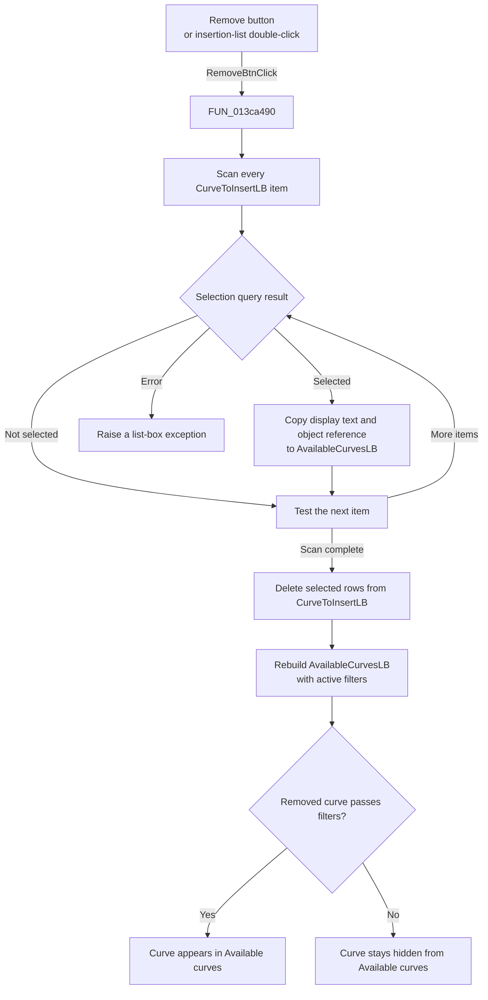

# << Remove

> Analysis status: Source reviewed. The button removes selected curve
> references from the insertion list and refreshes the available list.

## Control

| Property | Recovered value |
| --- | --- |
| Form | AddCurveDlg |
| Component path | AddCurveDlg.UpperPl.Panel2.RemoveBtn |
| Control class | TButton |
| Caption | << Remove |
| Hint | Not present in the recovered resource. |
| Text | Not present in the recovered resource. |
| Handler name | RemoveBtnClick |
| Handler address | 013ca490 |
| Graph node | `resource:dfm:AddCurveDlg/AddCurveDlg.UpperPl.Panel2.RemoveBtn` |
| Handler node | `function:013ca490` |
| Graph layer | UI |

## What happens when clicked

`<< Remove` processes every selected entry in `CurveToInsertLB`. A double-click
on `CurveToInsertLB` runs the same handler and has the same effect.

The handler uses these inputs from `CurveToInsertLB`:

- the current item count;
- the selected state of each item;
- each selected item's display string; and
- the curve-object reference attached to that item.

For each selected entry, it adds the same display string and object reference
to `AvailableCurvesLB`. It then makes a second pass through
`CurveToInsertLB` and deletes every selected row. This deletion pass reads the
current count after each deletion. A row that shifts into the deleted index is
therefore tested before the index advances.

The handler then calls `FUN_013cab80` with its filter-bypass argument set to
false. That function clears and rebuilds `AvailableCurvesLB` from the form's
master curve collection. It excludes objects that remain in
`CurveToInsertLB` and applies the current category and text filters. The
selected entries always leave **Curves to insert:**. They reappear under
**Available curves:** only when the active filters allow them.

This action changes UI list membership and preserves each entry's attached
curve-object reference. It does not delete a curve object or commit a model
change. The OK handler later reads the entries that remain in
`CurveToInsertLB`.

If the target list is empty or no entry is selected, the handler removes
nothing. It still refreshes the available list. It shows no message and does
not close the dialog. `FUN_0068bca0` raises an exception if the native list-box
selection query fails for an item index. `FUN_013ca490` does not catch that
error. Other list allocation or index errors also propagate to the caller.

## Click flow

## Handler evidence

- Source: [DecompiledSources/Tina16/functions/00000000013CA490__FUN_013ca490.c](../../../DecompiledSources/Tina16/functions/00000000013CA490__FUN_013ca490.c)
- Recovered role: Not present in the recovered resource.
- Current graph summary: Handles 2 Delphi UI events: AddCurveDlg.UpperPl.Panel2.RemoveBtn.OnClick, AddCurveDlg.UpperPl.Panel3.CurveToInsertLB.OnDblClick.
- Current graph behavior: Not present in the recovered resource.
- Current graph evidence: Not present in the recovered resource.
- Complexity: complex
- Distinct outgoing calls: 3
- Article finding: Removes selected curve entries and their object references
  from the insertion list, then rebuilds the filtered available list.

## Direct calls

- [`FUN_00414480`](../../../DecompiledSources/Tina16/functions/0000000000414480__FUN_00414480.c)
  finalizes the temporary Delphi UnicodeString used while item text is copied.
- [`FUN_0068bca0`](../../../DecompiledSources/Tina16/functions/000000000068BCA0__FUN_0068bca0.c)
  queries whether one list-box item is selected. It raises an exception if the
  native selection query reports an error.
- [`FUN_013cab80`](../../../DecompiledSources/Tina16/functions/00000000013CAB80__FUN_013cab80.c)
  rebuilds the available list from the master curve collection. It excludes
  objects still in `CurveToInsertLB` and applies the form's current filters.

## Resource evidence

- Kind: Not present in the recovered resource.
- Modal result: Not present in the recovered resource.
- Checked state: Not present in the recovered resource.
- List items: Not present in the recovered resource.
- Image reference: Not present in the recovered resource.
- Extracted glyph: None.
- `CurveToInsertLB` is the source for this command. Its direct label is
  **Curves to insert:**.
- `AvailableCurvesLB` is the refreshed destination list. Its direct label is
  **Available curves:**.
- `RemoveBtn.OnClick` and `CurveToInsertLB.OnDblClick` both resolve to
  `FUN_013ca490`.

## Nearby label candidates

Nearby labels are layout candidates only. They are not proof of behavior.

- Rank 1: Available curves: at distance 337.

## Analysis limits

- The recovered source does not provide Delphi field names for form offsets
  `0x778`, `0x7e0`, and `0x878`. The paired Add and Remove handlers, DFM event
  bindings, refresh logic, and OK-handler consumer establish their list roles.
- The handler does not remove an entry from the form's master curve collection.
  It only removes the entry from the current insertion request.
- The exact exception text for a native selection-query failure is stored in
  an unresolved resource pointer.
