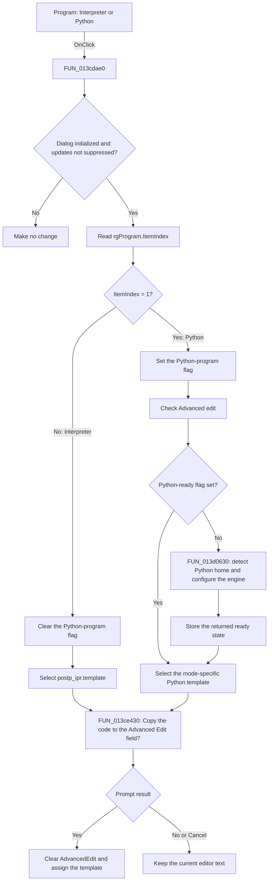

# Program

> Analysis status: Source reviewed. The click behavior is supported by the
> recovered handler, its direct callees, and the form resource.

## Control

| Property | Recovered value |
| --- | --- |
| Form | AddCurveDlg |
| Component path | AddCurveDlg.AdvancedPanel.rgProgram |
| Control class | TRadioGroup |
| Caption | Program |
| Hint | Not present in the recovered resource. |
| Text | Not present in the recovered resource. |
| Handler name | rgProgramClick |
| Handler address | 013cdae0 |
| Graph node | `resource:dfm:AddCurveDlg/AddCurveDlg.AdvancedPanel.rgProgram` |
| Handler node | `function:013cdae0` |
| Graph layer | UI |

## What happens when clicked

The handler first checks two form-state flags. It continues only after the
dialog has completed its show initialization and while programmatic control
updates are not suppressed. If either condition is false, the handler makes no
change.

For an active click, the handler reads `rgProgram.ItemIndex` and stores the
selected program type in the current post-processor definition:

- Index 0, **Interpreter**, clears the definition's Python-program flag. The
  handler then offers to copy the loaded `postp_ipr.template` code into
  `AdvancedEdit`.
- Index 1, **Python**, sets the definition's Python-program flag. It also checks
  `cbEnableAdvancedEdit`. If Python has not been initialized for this dialog,
  it calls `FUN_013d0630`. The handler then offers to copy the loaded Python
  template into `AdvancedEdit`. The dialog loads `postp_py_tr.template` for
  analysis mode 3 and `postp_py_ac.template` for the other recovered modes.

Both branches use the prompt **Copy the code to the Advanced Edit field?**. A
Yes result clears the editor, assigns the selected template to its line list,
and refreshes the editor state. No or Cancel keeps the current editor text.
The selected program type is stored before this prompt, so No or Cancel does
not undo the radio selection or the stored type. Changing from Python to
Interpreter does not clear the Advanced edit check box in this handler.

For the Python branch, `FUN_013d0630` first detects a Python home directory. If
that test fails, it returns false and the dialog leaves its Python-ready flag
false. A later Python selection can try again. The handler still shows the
template-copy prompt after this failure. It does not show an error message or
stop the template copy.

The VCL changes the radio selection before it calls `OnClick`. This handler
reads the resulting index. It does not change the selected radio item itself.
An index other than 1 follows the Interpreter branch; with the recovered two
items, the normal indexes are 0 and 1.

## Click flow

## Handler evidence

- Source: [DecompiledSources/Tina16/functions/00000000013CDAE0__FUN_013cdae0.c](../../../DecompiledSources/Tina16/functions/00000000013CDAE0__FUN_013cdae0.c)
- Recovered role: Program-type selector and Advanced Edit template coordinator
  for a post-processor definition.
- Current graph summary: Handles 1 Delphi UI event:
  AddCurveDlg.AdvancedPanel.rgProgram.OnClick.
- Current graph behavior: The checked-in graph does not yet contain a curated
  behavior description for this function.
- Current graph evidence: The handler is in the `UI` layer. Its direct call
  edges go to `FUN_013ce430` and `FUN_013d0630`.
- Complexity: moderate
- Distinct outgoing calls: 2

The recovered form-field use gives these mappings:

- `param_1 + 0x870` is `rgProgram`. Its field at `+0x4A8` supplies the item
  index.
- `param_1 + 0x728` is `cbEnableAdvancedEdit`. The Python branch sets its
  checked state. Its own click handler reads the same control through the
  matching getter.
- `param_1 + 0x848` is `AdvancedEdit`. `FUN_013ce430` clears and replaces its
  line text after user confirmation.
- `param_1 + 0x900` is the current post-processor definition. Its byte at
  `+0x30A` records whether the selected program is Python. Other recovered
  post-processor paths read this same byte.
- `param_1 + 0x8C8` and `param_1 + 0x8D0` hold the loaded Interpreter and
  Python templates. The handler passes one of these objects to
  `FUN_013ce430`.
- `param_1 + 0x8E8` is the cached Python-ready state. The handler stores the
  result of `FUN_013d0630` here and retries while it is false.
- `param_1 + 0x931` is set after dialog-show initialization. `param_1 + 0x932`
  suppresses this event while another path changes the controls
  programmatically.

[FUN_013CDA50](../../../DecompiledSources/Tina16/functions/00000000013CDA50__FUN_013cda50.c),
the `cbEnableAdvancedEdit` click handler, corroborates the radio-group,
check-box, and definition-field mappings. It also resets `rgProgram` to index 0
when Advanced edit is cleared.

## Direct calls

- `function:013ce430` — [FUN_013ce430](../../../DecompiledSources/Tina16/functions/00000000013CE430__FUN_013ce430.c)
  shows the copy prompt. For this caller, it uses the supplied template object,
  clears `AdvancedEdit`, assigns the template to the editor lines after a Yes
  result, and refreshes the editor state. No or Cancel skips the replacement.
- `function:013d0630` — [FUN_013d0630](../../../DecompiledSources/Tina16/functions/00000000013D0630__FUN_013d0630.c)
  detects a Python home directory. On success, it attempts to set `PYTHONHOME`,
  configures the dialog's Python engine and callback, and returns true. It
  returns false before engine configuration when the directory test fails.

[FUN_013CB5D0](../../../DecompiledSources/Tina16/functions/00000000013CB5D0__FUN_013cb5d0.c)
loads `postp_ipr.template` and the mode-specific Python template into the two
objects that this click handler selects.

## Resource evidence

- Kind: Not present in the recovered resource.
- Modal result: Not present in the recovered resource.
- Checked state: Not present in the recovered resource.
- List items: ("Interpreter", "Python")
- Image reference: Not present in the recovered resource.
- Extracted glyph: None.

## Nearby label candidates

Nearby labels are layout candidates only. They are not proof of behavior.

- Rank 1: New function name: at distance 88.
- Rank 2: Line Edit at distance 158.
- Rank 3: Built-in functions: at distance 260.

These labels describe other controls in `AdvancedPanel`. The recovered handler
does not read them.

## Analysis limits

- The radio group has no hint or glyph. Its two item strings identify the
  choices, and the handler data flow proves their effects.
- The recovered code does not show an error dialog for Python-home detection
  failure. A lower-level Python component can have behavior that is not visible
  in this handler.
- The recovered field names are not available. The names above come from form
  ownership, matching control access in related handlers, template-loading
  data flow, and repeated readers of the definition fields.
