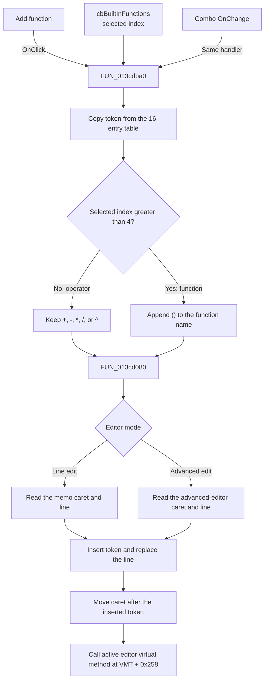

# Add function

> Analysis status: Source reviewed with direct handler, static token-table, editor insertion, and glyph evidence.

## Control

| Property | Recovered value |
| --- | --- |
| Form | AddCurveDlg |
| Component path | AddCurveDlg.AdvancedPanel.sbBuiltInFnAdd |
| Control class | TSpeedButton |
| Caption | Not present in the recovered resource. |
| Hint | Add function |
| Text | Not present in the recovered resource. |
| Handler name | sbBuiltInFnAddClick |
| Handler address | 013cdba0 |
| Graph node | `resource:dfm:AddCurveDlg/AddCurveDlg.AdvancedPanel.sbBuiltInFnAdd` |
| Handler node | `function:013cdba0` |
| Graph layer | UI |

## What happens when clicked

`FUN_013cdba0` inserts the selected built-in token into the current curve editor. The form-show path first clears `cbBuiltInFunctions`, adds 16 entries from the same static table that the handler uses, and selects index `0`.

The table order is:

`+`, `-`, `*`, `/`, `^`, `sin`, `cos`, `tan`, `log10`, `atan`, `arc`, `radtodeg`, `degtorad`, `ln`, `exp`, `abs`.

When the user clicks **Add function**, the handler performs these operations:

1. It reads the selected index from `cbBuiltInFunctions`.
2. It copies the token at that index from the static 16-entry table.
3. For indexes `0` through `4`, it keeps the operator token unchanged. For indexes `5` through `15`, it appends the recovered suffix `()` to the function name. For example, `sin` becomes `sin()`.
4. It passes the token and the current editor object to `FUN_013cd080`.
5. `FUN_013cd080` gets the caret position, finds the line that contains the caret, inserts the token into that line, replaces the line, and moves the caret by the inserted token length. The caret therefore ends after the token. For `sin()`, it ends after the closing parenthesis, not between the parentheses.
6. The handler then calls the same no-argument virtual method on the active editor in both editor modes. Its recovered VMT offset is `0x258`. The exact Delphi method name is not present in the recovered symbols, so this article does not assign a name to it.

The insertion helper supports both editing modes. Mode `0` uses the active line-edit memo and its line collection. The other mode uses the advanced editor and its line collection. Focus and mode-selection handlers store the current editor pointer before this click handler runs.

`cbBuiltInFunctions.OnChange` is also bound to `FUN_013cdba0`. As a result, selecting a different combo item inserts that item immediately. Clicking **Add function** inserts the current selection again.

There is no normal no-op or message-box path. Form initialization supplies all 16 items and sets a valid selection. The handler does not check the selected index before it reads the static table. If it runs before initialization, or if the index is outside `0` through `15`, the recovered code gives no defined safe result. Delphi string allocation or insertion failures can propagate because the handler has no exception block.

## Click flow

## Handler evidence

- Source: [DecompiledSources/Tina16/functions/00000000013CDBA0__FUN_013cdba0.c](../../../DecompiledSources/Tina16/functions/00000000013CDBA0__FUN_013cdba0.c)
- Recovered role: Built-in curve-expression token insertion handler.
- Current graph summary: Handles 2 Delphi UI events: AddCurveDlg.AdvancedPanel.sbBuiltInFnAdd.OnClick, AddCurveDlg.AdvancedPanel.cbBuiltInFunctions.OnChange.
- Proven behavior: Builds the selected operator or function token, inserts it at the current editor caret, and moves the caret after the inserted text.
- Evidence: The handler indexes the same 16-entry table that `FUN_013cd540` loads into the combo, appends the recovered `()` literal for function indexes, and calls the two-mode insertion helper.
- Complexity: complex
- Distinct outgoing calls: 4

## Direct calls

- `function:00414560` — Finalizes the temporary Delphi UnicodeString slots.
- `function:00414b50` — Copies the selected table token into a managed UnicodeString.
- `function:00416ad0` — Appends `()` for selected indexes `5` through `15`.
- `function:013cd080` — Inserts the token into the current line and advances the editor caret.

## Resource evidence

- Kind: Not present in the recovered resource.
- Modal result: Not present in the recovered resource.
- Checked state: Not present in the recovered resource.
- List items: Not stored in the DFM. The form-show path adds `+`, `-`, `*`, `/`, `^`, `sin`, `cos`, `tan`, `log10`, `atan`, `arc`, `radtodeg`, `degtorad`, `ln`, `exp`, and `abs` from a static table.
- Image reference: Not present in the recovered resource.
- Extracted glyph: [`0003_AddCurveDlg_AddCurveDlg_AdvancedPanel_sbBuiltInFnAdd_Glyph_Data.png`](../../../glyph/0003_AddCurveDlg_AddCurveDlg_AdvancedPanel_sbBuiltInFnAdd_Glyph_Data.png)

## Nearby label candidates

Nearby labels are layout candidates only. They are not proof of behavior.

- Rank 1: Line Edit at distance 165.
- Rank 2: New function name: at distance 235.
- Rank 3: Built-in functions: at distance 239.

## Analysis limits

- The hint and glyph support an add or insertion action, but the static table and editor insertion code establish the behavior.
- The decompiler does not recover the name of the final editor virtual method at VMT offset `0x258`. Its call is documented without an inferred Delphi name.
- The code does not put the caret inside the generated parentheses. Any later caret adjustment is not present in this handler or its insertion helper.
