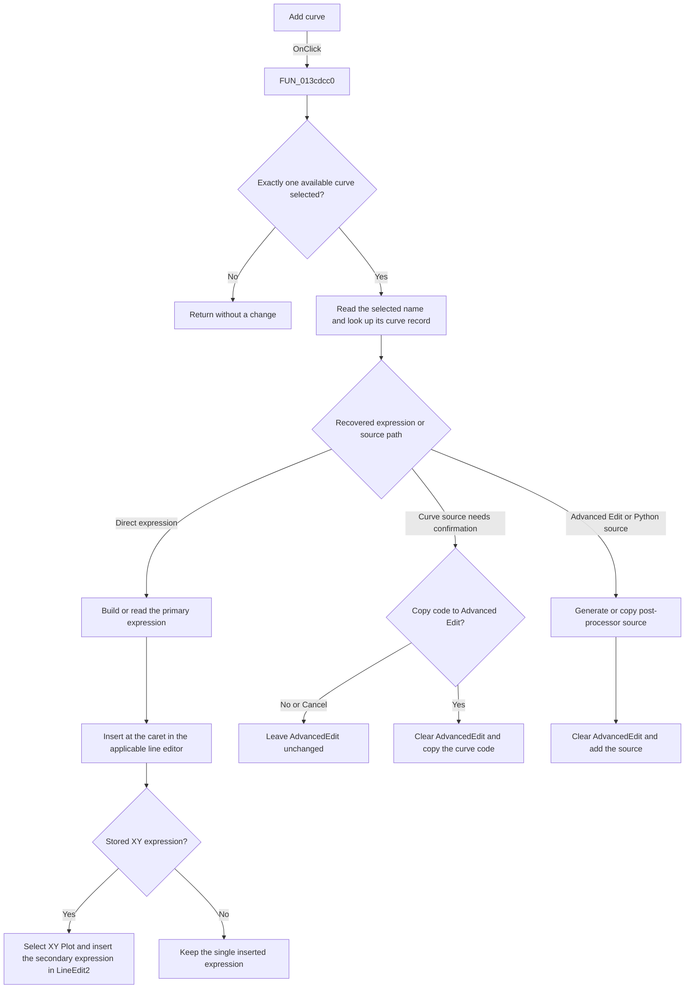

# Add curve

> Analysis status: Evidence-backed source review complete.

## Control

| Property | Recovered value |
| --- | --- |
| Form | AddCurveDlg |
| Component path | AddCurveDlg.AdvancedPanel.sbSignalAdd |
| Control class | TSpeedButton |
| Caption | Not present in the recovered resource. |
| Hint | Add curve |
| Text | Not present in the recovered resource. |
| Handler name | sbSignalAddClick |
| Handler address | 013cdcc0 |
| Graph node | `resource:dfm:AddCurveDlg/AddCurveDlg.AdvancedPanel.sbSignalAdd` |
| Handler node | `function:013cdcc0` |
| Graph layer | UI |

## What happens when clicked

The handler adds one selected item from `AvailableCurvesLB` to the post-processor edit fields. It requires exactly one selected item. If the list has zero or more than one selected item, the handler releases its temporary objects and returns without a UI or model change.

For one selected item, the handler reads the item text and looks for a user-defined curve with the same name. The selected item and its recovered curve flags then select one of these paths:

- For a direct expression, the handler builds a signal expression or reads the curve's stored primary expression. It inserts the text at the caret. A raw signal and an enabled **Advanced edit** option use the current line editor. A stored curve with **Advanced edit** disabled uses `LineEdit`. If the curve has an XY expression, the handler also inserts its stored secondary expression in `LineEdit2` and selects **XY Plot**.
- For a stored curve that needs its source copied, the handler asks `Copy the code to the Advanced Edit field?`. A Yes response clears the Advanced Edit field and copies the curve code to it. A No or Cancel response does not copy the code.
- For the Advanced Edit or Python source path, the handler generates or copies the post-processor source and replaces the contents of `AdvancedEdit`. A recovered curve source flag also makes `AdvancedEdit` active, selects **Advanced edit**, and selects the Python program option. For a raw signal on this path, the handler shows `<name> added to the post processor code` before it generates the source.

This click does not close the dialog. It also does not add an item directly to `CurveToInsertLB`. Its result is an inserted expression or replaced Advanced Edit source.

## Click flow

## Handler evidence

- Source: [DecompiledSources/Tina16/functions/00000000013CDCC0__FUN_013cdcc0.c](../../../DecompiledSources/Tina16/functions/00000000013CDCC0__FUN_013cdcc0.c)
- Recovered role: Adds the one selected available signal or curve to the post-processor expression or source editor.
- Current graph summary: Handles 1 Delphi UI event: AddCurveDlg.AdvancedPanel.sbSignalAdd.OnClick.
- Current graph behavior: The graph does not yet include the source-derived branches in this article.
- Current graph evidence: The DFM binding, hint, glyph, function call edges, and recovered handler body identify this control and handler.
- Complexity: complex
- Distinct outgoing calls: 18

The published-field RTTI maps the handler's control accesses to `AvailableCurvesLB`, `LineEdit`, `LineEdit2`, `cbEnableAdvancedEdit`, `cbXYPlot`, `AdvancedEdit`, and `rgProgram`. The recovered body gives these further checks:

- The list-box selection-count call must return `1` before the handler reads an item.
- [`FUN_0068bca0`](../../../DecompiledSources/Tina16/functions/000000000068BCA0__FUN_0068bca0.c) scans the list-box `Selected` state. [`FUN_00f211b0`](../../../DecompiledSources/Tina16/functions/0000000000F211B0__FUN_00f211b0.c) performs the case-insensitive curve-name lookup.
- [`FUN_013cd080`](../../../DecompiledSources/Tina16/functions/00000000013CD080__FUN_013cd080.c) inserts text at the current caret and updates the caret position.
- [`FUN_013ce430`](../../../DecompiledSources/Tina16/functions/00000000013CE430__FUN_013ce430.c) contains the copy-confirmation text and performs the clear-and-copy action after a Yes response.
- [`FUN_013c6750`](../../../DecompiledSources/Tina16/functions/00000000013C6750__FUN_013c6750.c) generates source that selects the named curve through `tina_postp.SelectCurve(...)`. [`FUN_013ce7e0`](../../../DecompiledSources/Tina16/functions/00000000013CE7E0__FUN_013ce7e0.c) copies stored source for the other Advanced Edit branch.

## Direct calls

- `function:00410f20` — Nil-safe Delphi object destruction helper
- `function:00414480` — Delphi UnicodeString clear and finalization helper
- `function:00414560` — Delphi UnicodeString array finalization helper
- `function:00414ad0` — Delphi UnicodeString assignment helper
- `function:00416ad0` — Appends a recovered suffix to the selected signal text
- `function:00416ba0` — Builds the raw-signal notification text
- `function:00416cd0` — Builds a signal expression from recovered string fragments
- `function:004b6930` — Constructs a temporary Delphi object
- `function:0068bca0` — Reads `TListBox.Selected[index]`
- `function:0072d440` — Shows the notification or confirmation dialog
- `function:0074b490` — Selects the Python program option
- `function:00f211b0` — Finds a user-defined curve by name
- `function:013c6750` — Generates post-processor source for a raw signal
- `function:013cd080` — Inserts expression text at an editor caret
- `function:013ce330` — Releases the handler's temporary state
- `function:013ce430` — Confirms and copies curve code to Advanced Edit
- `function:013ce7e0` — Copies stored curve source for Advanced Edit
- `function:013d05b0` — Refreshes the post-processor context before insertion

## Resource evidence

- Kind: `TSpeedButton`
- Modal result: Not present in the recovered resource.
- Checked state: Not present in the recovered resource.
- List items: Not present in the recovered resource.
- Image reference: Not present in the recovered resource.
- Extracted glyph: [`0002_AddCurveDlg_AddCurveDlg_AdvancedPanel_sbSignalAdd_Glyph_Data.png`](../../../glyph/0002_AddCurveDlg_AddCurveDlg_AdvancedPanel_sbSignalAdd_Glyph_Data.png)
- The **Add curve** hint states the add intent. The small extracted glyph does not independently identify the operation. The handler source supplies the specific editor and source behavior.

## Nearby label candidates

Nearby labels are layout candidates only. They are not proof of behavior.

- Rank 1: Line Edit at distance 31.
- Rank 2: Advanced Edit at distance 88.
- Rank 3: User defined curves at distance 177.

## Analysis limits

- The recovered user-defined curve record has several Boolean flags without Delphi field names. This article describes only the branch effects that their reads prove. It does not assign unproven domain names to the flags.
- The raw-signal expression has recovered formatting variants. The handler body proves that it inserts the selected signal, but the available source does not give a reliable name for each variant.
- The Advanced Edit paths clear the existing editor contents before they add the generated or copied source. This review did not run the original application to test the prompt or editor state.
