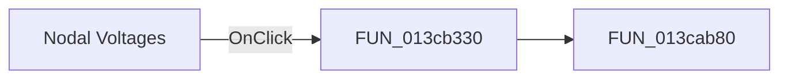

# Nodal Voltages

> Analysis status: Pending individual source review.

## Control

| Property | Recovered value |
| --- | --- |
| Form | AddCurveDlg |
| Component path | AddCurveDlg.UpperPl.Panel2.FilterGB.VoltagesCB |
| Control class | TCheckBox |
| Caption | Nodal Voltages |
| Hint | Not present in the recovered resource. |
| Text | Not present in the recovered resource. |
| Handler name | VoltagesCBClick |
| Handler address | 013cb330 |
| Graph node | `resource:dfm:AddCurveDlg/AddCurveDlg.UpperPl.Panel2.FilterGB.VoltagesCB` |
| Handler node | `function:013cb330` |
| Graph layer | UI |

## What happens when clicked

Pending individual analysis. An agent must read the recovered handler source and its relevant callees before it replaces this text.

## Click flow

## Handler evidence

- Source: [DecompiledSources/Tina16/functions/00000000013CB330__FUN_013cb330.c](../../../DecompiledSources/Tina16/functions/00000000013CB330__FUN_013cb330.c)
- Recovered role: Not present in the recovered resource.
- Current graph summary: Handles 2 Delphi UI events: AddCurveDlg.UpperPl.Panel2.FilterGB.VoltagesCB.OnClick, AddCurveDlg.UpperPl.Panel2.FilterGB.OutputsCB.OnClick.
- Current graph behavior: Not present in the recovered resource.
- Current graph evidence: Not present in the recovered resource.
- Complexity: simple
- Distinct outgoing calls: 1

## Direct calls

- `function:013cab80` — FUN_013cab80

## Resource evidence

- Kind: Not present in the recovered resource.
- Modal result: Not present in the recovered resource.
- Checked state: true
- List items: Not present in the recovered resource.
- Image reference: Not present in the recovered resource.
- Extracted glyph: None.

## Nearby label candidates

Nearby labels are layout candidates only. They are not proof of behavior.

- No same-parent label candidate is available.

## Analysis limits

- Do not infer behavior from the control class, caption, hint, glyph, or nearby label alone.
- Do not replace the pending status until the handler source and relevant call path provide enough evidence.
