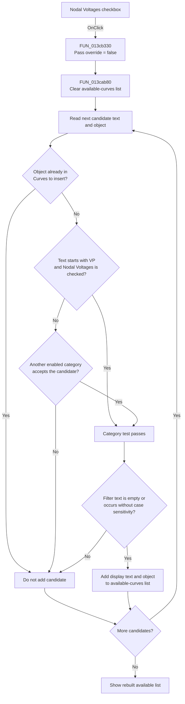

# Nodal Voltages

> Analysis status: Complete. The recovered handler, shared list rebuild, published form field map, and `VP` display-name test establish the Nodal Voltages filter behavior.

## Control

| Property | Recovered value |
| --- | --- |
| Form | AddCurveDlg |
| Form caption | Post-processor |
| Component path | AddCurveDlg.UpperPl.Panel2.FilterGB.VoltagesCB |
| Control class | TCheckBox |
| Caption | Nodal Voltages |
| Hint | Not present in the recovered resource. |
| Text | Not present in the recovered resource. |
| Handler name | VoltagesCBClick |
| Handler address | 013cb330 |
| Graph node | `resource:dfm:AddCurveDlg/AddCurveDlg.UpperPl.Panel2.FilterGB.VoltagesCB` |
| Handler node | `function:013cb330` |
| Graph layer | UI |

## What happens when clicked

The checkbox controls whether nodal-voltage candidates can appear in the **available curves** list. The VCL changes `VoltagesCB.Checked` before it calls `VoltagesCBClick`; the handler does not change the checkbox itself.

`FUN_013cb330` calls `FUN_013cab80(form, false)`. The false argument selects normal filtering, so it does not bypass a cleared category checkbox. The shared function rebuilds the available list:

1. It clears `AvailableCurvesLB` at form offset `+0x778`.
2. It scans the complete candidate collection at `+0x878`.
3. It skips a candidate whose attached object is already present in `CurveToInsertLB` at `+0x7e0`.
4. It reads the candidate display text. A non-empty text whose first two UTF-16 characters are `VP` enters the nodal-voltage category test.
5. For that category, it reads `VoltagesCB.Checked` from the published form field at `+0x7a0`. With the false override used by this click, the category accepts the candidate only when the checkbox is checked.
6. It also tests the other **Show** categories. These category tests form a union. Another enabled category can accept the same candidate when Nodal Voltages is cleared.
7. It reads `FilterEB` at `+0x810`. Empty filter text accepts the category result. Non-empty text must occur in the candidate display text without case sensitivity.
8. It adds each accepted display text and attached object to `AvailableCurvesLB`.

When the checkbox is checked, eligible `VP` candidates can appear. When it is cleared, `VP` candidates that have no other enabled category match disappear. `CurveToInsertLB`, the complete candidate collection, and the curve objects are unchanged. The click only refreshes the source list from which the user can add curves.

The same function is also bound to `OutputsCB.OnClick`. It does not inspect an event sender. Both controls cause a complete rebuild that reads all current filter states; the checked state that the VCL changed before dispatch determines which category result changes.

## Inputs, decisions, and outputs

| Stage | Proven behavior |
| --- | --- |
| Inputs | `VoltagesCB.Checked`, candidate display text and attached objects, the other category checkboxes, `FilterEB` text, and objects already in `CurveToInsertLB`. |
| Nodal-voltage decision | A non-empty display text must start with `VP`, and `VoltagesCB` must be checked because this handler passes a false override. |
| Other category decision | Another enabled category can accept the same candidate when Nodal Voltages is cleared. |
| Selected-item decision | A candidate object already present in `CurveToInsertLB` is excluded before category and text filtering. |
| Text decision | Empty filter text accepts the category result. Non-empty text requires a case-insensitive occurrence in the display text. |
| State change | `AvailableCurvesLB` is cleared and repopulated. The handler does not write the checkbox or selected-curves list. |
| Output | The visible available list immediately reflects the new Nodal Voltages state together with all other active filters. |

## Click flow

## Handler evidence

- Click handler: [FUN_013cb330](../../../DecompiledSources/Tina16/functions/00000000013CB330__FUN_013cb330.c)
- Available-list rebuild: [FUN_013cab80](../../../DecompiledSources/Tina16/functions/00000000013CAB80__FUN_013cab80.c)
- Case-insensitive text-match helper: [FUN_005b83d0](../../../DecompiledSources/Tina16/functions/00000000005B83D0__FUN_005b83d0.c)
- Form-show initialization: [FUN_013cbd70](../../../DecompiledSources/Tina16/functions/00000000013CBD70__FUN_013cbd70.c)
- Recovered role: Refresh the available-curve list after the Nodal Voltages or Outputs filter changes.
- Likely Delphi method: `TAddCurveDlg.VoltagesCBClick`.
- Current graph summary: Handles 2 Delphi UI events: AddCurveDlg.UpperPl.Panel2.FilterGB.VoltagesCB.OnClick, AddCurveDlg.UpperPl.Panel2.FilterGB.OutputsCB.OnClick.
- Current graph behavior: Passes the Add Curve form and a false override to the shared list rebuild. The result reflects both voltage and output checkbox states with the selected-item, other category, and text filters.
- Current graph evidence: The DFM binds both checkboxes to this handler. The source contains only `FUN_013cab80(param_1, 0)`. The shared rebuild reads `VoltagesCB` at `+0x7a0` only for candidate text that starts with `VP`.
- Complexity: simple
- Distinct outgoing calls: 1

The published field map and recovered data flow identify these fields:

| Form offset | Component or state | Role in the refresh |
| --- | --- | --- |
| `+0x778` | `AvailableCurvesLB` | Its items are cleared and receive passing candidates. |
| `+0x7a0` | `VoltagesCB` | Supplies the checked state for the `VP` category. |
| `+0x7c0` | `OutputsCB` | Supplies the sibling Outputs state read by the shared handler path. |
| `+0x7e0` | `CurveToInsertLB` | Its attached objects exclude curves already selected for insertion. |
| `+0x810` | `FilterEB` | Supplies the optional display-text filter. |
| `+0x878` | Complete candidate collection | Supplies candidate display text and attached objects. |

Other recovered callers use `FUN_013cab80` after form show, text-filter changes, category changes, Add/Remove transfers, and candidate-catalog changes. This handler supplies only the form and normal-filtering mode. Catalog creation, curve transfer, and curve deletion stay outside this click path.

## Direct calls

- `function:013cab80` - Clears and rebuilds `AvailableCurvesLB`. It excludes selected objects, applies the `VP`/`VoltagesCB` test and other category tests, applies `FilterEB`, and preserves each accepted candidate's attached object.

## Resource evidence

- Kind: Not present in the recovered resource.
- Modal result: Not present in the recovered resource.
- Checked state: true
- List items: Not present in the recovered resource.
- Image reference: Not present in the recovered resource.
- Extracted glyph: None.
- `VoltagesCB` is in the **Show** group beside **Outputs**, **Currents**, **Other Voltages**, **User defined**, and **Measurement**.
- The DFM sets `Checked = true` and `State = cbChecked`. On form show, the recovered `SaveAllAnalResults` flag replaces both the checkbox's enabled and checked states. A false flag therefore prevents a user click and excludes this category before the list rebuild.
- `AvailableCurvesLB` is the source list beside **Add >>**. `CurveToInsertLB` is labeled **Curves to insert:**.

## Nearby label candidates

Nearby labels are layout candidates only. They are not proof of behavior.

- No same-parent label candidate is available.

## Error and no-op behavior

- The handler has no explicit error message, exception handler, or guard. It rebuilds the list on each delivered click.
- An empty candidate collection produces an empty available list. A candidate that fails the selected-item, category, or text test is silently omitted.
- If no `VP` candidate changes eligibility, the visible list can remain the same even though the rebuild still occurs.

## Analysis limits

- The original Delphi name of `FUN_013cab80` is not recovered. Its callers and list data flow establish its available-list rebuild role.
- The `VP` prefix and checkbox field establish the Nodal Voltages category. The recovered code does not establish the rule that originally assigned each candidate display text.
- Clearing Nodal Voltages does not prove that every `VP` candidate disappears because another enabled category can accept the same object.
