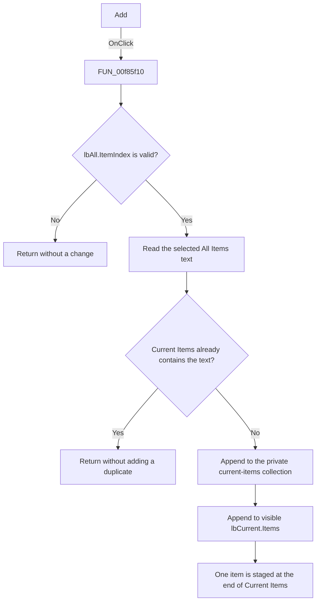

# Add

> Analysis status: Evidence-backed source review complete.

## Control

| Property | Recovered value |
| --- | --- |
| Form | AddWatch |
| Component path | AddWatch.sbAdd |
| Control class | TSpeedButton |
| Caption | Not present in the recovered resource. |
| Hint | Add |
| Text | Not present in the recovered resource. |
| Handler name | sbAddClick |
| Handler address | 00f85f10 |
| Graph node | `resource:dfm:AddWatch/AddWatch.sbAdd` |
| Handler node | `function:00f85f10` |
| Graph layer | UI |

## What happens when clicked

The handler stages one item from the right-side **All Items:** list in the left-side **Current Items:** list.

It first reads `lbAll.ItemIndex`. A negative index means that no source row is selected, so the handler returns without changing either list. For a valid index, it reads the selected `lbAll.Items` string and searches `lbCurrent.Items` for the same text.

If `lbCurrent` already contains the text, the handler makes no change. Otherwise, it appends the string in this order:

1. to the form's private current-items collection at offset `0x710`; and
2. to the visible `lbCurrent.Items` collection.

The new item is added at the end of both collections. The handler does not remove it from `lbAll`, select the new target row, show a message, or close the dialog. It only changes the staged current-item state in this dialog. The **OK** button has the recovered `bkOK` behavior and is the separate action that accepts the dialog.

The recovered VCL list operations can still raise allocation or list-access exceptions. This handler does not catch them. Normal negative selection and duplicate results are explicit no-op paths, not errors.

## Click flow

## Handler evidence

- Source: [DecompiledSources/Tina16/functions/0000000000F85F10__FUN_00f85f10.c](../../../DecompiledSources/Tina16/functions/0000000000F85F10__FUN_00f85f10.c)
- Recovered role: Add Watch selected-item transfer handler
- Current graph summary: Reads the selected All Items entry. If Current Items does not contain the same text, it adds the entry to the private current-items collection and the visible Current Items list. Handles 1 Delphi UI event: AddWatch.sbAdd.OnClick.
- Current graph behavior: Reads the selected All Items entry. If Current Items does not contain the same text, it adds the entry to the private current-items collection and the visible Current Items list.
- Current graph evidence: AddWatch.sbAdd has the hint Add and a two-frame glyph. The handler rejects a negative selection, reads the selected source string, uses the target list IndexOf result to reject duplicates, and adds the string to both target collections.
- Complexity: simple
- Distinct outgoing calls: 1

The recovered form state establishes the handler's field roles:

- `param_1 + 0x6d0` is `lbAll`. The handler reads its selected index and the string at that index.
- `param_1 + 0x6b0` is `lbCurrent`. The handler calls its `Items.IndexOf` equivalent before it appends the selected text.
- `param_1 + 0x710` is the private current-items string collection. [`FUN_00f85e80`](../../../DecompiledSources/Tina16/functions/0000000000F85E80__FUN_00f85e80.c), the recovered `FormCreate` handler, constructs this collection.
- [`FUN_00f85e30`](../../../DecompiledSources/Tina16/functions/0000000000F85E30__FUN_00f85e30.c), the recovered `FormShow` handler, assigns the source collection at offset `0x708` to `lbAll.Items` and the current-items collection at `0x710` to `lbCurrent.Items`. This proves that the handler updates both the private staged state and its visible list.

## Direct calls

- `function:00414480` — Delphi UnicodeString clear and finalization helper

## Resource evidence

- Kind: Not present in the recovered resource.
- Modal result: Not present in the recovered resource.
- Checked state: Not present in the recovered resource.
- List items: Not present in the recovered resource.
- Image reference: Not present in the recovered resource.
- Extracted glyph: [`0005_AddWatch_AddWatch_sbAdd_Glyph_Data.png`](../../../glyph/0005_AddWatch_AddWatch_sbAdd_Glyph_Data.png)
- Hint: **Add**.
- Glyph state: The 32-by-16 bitmap contains two 16-by-16 speed-button frames. Its left-directed graphic is consistent with transfer from the right-side **All Items:** list to the left-side **Current Items:** list. The field accesses and list mutations prove the direction.
- Form caption: **Add Watch**.
- `lbAll` and `lbCurrent` have no recovered design-time items. Their contents are assigned when the form is shown.

## Nearby label candidates

Nearby labels are layout candidates only. They are not proof of behavior.

- Rank 1: All Items:  at distance 212.
- Rank 2: Current Items:  at distance 491.

## Analysis limits

- The handler uses the target list's recovered `IndexOf` operation. The source proves duplicate prevention for the operation's same-text result, but it does not recover the VCL comparison settings, such as case sensitivity.
- The private and visible current-items collections are expected to be synchronized by `FormShow` and this handler. The click checks only the visible list before it adds to both collections; it does not repair a pre-existing mismatch.
- The handler stages the item in the dialog. This source does not prove how the caller persists or consumes the current-items collection after **OK**.
- This review did not run the original application. It does not claim a live test of selection, duplicate matching, or the two-frame glyph states.
