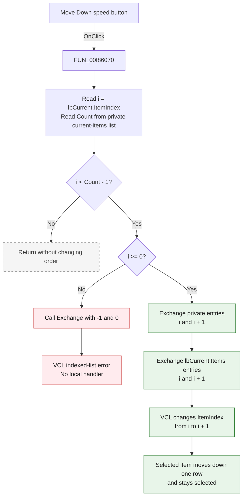

# Move Down

> Analysis status: Complete. The recovered handler, the Add Watch form lifecycle, the paired Add and Delete handlers, the VCL exchange targets, and the control resources agree on this control's behavior.

## Control

| Property | Recovered value |
| --- | --- |
| Form | AddWatch |
| Form caption | Add Watch |
| Component path | AddWatch.sbMoveDown |
| Control class | TSpeedButton |
| Caption | Not present in the recovered resource. |
| Hint | Move Down |
| Text | Not present in the recovered resource. |
| Handler name | sbMoveDownClick |
| Handler address | 00f86070 |
| Graph node | `resource:dfm:AddWatch/AddWatch.sbMoveDown` |
| Handler node | `function:00f86070` |
| Graph layer | UI |

## What happens when clicked

The button moves the selected **Current Items** entry down by one position. It changes both the dialog's private current-items string list and the visible `lbCurrent.Items` list so that their order stays the same.

The handler performs these operations:

1. It reads `lbCurrent.ItemIndex` into `i`.
2. It reads `Count` from the private current-items list at form offset `+0x710`.
3. It tests only `i < Count - 1`.
4. If the test passes, it calls the string-list exchange operation for positions `i` and `i + 1` on the private list.
5. It calls the same exchange operation on `lbCurrent.Items`.
6. The VCL list-box exchange changes `ItemIndex` from `i` to `i + 1`.

For a valid selection before the last row, the selected entry and the entry immediately below it exchange positions. The visible exchange swaps each string together with its attached item data. It then selects `i + 1`, so the same logical item stays selected at its new row. The operation does not jump to the bottom and does not change any item content.

## Inputs, decisions, and outputs

| Stage | Proven behavior |
| --- | --- |
| Selection input | The zero-based `lbCurrent.ItemIndex`. The VCL value is `-1` when no row is selected. |
| Order input | `Count` from the private current-items string list. |
| Move decision | Exchange only when `ItemIndex < Count - 1`. A valid selected row must also have `ItemIndex >= 0`. |
| Private state | Exchanges each string and attached object at `i` with the pair at `i + 1` in the private current-items list. |
| Visible state | Exchanges the same two strings and attached item-data values in `lbCurrent.Items`. |
| Selection state | The visible-list exchange changes `ItemIndex` from `i` to `i + 1`, so the moved logical item stays selected. |
| Output | A valid non-last entry moves down exactly one row in both stored and displayed order. |

## Click flow

## Handler evidence

- Handler source: [FUN_00f86070](../../../DecompiledSources/Tina16/functions/0000000000F86070__FUN_00f86070.c)
- Form creation: [FUN_00f85e80](../../../DecompiledSources/Tina16/functions/0000000000F85E80__FUN_00f85e80.c)
- Form display synchronization: [FUN_00f85e30](../../../DecompiledSources/Tina16/functions/0000000000F85E30__FUN_00f85e30.c)
- Paired Add handler: [FUN_00f85f10](../../../DecompiledSources/Tina16/functions/0000000000F85F10__FUN_00f85f10.c)
- Paired Delete handler: [FUN_00f85eb0](../../../DecompiledSources/Tina16/functions/0000000000F85EB0__FUN_00f85eb0.c)
- Private `TStringList` exchange: [FUN_004b5bd0](../../../DecompiledSources/Tina16/functions/00000000004B5BD0__FUN_004b5bd0.c)
- String and attached-object pair swap: [FUN_004b5c50](../../../DecompiledSources/Tina16/functions/00000000004B5C50__FUN_004b5c50.c)
- VCL list-box item exchange: [FUN_0068acb0](../../../DecompiledSources/Tina16/functions/000000000068ACB0__FUN_0068acb0.c)
- Recovered role: Move the selected Add Watch current item down by one position in stored and visible order.
- Likely Delphi method: `TAddWatch.sbMoveDownClick`.
- Complexity: simple
- Distinct outgoing calls: 0

The surrounding functions identify the two objects used by the handler:

| Form offset | Object | Evidence |
| --- | --- | --- |
| `+0x6b0` | `lbCurrent` | The handler reads its `ItemIndex` and exchanges entries through its `Items` object. The DFM label beside this list is `Current Items:`. |
| `+0x710` | Private current-items `TStringList` | `FormCreate` constructs it. `FormShow` assigns it to `lbCurrent.Items`. The Add and Delete handlers update it together with the visible list. |

## Calls and dispatch

- No direct call edge is present in the recovered graph.
- The handler uses virtual VCL dispatch to read `TListBox.ItemIndex`, read `TStrings.Count`, and invoke `TStrings.Exchange` on the private and visible lists.
- `FUN_004b5bd0` checks both private-list indexes, opens an update scope, calls `FUN_004b5c50`, and closes the update scope.
- `FUN_004b5c50` swaps the private string pointer and its attached object pointer as one pair.
- `FUN_0068acb0` swaps the visible strings and attached item data. If the current `ItemIndex` is one exchanged index, it changes the index to the other position. For this click, it changes `i` to `i + 1`.
- These calls use virtual dispatch and do not appear as direct edges from the handler in the current graph.

## Resource evidence

- The speed button hint is **Move Down** and `ShowHint` is enabled.
- Its extracted [two-frame glyph](../../../glyph/0007_AddWatch_AddWatch_sbMoveDown_Glyph_Data.png) contains downward arrows. The two frames agree with `NumGlyphs = 2`; they are button-state images, not two move operations.
- The button is beside `lbCurrent`, whose nearby label is **Current Items:**. The recovered field access proves that this is the list it changes.
- The graph also ranks **All Items:** as a nearby label. Proximity alone is not proof, and the handler does not access `lbAll`.

## No-op and error behavior

- A valid selection on the last row is a no-op because `i < Count - 1` is false.
- An empty list with no selection is a no-op because both sides of the comparison are `-1`.
- The handler has a missing lower-bound check. If no row is selected (`i = -1`) while the private list has one or more entries, the comparison passes and the first exchange receives indexes `-1` and `0`.
- String-list indexes are zero-based. The negative exchange index enters the VCL indexed-list error path. The handler has no local exception handler.
- The private list is exchanged before the visible list. In the invalid `-1` case, the first exchange fails before the visible exchange can run.
- The handler does not disable itself at a boundary or show a message. On a valid move, the VCL visible-list exchange sets the new selection index.

## Analysis limits

- The handler does not contain a direct `ItemIndex` setter. The recovered virtual target `FUN_0068acb0` proves the selection update performed inside the visible-list exchange.
- The exact text of the indexed-list exception is not recovered at this call site.
- The handler assumes that the private list and `lbCurrent.Items` have matching order and count. The Add, Delete, and FormShow paths maintain that invariant during normal use.
