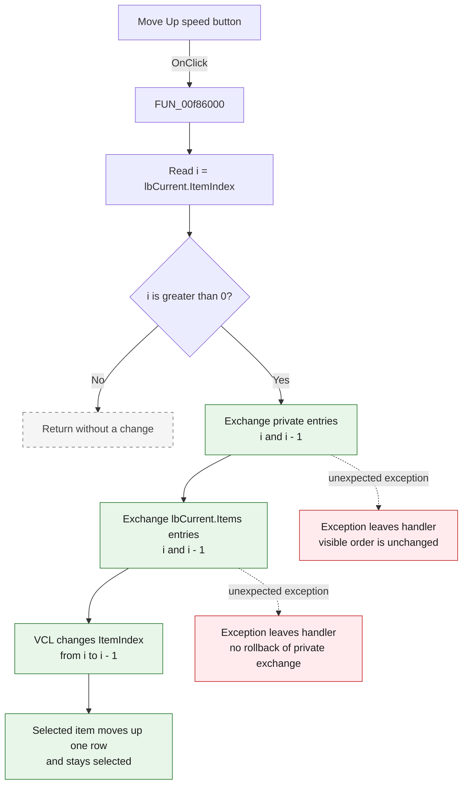

# Move Up

> Analysis status: Complete. The recovered handler, form lifecycle, paired list handlers, VCL exchange methods, and control resources agree on this behavior.

## Control

| Property | Recovered value |
| --- | --- |
| Form | AddWatch |
| Form caption | Add Watch |
| Component path | AddWatch.sbMoveUp |
| Control class | TSpeedButton |
| Caption | Not present in the recovered resource. |
| Hint | Move Up |
| Text | Not present in the recovered resource. |
| Handler name | sbMoveUpClick |
| Handler address | 00f86000 |
| Graph node | `resource:dfm:AddWatch/AddWatch.sbMoveUp` |
| Handler node | `function:00f86000` |
| Graph layer | UI |

## What happens when clicked

The button moves the selected **Current Items** entry up by one position. It
changes the private current-items string list and the visible
`lbCurrent.Items` list. The two orders stay the same.

The handler performs these operations:

1. It reads the zero-based `lbCurrent.ItemIndex` into `i`.
2. If `i` is zero or negative, it returns without a change.
3. It exchanges positions `i` and `i - 1` in the private current-items list.
4. It exchanges the same positions in `lbCurrent.Items`.
5. The VCL list-box exchange changes `ItemIndex` from `i` to `i - 1`.

The selected item and its preceding item exchange positions. The selected item
stays selected at its new row. No item text or attached object changes.

## Inputs, decisions, and outputs

| Stage | Proven behavior |
| --- | --- |
| Selection input | The zero-based `lbCurrent.ItemIndex`. No selection has the value `-1`. |
| Move decision | Continue only when `ItemIndex > 0`. |
| Private state | Exchange the selected string and attached object with the preceding entry in the private current-items list. |
| Visible state | Exchange the same two strings and attached objects in `lbCurrent.Items`. |
| Selection state | The visible-list exchange sets `ItemIndex` to `i - 1`, so the moved item stays selected. |
| Unchanged state | `lbAll`, the all-items collection, item contents, and the dialog result do not change. |
| Output | The selected Current Items entry moves up exactly one row in stored and displayed order. |

## Click flow

## Handler evidence

- Click handler: [FUN_00f86000](../../../DecompiledSources/Tina16/functions/0000000000F86000__FUN_00f86000.c)
- Form creation: [FUN_00f85e80](../../../DecompiledSources/Tina16/functions/0000000000F85E80__FUN_00f85e80.c)
- Form display synchronization: [FUN_00f85e30](../../../DecompiledSources/Tina16/functions/0000000000F85E30__FUN_00f85e30.c)
- Paired Add handler: [FUN_00f85f10](../../../DecompiledSources/Tina16/functions/0000000000F85F10__FUN_00f85f10.c)
- Paired Delete handler: [FUN_00f85eb0](../../../DecompiledSources/Tina16/functions/0000000000F85EB0__FUN_00f85eb0.c)
- Private `TStringList` exchange: [FUN_004b5bd0](../../../DecompiledSources/Tina16/functions/00000000004B5BD0__FUN_004b5bd0.c)
- String and object pair swap: [FUN_004b5c50](../../../DecompiledSources/Tina16/functions/00000000004B5C50__FUN_004b5c50.c)
- VCL list-box item exchange: [FUN_0068acb0](../../../DecompiledSources/Tina16/functions/000000000068ACB0__FUN_0068acb0.c)
- Recovered role: Move the selected Add Watch current item up by one position in stored and visible order.
- Likely Delphi method: `TAddWatch.sbMoveUpClick`.
- Complexity: simple
- Distinct direct outgoing calls: 0

The form and sibling handlers identify the two objects used by the handler:

| Form offset | Object | Evidence |
| --- | --- | --- |
| `+0x6b0` | `lbCurrent` | Move Up reads its `ItemIndex` and accesses its `Items`. Add reads into this list, and Delete removes from it. The DFM labels this list `Current Items:`. |
| `+0x710` | Private current-items `TStringList` | `FormCreate` constructs it. `FormShow` assigns its content to `lbCurrent.Items`. Add, Delete, Move Up, and Move Down update it with the visible list. |

The graph has no direct call edge from the handler. The selected-index getter
and both exchange operations use virtual Delphi dispatch. The recovered VCL
targets give these additional details:

- `FUN_004b5bd0` checks both indexes, opens an update scope, calls
  `FUN_004b5c50`, and closes the update scope.
- `FUN_004b5c50` swaps both the string pointer and its attached object pointer.
- `FUN_0068acb0` swaps the visible strings and attached item data. If the
  current `ItemIndex` is one exchanged index, it changes the index to the other
  position. For this click, it changes `i` to `i - 1`.

## Resource evidence

- The speed button hint is **Move Up**, and `ShowHint` is enabled.
- Its extracted [two-frame glyph](../../../glyph/0006_AddWatch_AddWatch_sbMoveUp_Glyph_Data.png) contains upward arrows. The two frames agree with `NumGlyphs = 2`; they are button-state images, not two move operations.
- The button is beside `lbCurrent`, whose label is **Current Items:**. The field accesses and sibling handlers prove that this is the changed list.
- The graph also ranks **All Items:** as a nearby label. The handler does not access `lbAll`.

## Boundary and no-op behavior

- No selection: `ItemIndex` is `-1`, so the click is a no-op.
- Empty list: `ItemIndex` is also negative, so the click is a no-op.
- First row: `ItemIndex` is `0`, so the click is a no-op.
- Middle or last row: the selected entry moves up one row.
- One-row list: the only possible selected index is `0`, so the click is a no-op.
- The handler does not disable the button at the boundary and does not show a message.

## Error behavior

- The handler assumes that the private list and `lbCurrent.Items` have the same
  count and order. FormShow and the paired Add, Delete, and move handlers
  maintain this invariant during normal use.
- The private `TStringList` exchange checks both indexes. An inconsistent
  private list can raise an indexed-list exception before the visible list
  changes.
- The handler has no local exception handler or rollback. If the visible
  exchange fails after the private exchange, the private order remains changed.
- Normal button use supplies two valid adjacent indexes, so these error cases
  require inconsistent internal state or an unexpected VCL failure.

## Analysis limits

- The private string list at `+0x710` has no recovered Delphi field name. Its
  construction and repeated use establish its current-items role.
- This handler changes the order in the dialog result. It does not show which
  subsystem consumes that order after the dialog closes.
