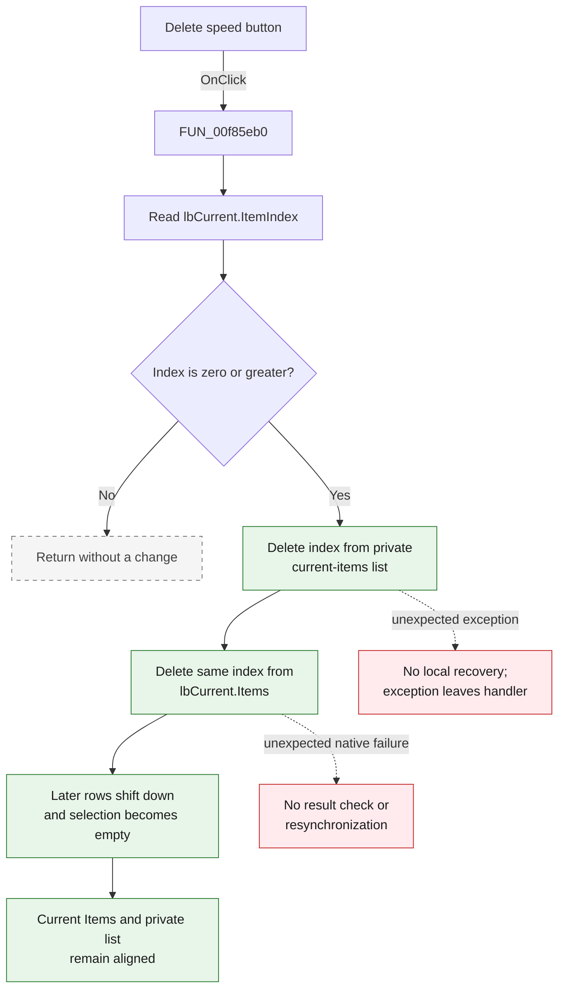

# Delete

> Analysis status: Complete. The recovered handler, AddWatch form state, paired Add handler, Delphi VCL list-box code, hint, and glyph agree on this control's behavior.

## Control

| Property | Recovered value |
| --- | --- |
| Form | AddWatch |
| Form caption | Add Watch |
| Component path | AddWatch.sbRemove |
| Control class | TSpeedButton |
| Caption | Not present in the recovered resource. |
| Hint | Delete |
| Handler name | sbRemoveClick |
| Handler address | 00f85eb0 |
| Graph node | `resource:dfm:AddWatch/AddWatch.sbRemove` |
| Handler node | `function:00f85eb0` |
| Graph layer | UI |

## What happens when clicked

The button removes the one selected entry from **Current Items**. It does not delete the same entry from **All Items**, so the user can add that entry again.

`FUN_00f85eb0` reads `lbCurrent.ItemIndex` from the list box at form field `+0x6b0`.

- If the index is negative, no item is selected. The handler returns without a change.
- If the index is zero or greater, the handler first deletes that index from the private current-items string list at `+0x710`. It then deletes the same index from `lbCurrent.Items`.

The two deletions keep the private result list and the visible list in the same order. Entries after the removed row move down by one index. Entries before it keep their index. Deleting the selected row clears the current selection, and the handler does not select another row. Therefore, `lbCurrent.ItemIndex` is `-1` after a normal removal.

The handler does not ask for confirmation. It does not use the removed text, change `lbAll`, or close the dialog.

## Inputs, decisions, and outputs

| Stage | Proven behavior |
| --- | --- |
| Input | The zero-based selected index from `lbCurrent.ItemIndex`. |
| Selection decision | Any negative index is a no-op. Any normal nonnegative selected index enters the delete path. |
| Model update | Deletes the index from the private current-items string list at `+0x710`. |
| UI update | Deletes the same index from `lbCurrent.Items` at `+0x6b0`. |
| Selection effect | The deleted row is no longer selected. No replacement row is selected by this handler. |
| Unchanged state | `lbAll`, the all-items collection, and the dialog result do not change. |
| Output | The Current Items list contains one fewer entry and stays aligned with the private current-items list. |

## Click flow

## Handler evidence

- Click handler: [FUN_00f85eb0](../../../DecompiledSources/Tina16/functions/0000000000F85EB0__FUN_00f85eb0.c)
- Form display synchronization: [FUN_00f85e30](../../../DecompiledSources/Tina16/functions/0000000000F85E30__FUN_00f85e30.c)
- Paired Add handler: [FUN_00f85f10](../../../DecompiledSources/Tina16/functions/0000000000F85F10__FUN_00f85f10.c)
- Delphi VCL list-box delete method: [FUN_0068b590](../../../DecompiledSources/Tina16/functions/000000000068B590__FUN_0068b590.c)
- Native message reference: [Microsoft `LB_DELETESTRING`](https://learn.microsoft.com/en-us/windows/win32/controls/lb-deletestring)
- Recovered handler role: Remove the selected Current Items entry from the result collection and visible list.
- Likely Delphi method: `TAddWatch.sbRemoveClick`.
- Complexity: simple
- Distinct direct outgoing calls: 0

The recovered form data flow identifies these fields:

| Form offset | Component or state | Evidence |
| --- | --- | --- |
| `+0x6b0` | `lbCurrent` | The handler reads its selected index and deletes from its `Items`. FormShow assigns the `+0x710` strings to this list box. |
| `+0x6d0` | `lbAll` | The paired Add handler reads the selected source row from this list. The Delete handler does not access it. |
| `+0x710` | Private current-items string list | FormCreate constructs this list. FormShow assigns it to `lbCurrent.Items`; Add and Delete change both copies. |

There is no direct call edge because the selected-index getter and both delete operations are virtual Delphi calls. The recovered VCL list-box delete implementation sends native message `0x182`, which is `LB_DELETESTRING`, with the selected index.

## Resource evidence

- The speed button has the direct hint **Delete**.
- The control has an extracted two-frame glyph: [`0004_AddWatch_AddWatch_sbRemove_Glyph_Data.png`](../../../glyph/0004_AddWatch_AddWatch_sbRemove_Glyph_Data.png). The hint and handler data flow, not the image alone, establish the delete action.
- The form labels the target list **Current Items:** and the unchanged source list **All Items:**.
- The paired **Add** handler reads `lbAll` and adds a missing string to both the private current-items list and `lbCurrent.Items`. This establishes the inverse relationship with Delete.
- The nearby-label ranks alone are not used to map the lists. The handler and FormShow field data flow establish the mapping.

## Empty and boundary behavior

- Empty list: `lbCurrent.ItemIndex` is negative, so the click is a no-op.
- Non-empty list with no selection: the index is also negative, so the click is a no-op.
- First row: index `0` passes the guard and is deleted from both lists.
- Middle row: the row is deleted and later rows move down one position.
- Last row: the row is deleted. No replacement row is selected.
- Only row: both lists become empty and the selection is `-1`.
- Repeated click: after a normal deletion, the cleared selection makes the next click a no-op until the user selects another row.

## Error behavior

- The handler assumes that the private list and `lbCurrent.Items` have the same count and order. FormShow and the paired Add handler maintain this invariant during normal use.
- The handler has no local exception handler. If the private-list deletion fails, the exception leaves the handler and the visible list deletion is not run.
- The VCL list-box delete method sends `LB_DELETESTRING` and does not check its return value. If that second deletion unexpectedly fails after the private deletion, this handler has no rollback or resynchronization path.
- A normal `ItemIndex` is valid for the visible list. Therefore, the invalid-index cases require inconsistent internal state; they are not normal button behavior.

## Analysis limits

- The private string list at `+0x710` has no recovered Delphi field name. Its construction, FormShow assignment, and paired Add/Delete accesses establish its role.
- The handler removes a string from the dialog's current selection result. This source does not show which later subsystem consumes the result after the dialog closes.
