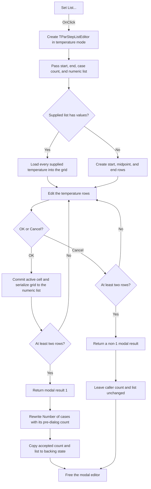

# Set List...

> Analysis status: Source, graph, and form evidence reviewed.

## Control

| Property | Recovered value |
| --- | --- |
| Form | AnalModeDlg |
| Component path | AnalModeDlg.Notebook.tsTemperature.GroupBox1.btnListEdit |
| Control class | TButton |
| Caption | Set List... |
| Hint | Not present in the recovered resource. |
| Text | Not present in the recovered resource. |
| Handler name | btnListEditClick |
| Handler address | 01155460 |
| Graph node | `resource:dfm:AnalModeDlg/AnalModeDlg.Notebook.tsTemperature.GroupBox1.btnListEdit` |
| Handler node | `function:01155460` |
| Graph layer | UI |

## What happens when clicked

The button opens `TParStepListEditor` as a modal editor for the explicit temperature sweep list. The editor shows one numeric grid row for each temperature. It can add a value, remove the last value, or clear the grid.

The click handler does these operations:

1. `FUN_01437450` constructs a `TParStepListEditor` with the recovered global owner object.
2. `FUN_01437560` copies four current Temperature-page backing values into the editor: the start temperature at form offset `0xbe8`, end temperature at `0xbf0`, case count at `0xbe6`, and numeric list reference at `0xbf8`. This handler does not read the three visible edit controls before it opens the list editor.
3. The handler sets editor byte `0x71c` to `1`. The editor's `OnActivate` handler uses this byte to select its temperature-specific title instead of its parameter-stepping title.
4. When the editor is shown, it loads every value from the supplied numeric list. If that list is nil or empty, it creates three working rows from the start temperature, the midpoint between start and end, and the end temperature.
5. The handler opens the editor modally and waits for its result.

Inside the editor, **Add New** appends `1.0` to an empty grid or appends the last value multiplied by `1.2`. It stops adding at 1,000 rows. **Remove Last** works only while more than two rows exist. **Clear** removes every row.

The editor validates the row count when any close is requested. `FormCloseQuery` permits closing only when more than one row exists. With zero or one row, both OK and Cancel remain in the editor. The recovered close-query handler shows no message. The traced editor code contains no separate numeric range check or numeric error message for individual list values.

If the user selects OK and the close query succeeds, `FUN_014377e0` first commits the active grid cell, replaces the supplied numeric list with all grid values, and stores the row count as the editor's output count. `ShowModal` then returns `1`. The caller copies the accepted count and list reference back to offsets `0xbe6` and `0xbf8` through `FUN_01437590`.

The recovered call order has one important detail: before it copies the returned count, the caller writes the existing pre-dialog count to the `TempPoints` **Number of cases** edit through `FUN_00f04fa0`. There is no second write of the returned count to that control in this handler. The backing count and list are updated, but this source does not prove that the visible count text is refreshed here.

If the modal result is not `1`, including a permitted Cancel, the caller skips both the edit-control write and the output copy. The original backing count and numeric list remain unchanged because grid changes are serialized only by the editor's OK handler. The temporary editor object is freed after both accepted and cancelled results.

The parent Analysis Mode dialog performs its start/end temperature validation later, outside this click handler. That later path requires two different values in the inclusive range `-100` through `500`. It does not add an individual-value range check to the list editor path described here.

## Click flow

## Handler evidence

- Source: [DecompiledSources/Tina16/functions/0000000001155460__FUN_01155460.c](../../../DecompiledSources/Tina16/functions/0000000001155460__FUN_01155460.c)
- Recovered role: Opens the temperature step-list editor and accepts its count and numeric list on OK.
- Current graph summary: Handles 1 Delphi UI event: AnalModeDlg.Notebook.tsTemperature.GroupBox1.btnListEdit.OnClick.
- Dialog evidence: The constructor class pointer used by `FUN_01437450` maps to the recovered `TParStepListEditor` DFM. That form contains `AttributeGrid`, OK, Cancel, Add New, Remove Last, and Clear controls.
- Input evidence: `FUN_01437560` stores the caller's start, end, count, and numeric list in editor fields `0x6f8`, `0x700`, `0x708`, and `0x710`.
- Initialization evidence: `TParStepListEditor.FormShow` copies a nonempty list into the grid or creates the three start/midpoint/end defaults.
- Acceptance evidence: `TParStepListEditor.OKBtnClick` commits the grid and serializes all rows. `FUN_01437590` copies only the resulting count and list reference back to the caller.
- Cancel evidence: The output-copy branch runs only when `ShowModal` returns `1`. All other results skip it, and the editor is freed unconditionally.
- Validation evidence: `TParStepListEditor.FormCloseQuery` sets `CanClose` to true only when the working row count is greater than one. No message call is present in that handler.
- Complexity: complex
- Distinct outgoing calls: 5

## Direct calls

- `function:00410f20` — Frees the temporary editor object when it is not nil.
- `function:00f04fa0` — Writes an integer value to the `TempPoints` edit control.
- `function:01437450` — Constructs the `TParStepListEditor` form.
- `function:01437560` — Seeds the editor with the current sweep bounds, count, and list.
- `function:01437590` — Copies the editor's output count and numeric list reference back to the Analysis Mode form.

## Resource evidence

- Kind: Not present in the recovered resource.
- Modal result: Not present in the recovered resource.
- Checked state: Not present in the recovered resource.
- Parent group: `Temperature stepping`.
- Related input labels: `Start temperature`, `End temperature`, and `Number of cases`.
- Sweep types: `Linear`, `Logarithmic`, and `List`.
- Opened form: `TParStepListEditor` with a numeric `AttributeGrid` and OK, Cancel, Add New, Remove Last, and Clear controls.
- List items: Not present in the recovered resource.
- Image reference: Not present in the recovered resource.
- Extracted glyph: None.

## Nearby label candidates

Nearby labels are layout candidates only. They are not proof of behavior.

- Rank 1: &Number of cases at distance 312.
- Rank 2: &End temperature at distance 339.
- Rank 3: St&art temperature at distance 362.

## Analysis limits

- The temperature-mode title is loaded from a resource string that is not present in the recovered DFM. The source proves the temperature/parameter mode switch but not the exact title text.
- The click passes the form's backing start, end, and count fields. It does not commit or read unaccepted text from `TempStartVal`, `TempEndVal`, or `TempPoints` before it opens the editor.
- The source calls the integer-edit update before it copies the accepted count. No later write to `TempPoints` occurs in this handler, so a visible count refresh must not be claimed here.
- The list editor enforces a minimum of two rows and a maximum Add New count of 1,000. It does not show an explicit per-value range check in the traced path.
