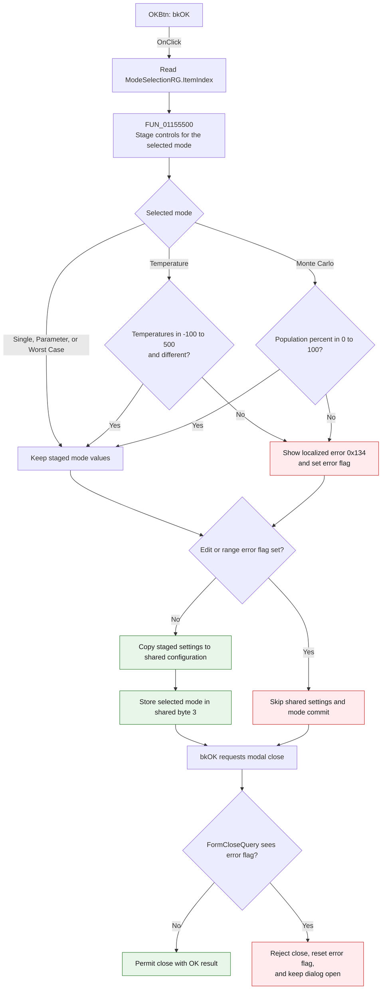

# OKBtn

> Analysis status: Source reviewed. The selected-mode validation, settings
> commit, and modal close guard are supported by the recovered handlers,
> published form fields, and DFM resources.

## Control

| Property | Recovered value |
| --- | --- |
| Form | AnalModeDlg |
| Form caption | Analysis Mode Selection |
| Component path | AnalModeDlg.ButtonPanel.OKBtn |
| Control class | TBitBtn |
| Caption | Not present in the recovered resource. |
| Hint | Not present in the recovered resource. |
| Text | Not present in the recovered resource. |
| Kind | bkOK |
| Handler name | OKBtnClick |
| Handler address | 011559e0 |
| Graph node | `resource:dfm:AnalModeDlg/AnalModeDlg.ButtonPanel.OKBtn` |
| Handler node | `function:011559e0` |
| Graph layer | UI |

## What happens when clicked

`FUN_011559e0` accepts the selected analysis mode and its staged settings. It
first reads `ModeSelectionRG.ItemIndex` and passes that index to
`FUN_01155500`. This callee reads only the controls for the selected mode and
writes their values to the dialog's private settings record.

The five resource items and their recovered staging behavior are:

| Index | Mode | Values staged by `FUN_01155500` | Additional rule |
| ---: | --- | --- | --- |
| 0 | Single | Sets the derived case count to 1. | No mode-specific range rule. |
| 1 | Temperature stepping | Start temperature, end temperature, number of cases, Separate cases, and Linear, Logarithmic, or List sweep type. List mode uses the stored list count; the other sweep types use the number-of-cases edit. | Both temperatures must be from -100 through 500, inclusive, and they must be different. |
| 2 | Parameter stepping | Combinational or Parallel stepping and Separate cases. Combinational stepping calculates the product of the parameter step counts. Parallel stepping uses the smallest step count. | No mode-specific range rule in this function. |
| 3 | Worst Case | Number of cases, Draw nominal value, and Stochastic or Analytic method. The derived case count includes one additional case when Draw nominal value is checked. | No mode-specific range rule in this function. |
| 4 | Monte Carlo | Percent of population, number of cases, and Draw nominal values. The derived case count includes one additional case when Draw nominal values is checked. | Percent of population must be from 0 through 100, inclusive. |

The numeric edit controls also have recovered `OnError` handlers. A float or
integer edit error goes through the same dialog error path as the two explicit
range rules.

On the first validation error, the dialog loads localized string resource
`0x134`, shows the message, and sets its error flag at `+0x7c8`. The exact
English text is not present in the recovered resource set. More errors during
the same attempt do not show additional messages because the shared helper
tests the flag before it displays a message.

After staging, `FUN_011559e0` tests the error flag:

- If the flag is clear, `FUN_00417c40` copies the complete staged settings
  record from form offset `+0x7d0` to the shared analysis-configuration record.
  The handler then stores the selected mode index in byte 3 of that shared
  record.
- If the flag is set, the handler skips both the record copy and the selected
  mode write. Some private staged fields can already contain the invalid input,
  but the shared configuration remains unchanged.

The handler does not call `Close`. The button's recovered `bkOK` kind supplies
the standard Delphi modal-accept request after `OnClick` returns.
`TAnalModeDlg.FormCloseQuery` makes the final decision. It permits the close
when the error flag is clear. When the flag is set, it rejects that close
attempt, resets the flag, and leaves the dialog open so the user can correct
the values and try again.

A previous edit error can leave the flag set even if the user corrects the text
before this click. In that case, this acceptance attempt still does not commit
or close. `FormCloseQuery` clears the flag, so a following valid click can
succeed.

## Inputs, decisions, state changes, and outputs

| Stage | Proven behavior |
| --- | --- |
| Mode input | Reads `ModeSelectionRG.ItemIndex` from form field `+0x6d0`. The resource defines indexes 0 through 4. |
| Value inputs | Reads the selected page's float edits, integer edits, check boxes, and radio groups. Hidden mode pages are not processed by this call. |
| Validation decision | Temperature mode checks the two temperature bounds and inequality. Monte Carlo checks the population percentage. Edit-control errors use the same error flag. |
| Failure state | Shows the first error, sets `+0x7c8`, skips the shared record copy and mode write, and lets `FormCloseQuery` reject the close and reset the flag. |
| Success state | Copies the private staged record at `+0x7d0` to the shared configuration and stores the selected mode index in shared byte 3. |
| Modal output | `bkOK` requests the OK modal result. The close query keeps the dialog open on failure and permits it to close on success. |

## Click flow

## Handler evidence

- Click handler: [FUN_011559e0](../../../DecompiledSources/Tina16/functions/00000000011559E0__FUN_011559e0.c)
- Selected-mode staging and validation: [FUN_01155500](../../../DecompiledSources/Tina16/functions/0000000001155500__FUN_01155500.c)
- Validation-message wrapper: [FUN_01155400](../../../DecompiledSources/Tina16/functions/0000000001155400__FUN_01155400.c)
- Close guard: [FUN_01155b90](../../../DecompiledSources/Tina16/functions/0000000001155B90__FUN_01155b90.c)
- Form-show state restore: [FUN_01155220](../../../DecompiledSources/Tina16/functions/0000000001155220__FUN_01155220.c)
- Recovered handler role: Validates and commits the selected analysis mode and
  its settings for modal acceptance.
- Likely Delphi method: `TAnalModeDlg.OKBtnClick`.
- Complexity: moderate.
- Distinct outgoing calls: 2.

The published Delphi field table gives the control mappings used by the
staging function:

| Form offset | Published field | Use |
| --- | --- | --- |
| `+0x6d0` | `ModeSelectionRG` | Supplies the selected mode index. |
| `+0x720`, `+0x728`, `+0x730` | `TempStartVal`, `TempEndVal`, `TempPoints` | Supply temperature-mode numeric values. |
| `+0x7a8`, `+0x7b8` | `TempSepViews`, `TempScaleRG` | Supply temperature display and sweep choices. |
| `+0x798`, `+0x7a0`, `+0x7b0` | `rbtnNestedSweep`, `rbtnCommonLoop`, `ParSepViews` | Supply parameter-stepping choices. |
| `+0x748`, `+0x750`, `+0x758` | `WCDrawNom`, `WCPoints`, `WCMethodRG` | Supply Worst Case settings. |
| `+0x778`, `+0x780`, `+0x788` | `MCPoints`, `MCPop`, `MCDrawNom` | Supply Monte Carlo settings. |

`FUN_01155220`, the form-show handler, copies the shared configuration in the
opposite direction into the staged record and restores the radio index from its
mode byte. This round trip confirms that the successful OK path commits the
dialog values to shared analysis configuration.

## Direct calls

- `function:01155500` - Reads and stages the controls for the selected mode.
  It performs the temperature and Monte Carlo range rules and sends failures
  through the dialog error helper.
- `function:00417c40` - Performs the descriptor-driven Delphi record assignment
  from the staged form record to the shared configuration. The handler calls it
  only while the error flag is clear.

## Downstream validation and close functions

- `function:01155400` - Passes the localized validation message to the shared
  first-error helper with the dialog's `+0x7c8` flag.
- `function:01b1cf30` - Displays the supplied message and sets the flag only
  when the flag was previously clear.
- `function:01155b90` - Handles `AnalModeDlg.OnCloseQuery`. It assigns
  `CanClose = not errorFlag` and then resets the flag.

## Resource evidence

- Kind: `bkOK`.
- Modal result: Not present as an explicit property. The built-in `bkOK` kind
  supplies the standard modal acceptance action.
- `ModeSelectionRG` items: **Single**, **Temperature stepping**, **Parameter
  stepping**, **Worst Case**, and **Monte Carlo**.
- Temperature resources label Start temperature, End temperature, Number of
  cases, Separate cases in diagram, and the three sweep types.
- Parameter resources label Combinational stepping, Parallel stepping, and
  Separate cases in diagram.
- Worst Case resources label Number of cases, Draw nominal value, and the
  Stochastic or Analytic method.
- Monte Carlo resources label Percent of population, Number of cases, and Draw
  nominal values.
- Image reference: Not present in the recovered resource.
- Extracted glyph: None.
- No same-parent label candidate is available.

## Error and no-op behavior

- An explicit range failure or a numeric edit error prevents the shared commit
  and prevents this modal close attempt.
- Only the first error message in one attempt is shown.
- On failure, private staged fields can change, but the shared configuration
  and selected shared mode do not change.
- The close-query handler resets the error flag after it rejects the close.
- There is no successful no-op path. A valid click copies the staged settings,
  stores the mode, and permits the standard OK close.
- The handler has no local exception handler. An exception from a numeric
  reader or record assignment propagates before a successful close.

## Analysis limits

- The exact localized text of string resource `0x134` is not present in the
  recovered files.
- The selected-mode byte is not range-checked in `FUN_011559e0`. A value outside
  0 through 4 makes `FUN_01155500` skip all mode branches. If no error flag is
  set, the handler can still copy the previous staged record and store that
  byte. Normal form-show and radio-group behavior select one of the five
  recovered items.
- The code computes a derived case count for each mode. This article describes
  the proven calculations but does not assign an unrecovered Delphi field name
  to the staged value at `+0x88d`.
- The handler itself does not call `Close` or set `ModalResult`. The modal close
  request comes from Delphi VCL `bkOK` behavior, and `FormCloseQuery` makes the
  final decision.
