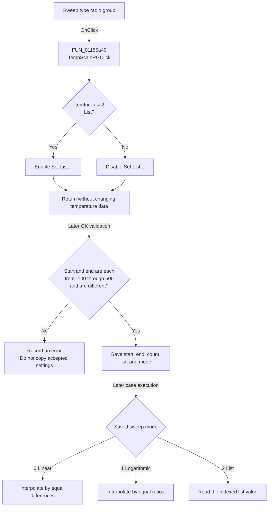

# Sweep type

> Analysis status: Source reviewed. The immediate control effect and the later temperature-sweep use are supported by recovered code.

## Control

| Property | Recovered value |
| --- | --- |
| Form | AnalModeDlg |
| Component path | AnalModeDlg.Notebook.tsTemperature.GroupBox1.TempScaleRG |
| Control class | TRadioGroup |
| Caption | Sweep type |
| Hint | Not present in the recovered resource. |
| Text | Not present in the recovered resource. |
| Handler name | TempScaleRGClick |
| Handler address | 01155a40 |
| Graph node | `resource:dfm:AnalModeDlg/AnalModeDlg.Notebook.tsTemperature.GroupBox1.TempScaleRG` |
| Handler node | `function:01155a40` |
| Graph layer | UI |

## What happens when clicked

This control selects how TIARA gets the temperature for each case. It does not select a temperature unit.

`FUN_01155a40` reads the radio-group `ItemIndex` and compares it with `2`, which is the third resource item, **List**. It then calls the VCL enabled-state setter on the adjacent **Set List...** button:

- **List** (`ItemIndex = 2`) enables **Set List...**.
- **Linear**, **Logarithmic**, an unselected value, or any other index disables **Set List...**.

The click handler does not open the list editor. It does not change the start temperature, end temperature, case count, or stored list. It also does not run an analysis.

The later acceptance and execution paths give the selected items these effects:

| Item | Stored mode | Proven later effect |
| --- | ---: | --- |
| Linear | 0 | For case index `i`, `FUN_017c58f0` returns `start + ((end - start) / (count - 1)) * i`. |
| Logarithmic | 1 | For case index `i`, the same function uses geometric interpolation: `start * 10^(log10(end / start) * i / (count - 1))`. |
| List | 2 | The function returns item `i` from the stored numeric list. The accepted list length becomes the case count. |

The start and end values go to the sweep calculator without a unit conversion in the inspected path. A later formatting call converts the calculated number to text for a case description, but this code does not identify a Celsius, Fahrenheit, or Kelvin conversion.

## Click and use flow

## Handler evidence

- Source: [DecompiledSources/Tina16/functions/0000000001155A40__FUN_01155a40.c](../../../DecompiledSources/Tina16/functions/0000000001155A40__FUN_01155a40.c)
- Recovered role: Not present in the current generated graph.
- Article finding: Enables the temperature list-editor button only when the List sweep item is selected.
- Current graph summary: Handles 1 Delphi UI event: AnalModeDlg.Notebook.tsTemperature.GroupBox1.TempScaleRG.OnClick.
- Complexity: simple
- Distinct outgoing graph calls: 0

The graph has no direct call edge because the handler dispatches the enabled-state change through VCL virtual-table slot `0x128`. The recovered base implementation, [FUN_0064dc60](../../../DecompiledSources/Tina16/functions/000000000064DC60__FUN_0064dc60.c), changes the control enabled byte and sends VCL message `CM_ENABLEDCHANGED` (`0xB00C`) only when the value changes.

## Relevant downstream evidence

- [FUN_01155220](../../../DecompiledSources/Tina16/functions/0000000001155220__FUN_01155220.c) initializes the radio group from analysis-state offset `0x430` when the form opens.
- [FUN_01155500](../../../DecompiledSources/Tina16/functions/0000000001155500__FUN_01155500.c) reads the temperature inputs when the current mode is Temperature stepping. It rejects a start or end value below `-100` or above `500`, and it rejects equal endpoints. On a valid input, it saves the selected sweep mode. List mode uses the list length as the case count; the other modes use the Number of cases edit.
- [FUN_011559e0](../../../DecompiledSources/Tina16/functions/00000000011559E0__FUN_011559e0.c) copies the form state to the active analysis settings only when the dialog error string is empty.
- [FUN_01342880](../../../DecompiledSources/Tina16/functions/0000000001342880__FUN_01342880.c) passes the stored temperature start, end, list, count, case index, and sweep mode to `FUN_017c58f0` during temperature-step execution.
- [FUN_017c58f0](../../../DecompiledSources/Tina16/functions/00000000017C58F0__FUN_017c58f0.c) implements the linear, logarithmic, and list branches. If `count - 1` is zero, it returns the start value without division or list access.
- [FUN_01437bf0](../../../DecompiledSources/Tina16/functions/0000000001437BF0__FUN_01437bf0.c) lets the list-editor form close only when the list has more than one item.

## Direct calls

- No direct call edge is present in the recovered graph.
- The source contains one indirect VCL call that sets the enabled state of **Set List...**.

## Boundary and error behavior

- The click handler has no error-message branch and does not validate numeric input.
- Any radio index other than `2`, including `-1`, disables **Set List...**.
- Repeating the same enabled value is a no-op in the VCL setter.
- The later OK path accepts `-100` and `500` as endpoints. It rejects values outside that inclusive range and rejects equal endpoints.
- A numeric edit can also report an error through the shared `EditFloatError` or `EditIntError` handlers. An error prevents the OK path from copying the form state.
- The recovered code uses one shared resource message for the inspected endpoint errors. The exact message text was not recovered, so this article does not invent it.

## Resource evidence

- List items: (**Linear**, **Logarithmic**, **List**)
- Sibling command: **Set List...** (`TButton`, handler `btnListEditClick` at `01155460`)
- Parent group: **Temperature stepping**
- Hint: Not present in the recovered resource.
- Image reference: Not present in the recovered resource.
- Extracted glyph: None.

## Nearby label candidates

The labels **Start temperature**, **End temperature**, and **Number of cases** share the same group. Their meaning is confirmed by `FUN_01155500`, which reads those three controls in the Temperature stepping branch.

## Analysis limits

- The inspected path proves sweep spacing and explicit-list selection. It does not prove a temperature-unit selection or conversion.
- It does not identify the exact text of the validation message.
- The **Separate cases in diagram** option is stored with the temperature settings, but this click handler does not read or change it.
